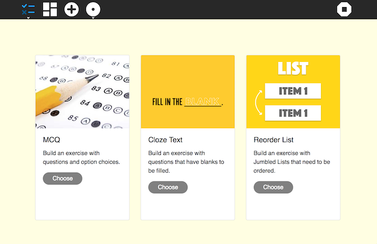
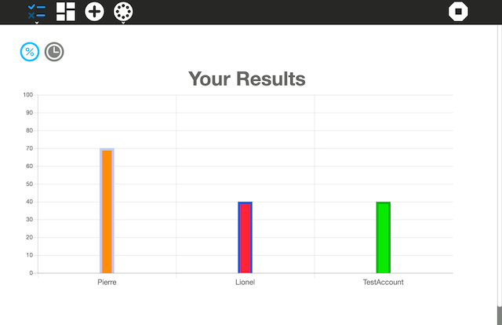
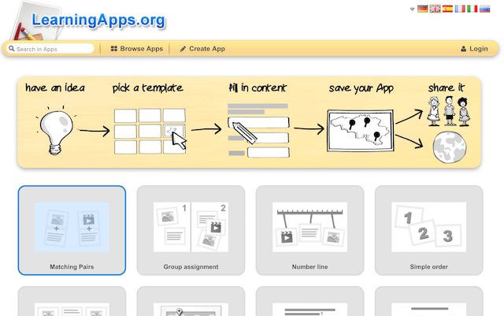
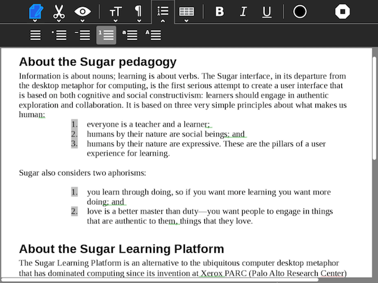
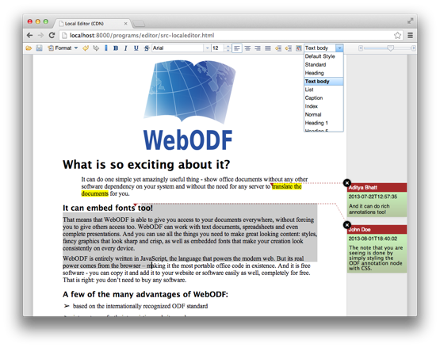
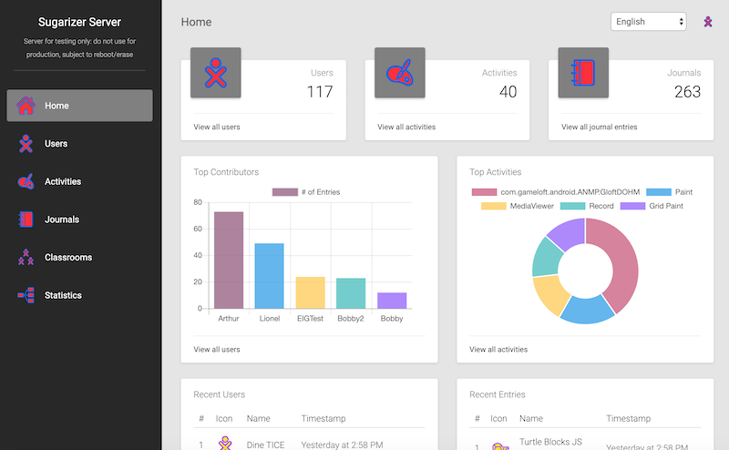

# GSoC 2019 Ideas
A list of ideas we've planned for GSoC 2019 projects.
If you have any ideas which can be useful to us, but are not in the
list, we'd love to hear from you.  You need not be a potential
student or a mentor to suggest ideas.

## Criteria for Ideas
1. Does it fill an empty pedagogy niche in the activity set for Sugar
   or Sugarizer,
2. Does it increase quality of our software products (Sugar, activities,
   Music Blocks, or Sugarizer),
3. Does it _not_ involve any project infrastructure, e.g. not another
   app store, web site, or developer landing page,
4. Do we have a developer _now_ who would be willing and able to do it
   if a student was not available, and who can _promise_ to do it if a
   student is not selected.

For some ideas, there is a list of 'Suggested issues to work on'.
These will help you to get familiar with the project.  The more you
work on these issues, the more experienced you will be for the
project.  However, this is not a strict list.  You _should_ try and
explore other issues as well.

------------

## Port Sugar and core activities to Python 3
**Priority:** High

**Prerequisites** 
 - Experience with Python
 - Experience with porting telepathy bindings
 - Strong experience with
   [Sugar Desktop](https://www.github.com/sugarlabs/sugar) and activities

**Description** 
Sugar runs on Python 2. Support for Python 2 is being withdrawn fast
and we need to move to Python 3. The work was started in GSoC 2018,
see [link](https://wiki.sugarlabs.org/go/Python_2to3), and needs to be
finished and released. See GitHub Project [Port to Python 3 via
six](https://github.com/orgs/sugarlabs/projects/1) for open issues and
pull requests.

The telepathy library does not have its bindings for Python 3, and
porting Telepathy to its PyGObject binding is a prerequisite for the
Port to Python 3 Project, see GitHub Project [Port to
TelepathyGLib](https://github.com/orgs/sugarlabs/projects/4).

**Project Task Checklist** 
_(in chronological order)_
 - Port all Telepathy bindings to TelepathyGLib, see [Port to
   TelepathyGLib](https://github.com/orgs/sugarlabs/projects/4).
 - Make activitychooser window modal and remove its dependency from
   toolkit to jarabe, see [sugar/#815](https://github.com/sugarlabs/sugar/issues/815)
 - Release gwebsockets for Python 3, see [gwebsockets/#2](https://github.com/sugarlabs/gwebsockets/issues)
 - Continue porting sugar-toolkit-gtk3 to six, see [
   sugar-toolkit-gtk3/#383](https://github.com/sugarlabs/sugar-toolkit-gtk3/pull/383)
 - Release sugar-toolkit-gtk3 which is compatible with both Python 2
   and 3
 - Port Sugar Desktop to Python 3, see [sugar/#805](https://github.com/sugarlabs/sugar/pull/805)
 - Port all fructose activities to Python 3

**Expected Mentors** 
[Rahul Bothra](https://www.github.com/pro-panda) and
[James Cameron](https://www.github.com/quozl)

------------

## Improve and maintain 25 Sugar activities
**Priority:** Moderate

**Prerequisites** 
 - Experience with Python
 - Strong experience with Sugar activities
 - Experience with maintaining activities on ASLO

**Description** 
Sugar has a lot of activities, with 250+ on GitHub, and more
elsewhere. These have scope for improvement; bugs,
features, updated human translations, and release.  This project will involve
working on at least 25 activities to improve them. Students can choose
activities on their own, and are encouraged to select activities which
are either a part of Fructose or have a strong pedagogical value. To
understand how to locate and work on activities, see our guide to
[Modifying
Activities](https://github.com/sugarlabs/sugar-docs/blob/master/src/contributing.md#modifying-activities)

In their proposal, students should mention some of the issues they will
work on.  Any new feature suggestion should be discussed on GitHub
Issues before being added to a proposal.

Since there are a lot of activities to work on, **more than one instance
of this project may be selected**.

**Suggested Issues to work on:** 
 - write-activity: [#28 Port to sugar3.speech](https://github.com/sugarlabs/write-activity/issues/28)
 - jukebox-activity: [#22 Add collaboration for sharing playlist items](https://github.com/sugarlabs/jukebox-activity/issues/22)
 - jukebox-activity: [#23 Enable visualisations in the playbin element for audio content](https://github.com/sugarlabs/jukebox-activity/issues/23)
 - log-activity: [#12 Delete Log File button leaves entry in list](https://github.com/sugarlabs/log-activity/issues/12)
 - read-activity: [#28 add back EPUB support](https://github.com/sugarlabs/read-activity/issues/28)
 - infoslicer: [#23 Traceback, motion_notify](https://github.com/sugarlabs/infoslicer/issues/23)
 - iq-activity: [#10 Port to Latest Sugargame](https://github.com/sugarlabs/iq-activity/issues/10)
 - GTranslator: [#8 Unconnected forks to be merged](https://github.com/sugarlabs/GTranslator/issues/8)
 - maze-activity: [#16 Add holes](https://github.com/sugarlabs/maze-activity/issues/16)
 - flappy-birds-activity: [#16 Suggested changes](https://github.com/sugarlabs/flappy-birds-activity/issues/16)
 - bichos-activity: [#9 Delete repository](https://github.com/sugarlabs/bichos-activity/issues/9)

Suggesting or adding features, fixing bugs, or releasing activities
will help you to gain experience

**Expected Mentors** 
[Rahul Bothra](https://www.github.com/pro-panda), [James Cameron](https://www.github.com/quozl) and [Ibiam Chihurumnaya](https://www.github.com/chimosky).

------------

## Create a new set of activities
**Priority:** Moderate

**Prerequisites** 
 - Experience with Python
 - Strong experience with Sugar activities

**Description** 
Sugar has a lot of activities (250+ on GitHub, and more
elsewhere). To understand how to locate and work on activities, see
our guide to [Modifying Activities](https://github.com/sugarlabs/sugar-docs/blob/master/src/contributing.md#modifying-activities).
This project expects you to think of what new activities can be created.
The activity or set of activities should add a new learning experience
for the user, and must be large enough for the three months work for GSoC.

Some ideas (but not limited to) are [Machine Learning Teaching](https://github.com/sugarlabs/GSoC/issues/16),
[Pronounciation Checker](https://github.com/sugarlabs/GSoC/issues/12),
[Jupyter Notebook](https://github.com/sugarlabs/GSoC/issues/13),
[Scratch](https://github.com/sugarlabs/GSoC/issues/5).

See https://www.tandfonline.com/doi/pdf/10.1080/15391523.2017.1388200?needAccess=true
to understand some user experiences and expectations.

In the proposal, students must mention the features
in their proposed activity(ies), and may include preliminary designs
as well.

**Project Task Checklist:** 
 - [ ] Create the activity; ensure that the code is modular, commented,
   and does not use any deprecated modules,
 - [ ] Test the activity; put it out for the community to test and
   implement feature requests or patches for bugs reported,
 - [ ] Release activity for use by primary school children.

**Suggested Issues to work on:** 
 - Fixing issues in activities
 - Adding new features in activities
 - Creating new activities

**Expected Mentors** 
[Rahul Bothra](https://www.github.com/pro-panda), [James Cameron](https://www.github.com/quozl) and [Ibiam Chihurumnaya](https://www.github.com/chimosky).

------------

## Performance in Music Blocks
**Priority:** High

**Prerequisites** 
 - Extensive experience with JavaScript
 - Experience with Travis CI (and/or other test environments for JavaScript)
 - Some experience of working on [Music
   Blocks](https://www.github.com/sugarlabs/musicblocks) or [Turtle
   Blocks](https://www.github.com/sugarlabs/turtleblocksjs)

**Description** 

Music Blocks is written in JavaScript and runs in a web browser. It
uses a number of libraries, notably, Tone.js and Easel.js. Since it
is intended to be used in settings such as schools, where old and
under-powered computers are common, tuning the performance (both the
memory footprint and the CPU consumption) is important. Further,
timing errors in audio are annoying and the Tone.js synths get crackly
when the CPU is maxed out.

This project involves several steps: (1) characterizing the problem,
e.g., what resources are currently being consumed? (2) identifying
potential places for improvement (including finding memory leaks,
etc.); (3) building a test environment so that we can measure the
impact of any changes to the code base; and (4) making changes to
enhance performance.

**Suggested issues to work on:** 
 - Any issue tagged with a
   [Performance](https://github.com/sugarlabs/musicblocks/labels/Performance)
   Label

**Expected Mentors** 
[Walter Bender](https://www.github.com/walterbender)

------------

## Platforms for Music Blocks
**Priority:** High

**Prerequisites** 
 - Extensive experience with JavaScript
 - Experience with Travis CI (and/or other test environments for JavaScript)
 - Some experience of working on [Music
   Blocks](https://www.github.com/sugarlabs/musicblocks) or [Turtle
   Blocks](https://www.github.com/sugarlabs/turtleblocksjs)

**Description** 

Music Blocks is written in JavaScript and runs in a web browser. It
uses a number of libraries, notably, Tone.js and Easel.js. Since it
is intended to be used in settings such as schools, we don't have a
lot of control over what platforms it will be run on, either in terms
of hardware, OS, or browser.

This project involves several steps

* characterizing the performance of Music Blocks across a variety of
platforms: different versions of Windows (e.g., 7 and 10), Mac OS,
GNU/Linux (Fedora, Ubuntu, et al.), and Android; different browsers,
such as Chrome, Chromium, Firefox, Opera, Safari, and Edge; and
different hardware platforms: low-end PCs, tablets, iPad, Android
devices, Raspberry Pi, and OLPC XO. Presumably it will work in some
situations and not in others. (Tone.js will be the issue in some
situations -- we need to explore porting the latest version, which as
of the writing of this description has not yet been released.)

* identifying potential places for improvement (e.g., working around
the local storage issues associated with Edge); and

* documenting the results of the investigation as well we developing
unit tests so that we can track changes going forward.

**Suggested issues to work on:**  - Any issue tagged with a
[Performance](https://github.com/sugarlabs/musicblocks/labels/Performance),
[Android](https://github.com/sugarlabs/musicblocks/labels/Android),
[Edge](https://github.com/sugarlabs/musicblocks/labels/Edge),
[Chrome](https://github.com/sugarlabs/musicblocks/labels/Chrome),
[Chrome on
Mac](https://github.com/sugarlabs/musicblocks/labels/Chrome%20on%20Mac),
[Chrome on
W10](https://github.com/sugarlabs/musicblocks/labels/Chrome%20on%20W10),
or [Firefox](https://github.com/sugarlabs/musicblocks/labels/Firefox)
Label

**Expected Mentors** 
[Walter Bender](https://www.github.com/walterbender)

------------

## Reconciling rhythm with pitch in Music Blocks widgets
**Priority:** Moderate

**Prerequisites** 
 - Experience with JavaScript
 - Some UX experience
 - Some experience of working on [Music
   Blocks](https://www.github.com/sugarlabs/musicblocks) or [Turtle
   Blocks](https://www.github.com/sugarlabs/turtleblocksjs)

**Description** 

Music Blocks is written in JavaScript and runs in a web browser. It
introduces the concept of a note, which is a temporal quantum which
contains actions such as playing a pitch or drum sound or drawing some
graphic.

Music Blocks uses some widgets to help users create code that plays
sequences of notes. Some of these widgets, notably the phrase maker
and the music keyboard, are used to create code that generates phrases
that vary in pitch. Others, notably the rhythm maker, are used to
create code that generates variations in temporal rhythm.

You import rhythms generated by the rhythm maker into the phrase maker
in order to define the rhythm of the phrase being made. But once a
rhythm is imported, the rhythm cannot be changed from within the
phrase maker. You cannot import a rhythm into the music keyboard
widget and you cannot vary the rhythm when playing the keyboard. All
of these interactions are confusing to our users.

The gist of this project to reexamine the assumptions underlying the
segregation of rhythm from pitch in these widgets and to design and
implement a more unified experience. This could mean adding some of
the features of the rhythm ruler to the phrase maker and music
keyboard. Or perhaps just making it more intuitive how to import
rhythms. Step One is to come up with a design proposal.

**Suggested issues to work on:** 
 - Any issue tagged with
   [Widget](https://github.com/sugarlabs/musicblocks/labels/widget)
   Label

**Expected Mentors** 
[Walter Bender](https://www.github.com/walterbender) and 
[Devin Ulibarri](https://github.com/pikurasa)

------------

## Export Music Blocks code to JavaScript
**Priority:** Moderate

**Prerequisites** 
 - Experience with JavaScript
 - Some experience of working on [Music
   Blocks](https://www.github.com/sugarlabs/musicblocks) or [Turtle
   Blocks](https://www.github.com/sugarlabs/turtleblocksjs)

**Description** 

Music Blocks is written in JavaScript and runs in a web browser. User
create programs in a snap-together block language which is inspired by
Logo. Music Blocks is a fork of Turtle Blocks JS, which is turn is a
derivative of [Turtle
Blocks](https://www.github.com/sugarlabs/turtleblocks), which is
written in Python.

One feature of the Python code is the ability to export to Python. In
other words, the block code can be exported as Python and run directly
by a Python interpreter. The required libraries, e.g., GTK, are
imported and the code itself reads as if the Turtle Blocks project
were written in Python. (There are a few anomalies, such as the use of
a dictionary for all of the Turtle Block boxes, although they are in
fact implemented as a dictionary internally.) See [Python
Export](https://wiki.sugarlabs.org/images/1/1a/Final_Report_on_Turtle_Blocks_Python_export.pdf)
for more details.

The goal of this project is to provide similar functionality for Music
Blocks: an export of a project to a JavaScript program (and HTML file)
that can run in a browser. The code should look and feel as much like
JavaScript as possible.

**Suggested issues to work on:** 
 - There are not any issues specific to this project, but working on
   some open bugs would be a good place to start in understanding the
   code base. [Bug](https://github.com/sugarlabs/musicblocks/issues?utf8=%E2%9C%93&q=is%3Aissue+is%3Aopen+label%3Abug+)

**Expected Mentors** 
[Walter Bender](https://www.github.com/walterbender)

------------

## Expand Sugarizer Exerciser activity
**Priority:** High

**Prerequisites** 

- Experience with JavaScript/HTML5 development
- Experience with ReactJS framework development

**Description** 
Exerciser is a new Sugarizer activity in version 1.1 that allow users to create exercise and let other users play to this exercise. 
This activity propose different templates (multiple-choice question, reordering a list of items, cloze text) and an editor to customize questions.

Once created, the exercise could be played locally or shared on the network using Sugarizer presence. At the end of the exercise a graph give results for each participants.

The Exerciser was requested by teachers from Sugarizer deployment in Saint-Ouen and was developed during [GSoC 2018](https://wiki.sugarlabs.org/go/Summer_of_Code/2018). The Exerciser activity was inspired by the [Learning Apps web site](https://learningapps.org/).

**Project Task** 
The objective of this project is to expand features of the Exerciser activity. More precisely, expected features are:

- Allow user to integrate multimedia element (images, sounds, videos) for questions and answers. All multimedia elements will come from the Journal. 
- Add new templates (matching pair, group assignment, free text input)
- Improve result screen to view detail result on each answer for each user
- Support access to a remote library of exercises.

These improvements should keep the activity very simple so even a child should be able to create an exercise and share it. Like all Sugarizer activity, Exerciser activity should adopt the Sugar UI, be responsive (work on any screen size), work with the keyboard and with the mouse (to support touch screen), use journal and use localization. 

Technically speaking the Exerciser activity is wrote in Javascript using Sugar-Web framework in ReactJS.

**Fist step to start:** 

- Play with the Exerciser activity
- Complete the [Sugarizer activity development tutorial](https://github.com/llaske/sugarizer/blob/dev/docs/tutorial.md)
- Study the [source code](https://github.com/llaske/ExerciserReact) of the Exerciser activity, try to fix bug or propose improvement
- Study integration of Journal in an activity by looking source code of ([Paint](https://github.com/llaske/sugarizer/tree/dev/activities/Paint.activity), [Memorize](https://github.com/llaske/sugarizer/tree/dev/activities/Memorize.activity) or [Fototoon](https://github.com/llaske/sugarizer/tree/dev/activities/Fototoon.activity) activity)

**Expected Mentors** 
[Lionel Laské](https://www.github.com/llaske) and 
[Michaël Ohayon](https://github.com/mikklfr)

------------

## Write activity for Sugarizer
**Priority:** Moderate

**Prerequisites** 

- Experience with JavaScript/HTML5 development

**Description** 
Write is a major application provided by the Sugar Learning Platform. Write serves as a basic text editing application for Sugar. Write allow text formatting on characters (Font change, Bold, Italic, Underline) and paragraphs (Center, Justify left or right) plus some other extended features (Arrays, images, …), save it as ODF file and export to RTF, PDF, TXT or HTML.

More about Write features [here](https://help.sugarlabs.org/write.html).

The Write activity is a port of [AbiWord](https://www.abisource.com/) word processing tool. Write is developed in Python and GTK+.

**Project Task** 
The objective of this project is to rewrite an equivalent of Write activity in pure JavaScript to include it in Sugarizer.

This new Write activity should provide:

- Text formatting on characters (font change, bold, italic, underline, foreground/background color, …) 
- Text formatting on paragraphs (center, justify left or right, list, blockquote, …) 
- Embedded Images
- Arrays
- Export content to an easily editable/printable format (RTF/ODF, PDF)
- Multi-user editing the same document

This new Write activity may rely on an existing web editor ([Quill](https://quilljs.com/), [TinyMCE](https://www.tiny.cloud/), [CKEditor](https://ckeditor.com), [webODF](https://webodf.org/), ...).

This new Write activity should provide unique Sugarizer features:

- Sugarizer look & feel: use of Sugar toolbar and palette
- Sugarizer storage: load/save content into the Journal
- Export feature: an easy way to export content to a file format editable in other tools (Word, Open Office, RTF)
- Print feature: an easy way to export content to a printable format (PDF)
- Network integration: integrate Sugarizer presence to share the activity on the network so multiple users could edit the document at the same time
- Multi-device support: should work on any browser (Chrome, Firefox, Safari) and any platform (Android, iOS, Windows, Linux, MacOS) supported by Sugarizer.

As with other Sugarizer activities, the new Write activity should be written using JavaScript and Sugar-Web library.  Any JavaScript framework could also be use: jQuery, Vue.js, ReactJS, …

**First step to start:** 

- Test the existing Write activity in Sugar
- Complete the [Sugarizer activity development tutorial](https://github.com/llaske/sugarizer/blob/dev/docs/tutorial.md)
- Make a study on existing web editors: identify features of each and identify ways to export content to an editable/printable format.

**Expected Mentors** 
[Lionel Laské](https://www.github.com/llaske) and 
[Michaël Ohayon](https://github.com/mikklfr)

------------

## Improve Sugarizer Server Dashboard
**Priority:** High

**Prerequisites** 

- Experience with JavaScript/HTML5 development
- Experience with MongoDB
- Experience with node.js and EJS framework

**Description** 
Sugarizer Server Dashboard is an admin tool for administrators and teachers of a Sugarizer deployment. The dashboard is used to control and manage the work of learners and manage and analyze all activities on a Sugarizer Server.

Wrote two years ago during [GSoC 2017](https://wiki.sugarlabs.org/go/Summer_of_Code/2017), some improvement was requested this year by teachers for the incoming Sugarizer deployment in eight schools in Saint-Ouen.

**Project Task** 
The objective of this project is to expand features of the Sugarizer Dashboard. More precisely, expected features are:

- Extend dashboard UI
	- Provide sort by column on all views in Users/Journal/Activities/Classrooms screen
	- Add size column on Journal views and allow to sort on it
	- Add classroom counter in home page
	- Add export/import to CSV feature for Users/Classrooms screen
	- Improve Classrooms UI: integrate user icon, sort by name, …
	- Allow running on mobile (full responsive UI)
	- Integrate a simple tutorial (inspired by the one in Sugarizer)
	
- Create a new teacher profile
	- Update API to allow a new type of profile named "teacher" with view on its classrooms only
	- Add screens to handle teacher profile
	- Update global view to handle teacher profile
- Build improvement
	- Use build tools such as gulp, etc to minify and manage public resources
	- Upgrade outdated EJS version
- Add scripting
	- Create an initialization script to generate settings file and automate first admin creation
	- Provide import/export scripts for Users/Classrooms

Some other features could be added to this list depending of feedbacks on the field (new schools deployed in March).

Technically speaking the Sugarizer Server is wrote in JavaScript with node.js using [EJS](https://ejs.co/) framework.

**Fist step to start:** 

- Complete the [Sugarizer activity development tutorial](https://github.com/llaske/sugarizer/blob/dev/docs/tutorial.md) to understand how Sugarizer work
- Install [Sugarizer Server](https://github.com/llaske/sugarizer-server/tree/dev) and dashboard
- Create different Sugarizer users and see how the dashboard trace activities and usage
- Study the [source code](https://github.com/llaske/sugarizer-server/tree/dev/dashboard) of dashboard, try to fix bug, propose improvement or start to implement improvement suggested here.

**Expected Mentors** 
[Tarun singhal](https://github.com/tarunsinghal92) and
[Lionel Laské](https://www.github.com/llaske) 

------------

## Want to fill this place ? Make a PR with your idea!
