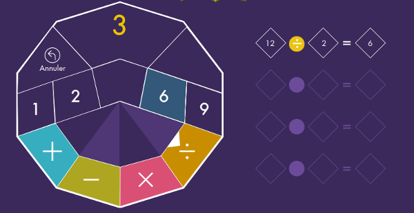
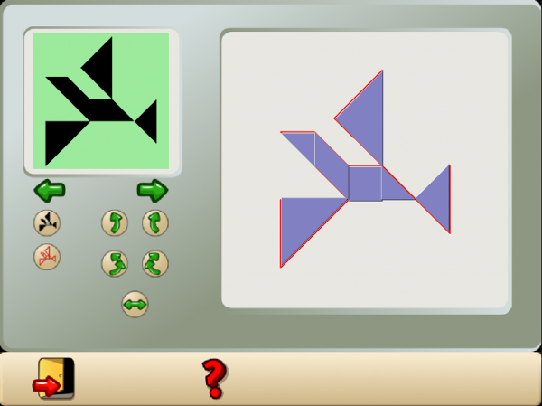
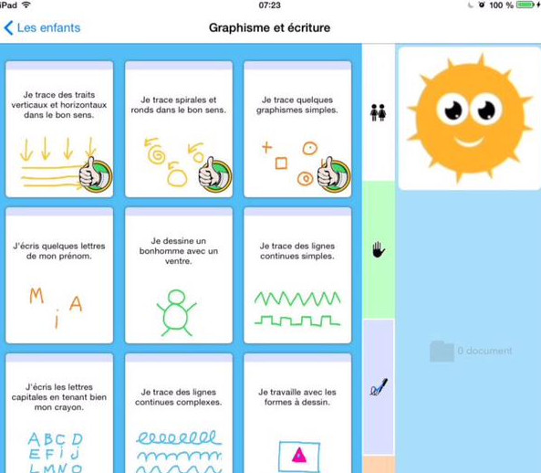
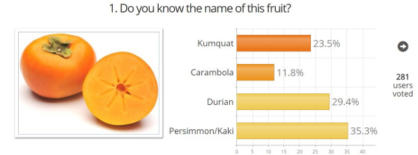
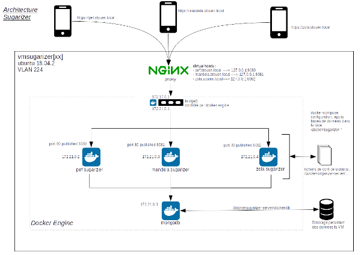

# GSoC 2020 Ideas

   * [Port Sugar and core activities to Python 3](#port-sugar-and-core-activities-to-python-3)
   * [Improve and maintain 25 Sugar activities](#improve-and-maintain-25-sugar-activities)
   * [Export Music Blocks code to JavaScript](#export-music-blocks-code-to-javascript)
   * [Colored desktop and activity icons](#colored-desktop-and-activity-icons)
   * [Port Sugarizer activities to Sugar](#port-sugarizer-activities-to-sugar)
   * [Fedora advocacy for Sugar](#fedora-advocacy-for-sugar)
   * [Debian advocacy for Sugar](#debian-advocacy-for-sugar)
   * [Sugar app store for Python 3 activities (aslov4)](#sugar-app-store-for-python-3-activities-aslov4)
   * [Resolve 100 issues in Music Blocks](#resolve-100-issues-in-music-blocks)
   * [Model–View–Controller refactoring for Music Blocks](#modelviewcontroller-refactoring-for-music-blocks)
   * [Sugarizer game activity pack](#sugarizer-game-activity-pack)
   * [Sugarizer knowledge activity pack](#sugarizer-knowledge-activity-pack)
   * [Sugarizer School Portal](#sugarizer-school-portal)
   
[Administrative notes](#administrative-notes)

------------

## Port Sugar and core activities to Python 3

**Selected** 
Nobody.

**Prerequisites** 
 - Experience with Python
 - Experience with porting telepathy bindings
 - Strong experience with
   [Sugar Desktop](https://github.com/sugarlabs/sugar) and activities

**Description**  Support for Python 2 was withdrawn by the Python
Foundation, so we need to finish the move to Python 3.  The move was
started in GSoC 2018, and continued in GSoC 2020, but there is still
work to be done.  Sugar 0.116 runs on Python 2 or Python 3.  Core
activities run on Python 3.  Many other activities run on Python 2.
Many regressions have been seen as a result of code not being tested.

We have a [Python 3 Porting
Guide](https://github.com/sugarlabs/sugar-docs/blob/master/src/python-porting-guide.md)
which describes the process for activities.

**Project Task Checklist** 
 - Review the Sugar source code changes since 0.112 that were made for porting to Python 3,
 - Design tests and iterate until the tests have sufficient [coverage](https://github.com/sugarlabs/sugar-docs/blob/master/src/python-coverage-guide.md) for the code changes identified about,
 - Fix regressions in Sugar, the Toolkit, and the Datastore,
 - For affected activities, port Telepathy bindings to TelepathyGLib, see [Port to TelepathyGLib](https://github.com/orgs/sugarlabs/projects/4).
 - For affected activities, port to the latest Sugargame or CollabWrapper library,
 - Port activities to Python 3, fixing any problems that prevent them from being ported or used,

See GitHub Project [Port to Python 3 via
six](https://github.com/orgs/sugarlabs/projects/1) for some open
issues and pull requests.  Most activities do not have issues.  Some
activities have problems that prevent them from being ported.

The Telepathy library is used by some activities for network
collaboration between Sugar users.  The library does not have static
bindings for Python 3, so porting Telepathy to the PyGObject binding
is a prerequisite, see GitHub Project [Port to
TelepathyGLib](https://github.com/orgs/sugarlabs/projects/4).

**Coding Mentors** 
[James Cameron](https://github.com/quozl) (via mailing list)

**Assisting Mentors** 
None.

------------

## Improve and maintain 25 Sugar activities

**Selected** 
Nobody.

**Prerequisites** 
 - Experience with Python
 - Strong experience with Sugar activities
 - Experience with maintaining activities on ASLO

**Description** 
Sugar has a lot of activities, with 250+ on GitHub, and more
elsewhere. These have scope for improvement; bugs,
features, updated human translations, and release.  This project will involve
working on at least 25 activities to improve them. Students can choose
activities on their own, and are encouraged to select activities which
are either a part of Fructose or have a strong pedagogical value. To
understand how to locate and work on activities, see our guide to
[Modifying
Activities](https://github.com/sugarlabs/sugar-docs/blob/master/src/contributing.md#modifying-activities)

In their proposal, students may mention _some_ of the issues they will
work on.  Any new feature suggestion should be discussed on GitHub
Issues before being added to a proposal.

Since there are a lot of activities to work on, **more than one instance
of this project may be selected**.

**Suggested Issues to work on:** 
 - jukebox-activity: [#22 Add collaboration for sharing playlist items](https://github.com/sugarlabs/jukebox-activity/issues/22)

Other issues will have been raised since.

Suggesting or adding features, fixing bugs, or releasing activities
will help you to gain experience

**Coding Mentors** 
[James Cameron](https://github.com/quozl) and
[Ibiam Chihurumnaya](https://github.com/chimosky) (via mailing list).

**Assisting Mentors** 
None.

------------

## Export Music Blocks code to JavaScript

**Selected** 
Nobody.

**Prerequisites** 
 - Experience with JavaScript
 - Some experience of working on [Music
   Blocks](https://github.com/sugarlabs/musicblocks) or [Turtle
   Blocks](https://github.com/sugarlabs/turtleblocksjs)

**Description** 

Music Blocks is written in JavaScript and runs in a web browser. User
create programs in a snap-together block language which is inspired by
Logo. Music Blocks is a fork of Turtle Blocks JS, which is turn is a
derivative of [Turtle
Blocks](https://github.com/sugarlabs/turtleart-activity), which is
written in Python.

One feature of the Python code is the ability to export to Python. In
other words, the block code can be exported as Python and run directly
by a Python interpreter. The required libraries, e.g., GTK, are
imported and the code itself reads as if the Turtle Blocks project
were written in Python. (There are a few anomalies, such as the use of
a dictionary for all of the Turtle Block boxes, although they are in
fact implemented as a dictionary internally.) See [Python
Export](https://wiki.sugarlabs.org/images/1/1a/Final_Report_on_Turtle_Blocks_Python_export.pdf)
for more details.

The goal of this project is to provide similar functionality for Music
Blocks: an export of a project to a JavaScript program (and HTML file)
that can run in a browser. The code should look and feel as much like
JavaScript as possible.

**Suggested issues to work on:** 
 - There are not any issues specific to this project, but working on
   some open bugs would be a good place to start in understanding the
   code base. [Bug](https://github.com/sugarlabs/musicblocks/issues?utf8=%E2%9C%93&q=is%3Aissue+is%3Aopen+label%3Abug+)

**Coding Mentors** 
_unverified_: [Vaibhav Aren](https://github.com/vaibhavdaren) and
[Walter Bender](https://github.com/walterbender)

**Assisting Mentors** 
_unverified_: [Jaskirat Singh](https://github.com/jaskirat2000),
_unverified_: [Sumit Srivastava](https://github.com/sum2it), and
_unverified_: [Devin Ulibarri](https://github.com/pikurasa).

--------------

## Colored desktop and activity icons

**Selected** 
Nobody.

**Prerequisites** 
- Extensive experience with Python and GTK3
- Experience with Sugar activities/toolkit
- Experience with user interface and graphics design (and SVG)

**Description** 
Sugar’s use of color and icons (described in detail here [HIG
color](https://wiki.sugarlabs.org/go/Human_Interface_Guidelines/The_Sugar_Interface/Colors)
and [HIG
icons](https://wiki.sugarlabs.org/go/Human_Interface_Guidelines/The_Sugar_Interface/Icons))
is functional but a bit tired when compared to modern desktops and
mobile systems.

This project is about redesigning the use of color in Sugar in order
to enable full-color icons for both the desktop itself and activities.

The primary role of color in the current icon design is to;
 - Indicate whether or not an activity has been used
 - Indicate whether or not an activity is being shared with another
   Sugar user (the colors of the person who launches the activity show
   up on the desktops of the people who join the activity.)

Fortunately, Sugar also support a mechanism for putting badges on
icons. An example is in the neighborhood view, where badges are used
to indicate which access points are active (See
[networkviews.py](https://github.com/sugarlabs/sugar/blob/master/src/jarabe/desktop/networkviews.py)).

We could use badges (See
[icon.py](https://github.com/sugarlabs/sugar-toolkit-gtk3/blob/master/src/sugar3/graphics/icon.py#L49))
to replace the functionality of color described above: for example, an
XO badge to indicate an activity has been used. And the color of that
badge could indicate collaboration. This would free up the icon itself
to take on any colors deemed suitable by the activity designer.

**Project Task:** 
 - [ ] Add color functionality to the badges;
 - [ ] Add badges in every instance where we currently use color: the
       desktop, the journal, the neighborhood view and the activity
       toolbar;
 - [ ] Work with the design team to come up with new color icons for
       all of the core Sugar toolbars, activities and activity toolbars

**Suggested issues to work on:** 
 - There are not any issues specific to this project, but working on
   some open bugs would be a good place to start in understanding the
   code base.

**Coding Mentors** 
[Walter Bender](https://github.com/walterbender) and

**Assisting Mentors** 
_unverified_: [Peace Ojemeh](https://github.com/perriefidelis) and
_unverified_: [Jaskirat Singh](https://github.com/jaskirat2000)

------------

## Port Sugarizer activities to Sugar

**Selected** 
Nobody.

**Prerequisites** 
 - Ability to write in programming languages like Python, GTK, JavaScript

**Description** 
The main aim of this project is to port [sugarizer activities](https://github.com/llaske/sugarizer/tree/dev/activities) back to Sugar Desktop.. Among these sugarizer activities, we also intend to Port Scratch and music blocks to Sugar Desktop.
[Scratch](https://scratch.mit.edu/) is a block based visual programming language for kids. Scratch 3.0 was created with HTML 5 using [Google’s blocky](https://developers.google.com/blockly/). Scratch 3.0 is an activity in Sugarizer, and can work offline. Scratch 3.0 works in the Browse activity in Sugar, but is online.

-We expect the [Sugarizer Scratch activity](https://github.com/llaske/sugarizer/tree/dev/activities/Scratch.activity) to be used.  This was ported by [Emily Ong](https://github.com/EmilyOng/Scratch.activity) and has been improved since by [Lionel Laské](https://github.com/llaske).  Also needed may be the latest version of [Scratch 3.0](https://github.com/LLK/scratch-gui).

 -We expect the [Sugar web activity library `sugar-web`](https://github.com/sugarlabs/sugar-web) will need fixes backported from Sugarizer.

-We expect the [Sugar Toolkit for GTK+ 3 `sugar-toolkit-gtk3`](https://github.com/sugarlabs/sugar-toolkit-gtk3) may need new fixes.

Suggested issues to work on:

- backport the changes from Sugarizer to `sugar-web`, such as in [`env.js`](https://github.com/sugarlabs/sugar-web/blob/master/env.js#L49),
 - Suggesting or adding features, fixing bugs, or releasing activities will help you to gain experience	Suggesting or adding features, fixing bugs, or releasing activities may help you to gain experience.

Steps to take:
1. [Setup a Development Environment](https://github.com/sugarlabs/sugar/blob/master/docs/development-environment.md)
2. Fix all [issues](https://github.com/sugarlabs/sugar-web/issues) listed on the sugar-web repository
3. Fix [sugar-web](https://github.com/sugarlabs/sugar-web) and make sure it works.
4. Test some [Sugarizer activities](https://github.com/llaske/sugarizer/tree/dev/activities) on Sugar to make sure sugar-web is working.
5. Investigate the current [Scratch 3.0 port](https://github.com/llaske/sugarizer/tree/dev/activities/Scratch.activity) on Sugarizer and play around it.
6. Fix the user media permission request handing in [Browse](https://github.com/sugarlabs/browse-activity/issues/85) activity
7. Get [Music Blocks](https://github.com/sugarlabs/musicblocks) working in Sugar Web
8. Get [Scratch](https://github.com/LLK/scratch-gui) working in Sugar Web
9. Make Scratch port as a native activity.
10. Make Music Blocks port as a native activity

**Coding Mentors** 
[James Cameron](https://github.com/quozl) and
[Iqra Mohammad](https://github.com/iqraceme) (via mailing list)

**Assistant Mentors** 
_unverified_: [Samson Goddy](https://github.com/samswag)

------------

## Fedora advocacy for Sugar

**Selected** 
Nobody.

**Prerequisites** 
 - Ability to install Linux,
 - Ability to test all features of a software package,
 - Ability to write in International English for communication with Open Source communities,

**Description** 

Fedora Project make Sugar on a Stick, a bootable live environment containing Sugar and selected activities.

Sugar on a Stick depends on Fedora packaging of Sugar and activities.

Fedora project needs help, and this help would benefit Sugar Labs;
 - Test Sugar on Fedora latest release and testing release (rawhide),
 - Test Sugar on a Stick,
 - Report bugs to Sugar Labs, where those bugs are due to our source code,
 - Report bugs to Fedora, where those bugs are due to Fedora packaging decisions.
 - Fix bugs and participate in peer review with the respective community.

**Coding Mentors** 
[James Cameron](https://github.com/quozl) (via mailing list)

**Assistant Mentors** 
None.

------------

## Debian advocacy for Sugar

**Selected** 
Nobody.

**Prerequisites** 
 - Ability to install Linux,
 - Ability to test all features of a software package,
 - Ability to write in International English for communication with Open Source communities,

**Description** 

Debian is a Linux distribution composed of free and open-source software, developed by the community-supported Debian Project.  Ubuntu is a free and open-source Linux distribution based on Debian.

Debian volunteers make software packages of Sugar and selected activities and make them available for installation.  Ubuntu brings these packages into their distribution.

Sugar Labs makes a Sugar Live Build based on Debian, using Sugar and activity source code, and not the Debian software packages.

Debian Project needs help, and this help would benefit Sugar Labs;
 - Test Sugar on Debian latest release (Debian 10 aka Buster), testing release (Debian 11 aka Bullseye), and experimental release (sid),
 - Test Sugar Live Build,
 - Report bugs to Sugar Labs, where those bugs are due to our source code,
 - Report bugs to Debian, where those bugs are due to Debian packaging decisions.
 - Fix bugs and participate in peer review with the respective community.

**Coding Mentors** 
[James Cameron](https://github.com/quozl) (via mailing list)

**Assistant Mentors** 
None.

------------

## Sugar app store for Python 3 activities (aslov4)

**Selected** 
Nobody.

**Prerequisites** 
 - Ability to write programs in Python,
 - Ability to design and write web pages that use HTML5 and JavaScript,

**Description** 

Create the simplest possible app store for Sugar activities, where
each activity included has been (a) ported to Python 3 and released,
and (b) tested on Sugar Live Build.

We used to have an app store for Sugar activities, but because we
can't seem to attract any PHP developers the app store has failed to
keep up with development.

We now use activities.sugarlabs.org for Python 2 activities only.

We have tried to make a replacement for activities.sugarlabs.org three
times, and each time the features we need were not finished.  These
projects have been too ambitious and have not been supported
collectively by the Sugar Labs community.

Minimum Requirements;

 - support activity bundles uploaded via ssh,
 - detect User-Agent of Fedora 18 systems running Sugar 0.112 or earlier, and redirect to activities.sugarlabs.org,
 - provide a list of all activity bundles,
 - provide activity bundle download, using the correct Content-Type,
 - provide search of activity bundles (using title, description, or other keywords),
 - support Sugar's microformat software upgrade feature in My Settings,

Optional requirements;

 - for a specific list of activities, access the source repository and detect any change to a release tag (publish), create a bundle and extract release notes,
 - display in Browse if an activity bundle is already installed, (requires integration between Sugar on the local system and the web app),
 - download counts,
 - graphic design, style and appearance,

Non-requirements; things we don't want to have to do;

 - any changes to activity metadata files `activity/activity.info`,

Project Scheduling;

 - a working prototype with minimum requirements must be ready within the first two weeks,
 - once approved, the Browse activity is to be changed to point to the service, and Sugar's software upgrade feature changed,

**Coding Mentors** 
[James Cameron](https://github.com/quozl) (via mailing list)

**Assistant Mentors** 
None.

------------

## Resolve 100 issues in Music Blocks
**Selected** 
Nobody.

**Prerequisites** 
 - Experience with JavaScript
 - Some experience of working on [Music
   Blocks](https://github.com/sugarlabs/musicblocks) or [Turtle
   Blocks](https://github.com/sugarlabs/turtleblocksjs)

**Description** 

There are 200+ open [issues on Music
Blocks](https://github.com/sugarlabs/musicblocks/issues). Some are
[trivial](https://github.com/sugarlabs/musicblocks/issues/1967) and
some will require some [major
effort](https://github.com/sugarlabs/musicblocks/issues/2020) to
resolve. But a dedicated effort could probably tackle half of them --
on average one a day -- over the course of GSoC.

As part of your application, prepare a schedule of which issues you
plan to work on.

**Coding Mentors** 
[Walter Bender](https://github.com/walterbender)
[Favour Kelvin](favourkelvin17@gmail.com)

**Assisting Mentors** 
[Devin Ulibarri](https://github.com/pikurasa).

------------
## Model–View–Controller refactoring for Music Blocks

Model–View–Controller is a software design approach used for
developing user interfaces that divides the program logic into three
interconnected elements to separate internal representations of
information from the ways information is presented to and accepted
from the user. (See
https://en.wikipedia.org/wiki/Model%E2%80%93view%E2%80%93controller)

Music Blocks intermixes it program logic to the point where it is
getting difficult to maintain. This project is to take a deep dive
into the code in order to develop a plan (your proposal) and implement
a refactoring along the lines of MVC.

We made [some
progress](https://github.com/sugarlabs/musicblocks/commit/3085a99a7259d9d30522daaf1da2c831d0b4bda2)
on MVC during GCI, but there is much more to be done.

**Coding Mentors** 
[Walter Bender](https://github.com/walterbender)
[Favour Kelvin](favourkelvin17@gmail.com)

**Assisting Mentors** 
[Devin Ulibarri](https://github.com/pikurasa).

------------

## Sugarizer game activity pack

**Selected**

Nobody.

**Prerequisites**

- Experience with JavaScript/HTML5 development
- Experience with Vue.js framework development

**Description**

The goal of this project is to develop new Sugarizer activities needed by teachers from [Sugarizer deployment in Saint-Ouen](https://wiki.sugarlabs.org/go/Sugarizer_Saint-Ouen_deployment).

Specifically, the goal of this project is to develop two new games:

- A Mind Math activity
- A Tangram activity

*Mind Math Activity*

The Mind Math activity will be a game to practice mathematics in a different way.  The student is given five random numbers and should use the four basic arithmetic operations (+, -, ×, ÷) to build an operation that will result in the given output.

Two levels of difficulty will be proposed:

- an easy level with a chosen number between 10 and 69
- a medium level with a chosen number between 0 and 99

The difficulty level could also be increased by making some operations mandatory.

The user will have five random numbers (one between 1-4, one between 1-6, one between 1-8, one between 1-12 and one between 1-20) and 4 slots to find the chosen number. The user will be able to undo an operation.

The score will depend of:

- Number of slots used (more is better)
- Bonus when all four arithmetic operations are used
- Bonus depending on the time spent to solve the challenge

The game could be played alone or against other users on the network. In one-player mode, a solver should be integrated to help the user and show the best result at the end. In multiple-players mode, a leader board will be displayed.

The detailed game play will be discussed with the project mentor but following is a non-exhaustive list of inspiration:

- [https://www.mathador.fr/](https://www.mathador.fr/)
- [https://www.solumaths.com/en/play-app-math-games-kids/countdown](https://www.solumaths.com/en/play-app-math-games-kids/countdown)
- [https://www.logicieleducatif.fr/math/calcul/compte_est_bon_junior.php](https://www.logicieleducatif.fr/math/calcul/compte_est_bon_junior.php)

*Tangram Activity*

The Tangram activity will be an activity to play the traditional [Tangram game](https://en.wikipedia.org/wiki/Tangram).

The Tangram activity will present a set of Tangram pieces to the right of the screen and a canvas where the user should form a specific shape using these pieces to the left of the screen.

Two levels of difficulty could be proposed:

- an easy level where the user knows where each piece should be set on the shape and just have to move/rotate the right piece to the right place
- a medium level where the user should guess where each piece should be set and move/rotate it to the right place

The difficulty level could also depend on the complexity of the shape.

The detailed game play will be discussed with the project mentor but here is a non-exhaustive list of inspiration:

- [http://activities.sugarlabs.org/en/sugar/addon/4186](http://activities.sugarlabs.org/en/sugar/addon/4186)
- [https://freegames.org/tangrams/](https://freegames.org/tangrams/)
- [https://www.abcya.com/games/tangrams](https://www.abcya.com/games/tangrams)
- [https://www.giochi.it/gioco/kids-tangram](https://www.giochi.it/gioco/kids-tangram)
- [https://www.tangram-channel.com/](https://www.tangram-channel.com/)

**Project Tasks**

These new activities should provide unique Sugarizer features:

- Sugarizer look & feel: use of Sugar toolbar and palette
- Sugarizer storage: load/save content into the Journal
- Network integration: integrate Sugarizer presence to share the activity on the network so that multiple users could play together
- Responsive: content should adapt to any screen size, a fullscreen button should allow to mask the toolbar for smaller screens
- Multi-device support: should work on any browser (Chrome, Firefox, Safari) and any platform (Android, iOS, Windows, Linux, MacOS) supported by Sugarizer
- Tutorial: an integrated documentation should be integrated to explain each feature of the activity

As with other Sugarizer activities, the new activities should be written using JavaScript and Sugar-Web library. We recommend also to use the Vue.js framework.

**First steps to start:**

- Complete the [Sugarizer activity development tutorial](https://github.com/llaske/sugarizer/blob/dev/docs/tutorial.md)
- Complete the [Chessboard task](https://github.com/llaske/sugarizer/issues/592)
- Explore the list of inspiration provided above
- Study the [source code](https://github.com/llaske/sugarizer/tree/dev/activities/Calligra.activity) of the Calligra activity, a Sugarizer activity developed with the Vue.js framework
- Learn about [Vue.js](https://vuejs.org) framework and complete the Vue.js tutorial
- Propose a game play for these activities

**Coding Mentors**

[Ashish Aggarwal](https://github.com/ashish0910) and [Lionel Laské](https://github.com/llaske) (via direct mail)

**Assisting Mentors**

Nobody.

------------

## Sugarizer knowledge activity pack

**Selected**

Nobody.

**Prerequisites**

- Experience with JavaScript/HTML5 development
- Experience with Vue.js framework development

**Description**

The objective of this project is to develop new Sugarizer activities requested by teachers from [Sugarizer deployment in Saint-Ouen](https://wiki.sugarlabs.org/go/Sugarizer_Saint-Ouen_deployment).

Specifically, the objective of this project is to develop two new activities:

- A Curriculum activity
- A Vote activity

*Curriculum Activity*

The Curriculum activity will be a way for a student to self check its skill in a set of knowledge and provide multimedia element to demonstrate these skills.

The Curriculum activity will display a hierarchical set of skills grouped by categories then let the user explore the tree. On each skill the user should be able to validate (i.e. skill acquired) and provide multimedia elements (pictures or sounds coming from Journal) to demonstrate the skill.

The Curriculum activity will provide a settings mode to edit the set of skills: Create/Update/Delete/Sort skills or categories. A category should have a title and a color, a skill should have a title and an image.
It should be possible to generate a Word/ODT document with all skills and dated multimedia elements.
It should be possible to share its skills on the network.

The detailed features will be discussed with the project mentor but the inspiration of this activity came from [JeValide](http://classetice.fr/spip.php?article437) application.

*Vote Activity*

The Vote activity will allow easily to build a poll system. The user create a poll (yes/no, choose a value in a list, enter a value) then share it on the network so any user could vote in real time. At the end of the vote, a screen will sum up results of the vote: stats, who vote for what, who vote first, ...

The design of the Vote activity could be inspired by the Exerciser activity:

- A home screen allow to quickly choose a poll template and run the vote
- A setting screen allow user to create new poll or customize a poll

A poll is a label (question) and could integrate a multimedia element (image, audio, video, speech to text).

The detailed features for this activity will be discussed with the project mentor but following is a non-exhaustive list of inspiration:

- [https://www.speechi.net/en/home/assess/free-interactive-voting-system-mobile-application/](https://www.speechi.net/en/home/assess/free-interactive-voting-system-mobile-application/)
- [https://www.voxvote.com/](https://www.voxvote.com/)

**Project Tasks**
These new activities should provide unique Sugarizer features:

- Sugarizer look & feel: use of Sugar toolbar and palette
- Sugarizer storage: load/save content into the Journal
- Network integration: integrate Sugarizer presence to share the activity on the network so multiple users could play together
- Responsive: content should adapt to any screen size, a fullscreen button should allow to mask the toolbar for smaller screens
- Multi-device support: should work on any browser (Chrome, Firefox, Safari) and any platform (Android, iOS, Windows, Linux, MacOS) supported by Sugarizer
- Tutorial: an integrated documentation should be integrated to explain each feature of the activity

As with other Sugarizer activities, the new activities should be written using JavaScript and Sugar-Web library. We recommand also to use the Vue.js framework.

**Fist step to start:**

- Complete the [Sugarizer activity development tutorial](https://github.com/llaske/sugarizer/blob/dev/docs/tutorial.md)
- Complete the [Chessboard task](https://github.com/llaske/sugarizer/issues/592)
- Explore the list of inspiration provided above
- Study the [source code](https://github.com/llaske/sugarizer/tree/dev/activities/Calligra.activity) of the Calligra activity, a Sugarizer activity developped with the Vue.js framework
- Learn about [Vue.js](https://vuejs.org) framework and complete the Vue.js tutorial
- Propose a game play for these activities

**Coding Mentors**

[Lionel Laské](https://github.com/llaske) and [Michaël Ohayon](https://github.com/mikklfr) (via direct mail)

**Assisting Mentors**

Nobody.

------------

## Sugarizer School Portal

**Selected**

Nobody.

**Prerequisites**

- Experience with JavaScript/HTML5 development
- Experience with node.js and EJS framework
- Experience with Docker and Kubernetes
- Experience with Ansible

**Description**

Sugarizer School Portal is a new tool in the Sugarizer family to provide a way, for schools interested by Sugarizer, to host and manage themselves their Sugarizer deployment. More precisely, the idea is to provide an on-demand (SaaS) Sugarizer Server deployment tool. So, every school will be able in few clicks to create a Sugarizer Server to host its own deployment without any technical skill.

Under the hood, Sugarizer School Portal will be a Kubernetes server that should be able to create/manage on demand new Sugarizer Server docker instances. Some Kubernetes services should be realized to handle: traffic redirection, data persistance, rolling update, secure access,...

A web interface will be created to let users ask for a new deployment. This web interface will integrate a dashboard to let super administrator follow number of deployments and usage of each deployment to be able to resize the infrastructure if need.

Finally, to easily deploy Sugarizer Server, an Ansible package will be realized.

It's important to note than some Sugarizer Server improvements could be required, for example the replacement of MongoDB by another database.

**Project Tasks**

- Create a Kubernetes infrastructure that could deploy on demand Sugarizer Server instance
- Create an Ansible package to install Sugarizer Server and Sugarizer
- Create a set of scripts to handle deployment/removal of a new Docker instance
- Create a set of scripts to extract stats usage of Sugarizer Server
- Create a web interface to let users ask for a new deployment
- Create a web dashboard to let super administrator manage instances deployment and usage

Some other features could be added to this list depending of feedbacks on the field.

**Fist step to start:**

- Complete the [Sugarizer activity development tutorial](https://github.com/llaske/sugarizer/blob/dev/docs/tutorial.md) to understand how Sugarizer work
- Complete the [Chessboard task](https://github.com/llaske/sugarizer/issues/592)
- Install [Sugarizer Server](https://github.com/llaske/sugarizer-server/tree/dev) and dashboard using Docker and explore the Docker compose file provided with Sugarizer Server
- Create different Sugarizer users and see how the dashboard trace activities and usage works
- Study the [source code](https://github.com/llaske/sugarizer-server/tree/dev/dashboard) of dashboard
- Learn about [Kubernetes](https://kubernetes.io/) and complete the [Kubernetes tutorial](https://kubernetes.io/docs/tutorials/)
- Learn about [Ansible](https://www.ansible.com/) and complete the [Ansible tutorial](https://www.ansible.com/resources/get-started). Install [IIAB](https://github.com/iiab/iiab), test use of Sugarizer throught IIAB and study the way of working of [IIAB](https://github.com/iiab/iiab) Ansible packages

**Coding Mentors**

[Michaël Ohayon](https://github.com/mikklfr) and [Lionel Laské](https://github.com/llaske) (via direct mail)

**Assisting Mentors**

Nobody.

------------

# Administrative notes

Above are a list of ideas we've planned for GSoC 2020 projects.
If you have any ideas which can be useful to us, but are not in the
list, we'd love to hear from you.  You need not be a potential
student or a mentor to suggest ideas.

   * [Criteria for Ideas](#criteria-for-ideas)
   * [Coding Mentors](#coding-mentors)
   * [Assisting Mentors](#assisting-mentors)
   * [Everyone Else](#everyone-else)
   * [Suggested Issues](#suggested-issues)

## Criteria for Ideas
1. Does it fill an empty pedagogy niche in the activity set for Sugar
   or Sugarizer,
2. Does it increase quality of our software products (Sugar, activities,
   Music Blocks, or Sugarizer),
3. Does it _not_ involve any project infrastructure, e.g. not another
   app store, web site, or developer landing page,
4. Do we have a developer _now_ who would be willing and able to do it
   if a student was not available, and who can _promise_ to do it if a
   student is not selected; these are shown as a _coding mentor_,

## Coding Mentors
For each idea, we must have offers from one or more _coding mentors_
willing and able to assist students with coding questions.

Requirements for a _coding mentor_ are a demonstrated coding ability
in the form of contributions of code to Sugar Labs.

Mentors for a project will be assigned after proposals are received.

## Assisting Mentors
For each idea, we may have offers from mentors _who do not code_
willing to assist students in various other ways, such as gathering
requirements, visual design, testing, and deployment; these are shown
as an _assisting mentor_.

The only requirement for an _assisting mentor_ is _knowledge of the
project_.

Mentors for a project will be assigned after proposals are received.

## Everyone Else
Everyone else in Sugar Labs may also be involved with these projects, through mailing lists, Wiki, and GitHub.

The difference between a _mentor_ and _everyone else_, is that a
_mentor_ is obliged to respond when a student has a question, even if
the answer is "I don't know."

When a _mentor_ receives a question for which the best forum is
_everyone else_, then they are to respectively redirect the student to
ask _everyone else_.  See
[Be flexible](https://github.com/sugarlabs/sugar-docs/blob/master/src/CODE_OF_CONDUCT.md#be-flexible)
and
[When you are unsure, ask for help](https://github.com/sugarlabs/sugar-docs/blob/master/src/CODE_OF_CONDUCT.md#when-you-are-unsure-ask-for-help)
in our Code of Conduct.

## Suggested Issues

For some ideas, there is a list of 'Suggested issues to work on'.
These may help you to get familiar with the project.  The more you
work on these issues, the more experienced you will be for the
project.  However, this is not a strict list.  You _should_ try and
explore other issues as well.
