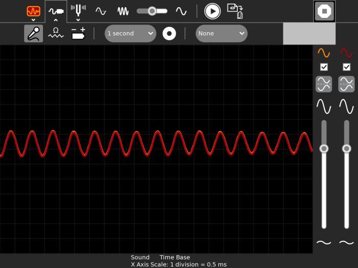
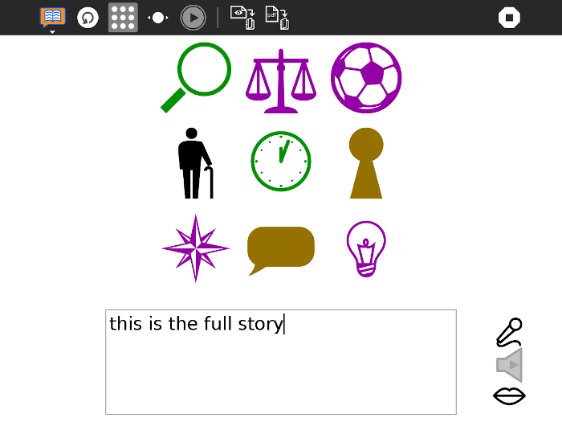

# GSoC 2021 Ideas

## Project Ideas

   * [Port Sugar and core activities to Python 3](#port-sugar-and-core-activities-to-python-3)
   * [Improve and maintain 15 Sugar activities](#improve-and-maintain-15-sugar-activities)
   * [Music Blocks Block Graphics Refactoring](#music-blocks-block-graphics-refactoring)
   * [Music Blocks Menus and Palettes](#music-blocks-menus-and-palettes)
   * [Music Blocks Debugging Aids](#music-blocks-debugging-aids)
   * [Sugarizer Measure activity](#sugarizer-measure-activity)
   * [Sugarizer Story activity](#sugarizer-story-activity)
   * [Port ASLOv1 to PHP8](#port-aslov1-to-php8)

[Administrative notes](#administrative-notes)

------------

## Port Sugar and core activities to Python 3

**Prerequisites** 
 - Experience with Python
 - Experience with porting telepathy bindings
 - Strong experience with
   [Sugar Desktop](https://github.com/sugarlabs/sugar) and activities

**Description**  Support for Python 2 was withdrawn by the Python
Foundation, so we need to finish the move to Python 3.  The move was
started in GSoC 2018, and continued in GSoC 2020, but there is still
work to be done.  Sugar 0.116 runs on Python 2 or Python 3.  Core
activities run on Python 3.  Many other activities run on Python 2.
Many regressions have been seen as a result of code not being tested.

We have a [Python 3 Porting
Guide](https://github.com/sugarlabs/sugar-docs/blob/master/src/python-porting-guide.md)
which describes the process for activities.

**Project Task Checklist** 
 - Review the Sugar source code changes since 0.112 that were made for porting to Python 3,
 - Design tests and iterate until the tests have sufficient [coverage](https://github.com/sugarlabs/sugar-docs/blob/master/src/python-coverage-guide.md) for the code changes identified about,
 - Fix regressions in Sugar, the Toolkit, and the Datastore,
 - For affected activities, port Telepathy bindings to TelepathyGLib, see [Port to TelepathyGLib](https://github.com/orgs/sugarlabs/projects/4).
 - For affected activities, port to the latest Sugargame or CollabWrapper library,
 - Port activities to Python 3, fixing any problems that prevent them from being ported or used,

See GitHub Project [Port to Python 3 via
six](https://github.com/orgs/sugarlabs/projects/1) for some open
issues and pull requests.  Most activities do not have issues.  Some
activities have problems that prevent them from being ported.

The Telepathy library is used by some activities for network
collaboration between Sugar users.  The library does not have static
bindings for Python 3, so porting Telepathy to the PyGObject binding
is a prerequisite, see GitHub Project [Port to
TelepathyGLib](https://github.com/orgs/sugarlabs/projects/4).

**Coding Mentors** 
[Jui Pradhan](https://github.com/JuiP), [Srevin Saju](https://github.com/srevinsaju), [Saumya Mishra](https://github.com/Saumya-Mishra9129)

**Assisting Mentors** 
To be added.

------------

## Improve and maintain 15 Sugar activities

**Prerequisites** 
 - Experience with Python
 - Strong experience with Sugar activities
 - Experience with maintaining activities on ASLO and ASLO-v4

**Description** 
Sugar has a lot of activities, with 250+ on GitHub, and more
elsewhere. These have scope for improvement; bugs,
features, updated human translations, and release.  This project will involve
working on **at least 15** activities to improve them. Students can choose
activities on their own, and are encouraged to select activities which
are either a part of Fructose or have a strong pedagogical value. To
understand how to locate and work on activities, see our guide to
[Modifying
Activities](https://github.com/sugarlabs/sugar-docs/blob/master/src/contributing.md#modifying-activities)

In their proposal, students may mention _some_ of the issues they will
work on.  Any new feature suggestion should be discussed on GitHub
Issues or on the mailing list before being added to a proposal.

Since there are a lot of activities to work on, **more than one instance
of this project may be selected**.

**Suggested Issues to work on:** 
 - jukebox-activity: [#22 Add collaboration for sharing playlist items](https://github.com/sugarlabs/jukebox-activity/issues/22)

Other issues will have been raised since.

Suggesting or adding features, fixing bugs, or releasing activities
will help you to gain experience

**Coding Mentors** 
[Jui Pradhan](https://github.com/JuiP), [Srevin Saju](https://github.com/srevinsaju), [Saumya Mishra](https://github.com/Saumya-Mishra9129)

**Assisting Mentors** 
To be added.

------------

## Music Blocks Block Graphics Refactoring

**Prerequisites** 
 - Experience with React (TypeScript)
 - Experience with graphic design
 - Strong experience with SVG

**Description**  We are refactoring Music Blocks. This gives us an opportunity to revisit a number of UX issues, including the design and implementation of the block graphics. One thing that will not change is that we will use SVG for the block graphics, but other than that, we have the opportunity to rethink bot how blocks look (in particular, how they interlock and how they expand/resize) as well as the corresponding code we use to generate the block artwork SVG. Finally, it would be great to use CSS to define many of the block attributes, e.g., color and other styling features, rather than having everything hardcoded in the SVG. (Modern SVG supports this.)

**Project Task Checklist** 
 - Familiarize yourself with the current implementation [blockfactory](https://github.com/sugarlabs/musicblocks/blob/master/js/blockfactory.js)
 - Come up with a framework for how the block interconnections will work -- we'd like to make it more obvious how blocks interlock and also use the interlocking to help define the schemas associated with some block logic.
 - Design the class structure for the new block rendering approach.
 - Implement all of the above in React (TypeScript).

**Coding Mentors** 
[Walter Bender](https://github.com/walterbender),
[Anindya Kundu](https://github.com/meganindya).

**Assisting Mentors** 
None.

------------

## Music Blocks Menus and Palettes

**Prerequisites** 
 - Experience with React (TypeScript).
 - Experience with user interface design
 - Experience with Materials

**Description**  We are refactoring Music Blocks. This gives us an opportunity to revisit a number of UX issues, including the design and implementation of the menu bars and block palettes. We have some sketches as to what it might look like, but your ideas are most welcome.

**Project Task Checklist** 
 - Familiarize yourself with the current implementations [toolbars](https://github.com/sugarlabs/musicblocks/blob/master/js/toolbar.js) [palettes](https://github.com/sugarlabs/musicblocks/blob/master/js/palette.js)
 - Familiarize yourself with the M 2.0 sketches [wireframe](https://github.com/sugarlabs/musicblocks-2/discussions/5)
 - Come up with a framework for the new toolbars and palettes
 - Design the class structure for the toolbars
 - Design the class structure for the palettes
 - Implement all of the above in React (TypeScript).

**Coding Mentors** 
[Anindya Kundu](https://github.com/meganindya),
[Walter Bender](https://github.com/walterbender).

**Assisting Mentors** 
None.

------------

## Port ASLOv1 to PHP8

**Prerequisites** 
 - Experience with PHP
 - Ability to test aslo-v1 against multiple versions of PHP
 - Experience with CakePHP (not required, but preferred)

**Description**  ASLO, which is expanded to Activities (dot) Sugar Labs (dot) org is 
[Sugar's Activity Library](https://wiki.sugarlabs.org/go/Activities) created primarily for Python 2 Activities.
ASLOv1, written in PHP 5, is accessible at [activities.sugarlabs.org](http://activities.sugarlabs.org). 
PHP 5 has reached [its 'end-of-life'](https://www.php.net/supported-versions.php) on January 1st 2019. ASLO v1 uses 
[Remora](https://wiki.mozilla.org/Update:Remora). This is however, no longer maintained. 
It is important to migrate to a newer version, such as PHP 8 (preferred)
or PHP7. 

The source code for ASLO-v1 is available here: [sugarlabs/aslo](https://github.com/sugarlabs/aslo).
Along with the source code, the [Sugar Labs Wiki page for ASLO](https://wiki.sugarlabs.org/go/Service/activities)
is also an inexhaustible resource to help developers get started to ASLO-v1

**Project Task Checklist** 
 - [ ] Port ASLO v1 and its dependencies to PHP 8
 - [ ] Make sure that ASLO v1 works as intended even after the port to PHP 8
 
**Suggested Issues** 
- [ ] Automatically redirect to [v4.activities.sugarlabs.org](https://v4.activities.sugarlabs.org)
      based on the User Agent [#21](https://github.com/sugarlabs/aslo/issues/21).
- [ ] Fix insecure login [#5](https://github.com/sugarlabs/aslo/issues/5)
- [ ] Fix incorrect mimetype on downloads [#13](https://github.com/sugarlabs/aslo/issues/13)
- [ ] Show supported versions [#4](https://github.com/sugarlabs/aslo/issues/4)
 
**Coding Mentors** 
To be added.

**Assisting Mentors** 
To be added.

------------

## Music Blocks Debugging Aids

**Prerequisites** 
 - Experience with React (TypeScript).
 - Experience with user interface design

**Description**  We are refactoring Music Blocks. This gives us an opportunity to revisit a number of UX issues, including the design and implementation of the various tools we provide for debugging. We have some ideas, such as changing the appearing of a block that is throwing an error, better handling of break points, visualizing program status, etc., but your ideas are most welcome.

**Project Task Checklist** 
 - Familiarize yourself with the current debugging features [Debugging](https://github.com/sugarlabs/musicblocks/blob/master/Debugging.md)
 - Come up with a framework for how debugging might work in MB 2.0
 - Implement your ideas -- some coordination will be needed both with the [Music Blocks Block Graphics Refactoring](#music-blocks-block-graphics-refactoring) project and the language interpreter.

**Coding Mentors** 
[Walter Bender](https://github.com/walterbender).
[Anindya Kundu](https://github.com/meganindya),

**Assisting Mentors** 
None.

------------

## Sugarizer Measure activity
Mentor: [Lionel Laské](https://github.com/llaske),
Backup mentor: -.

**Prerequisites** 

 * Experience with JavaScript/HTML5 development
 * Experience with Vue.js framework development
 * Experience with Android and/or iOS development using  Cordova
* Basic knowledge of audio concepts

**Description** Measure activity is an activity written for Sugar and available [here](https://activities.sugarlabs.org/en/sugar/addon/4197).The Measure activity draws a picture of the sound heard by the internal microphone or of the signal present on the microphone socket. More specifically it draws a graph of this input versus time, the input is on the vertical axis and time is on the horizontal axis. That is, the activity functions like a machine called an oscilloscope.
 The objective of this project is to develop a new Sugarizer Measure activity equivalent to the Sugar Measure activity.

 A major complexity to implement this activity is to support Android/iOS platform. On these platforms, direct HTML5 audio capture is not possible so audio input should be captured using a Cordova Plugin that have to be identify.

 The detailed activity feature and implementation will be discussed with the project mentor but here is a non-exhaustive list of inspiration:

- [Sugar Measure activity](https://help.sugarlabs.org/measure.html)
- [Oscilloscope.js](https://sambego.github.io/oscilloscope.js/)
- [Audio oscilloscope](https://github.com/mathiasvr/audio-oscilloscope)
- [Virtual oscilloscope](https://academo.org/demos/virtual-oscilloscope/)
- [Cordova Plugin AudioInput](https://github.com/edimuj/cordova-plugin-audioinput)
- [An incomplete PR with a Measure activity for Sugarizer](https://github.com/llaske/sugarizer/pull/708 )

**Project Tasks**

These new activity should provide unique Sugarizer features:

- Sugarizer look & feel: use of Sugar toolbar and palette
- Sugarizer storage: load/save context into the Journal
- Network integration: integrate Sugarizer presence to share the activity on the network so that multiple users could play together
- Responsive: content should adapt to any screen size, a fullscreen button should allow to mask the toolbar for smaller screens
- Multi-device support: should work on any browser (Chrome, Firefox, Safari) and any platform (Android, iOS, Windows, Linux, MacOS) supported by Sugarizer
- Tutorial: an integrated documentation should be integrated to explain each feature of the activity

As with other Sugarizer activities, the new activity should be written using JavaScript and Sugar-Web library. The activity should be written using the Vue.js framework.

**First steps to start:**

- Complete the [Sugarizer Vue.js activity development tutorial](https://github.com/llaske/sugarizer/blob/dev/docs/tutorial/VueJS/tutorial.md)
- Create a Sugarizer environment to be able to generate Sugarizer for Android/iOS, for example by using [Sugarizer APK Builder](https://github.com/llaske/sugarizer-apkbuilder)
- Test and suggest Cordova Plugin that could be use for the development
- Explore the list of inspiration provided above
- Propose UI and features for this activity

**Coding Mentors** 
[Lionel Laské](https://github.com/llaske).

**Assisting Mentors** 
None.

------------

## Sugarizer Story activity
Mentor: [Lionel Laské](https://github.com/llaske),
Backup mentor: -.

**Prerequisites** 

 * Experience with JavaScript/HTML5 development
 * Experience with Vue.js framework development
 * Experience with Android and/or iOS development using  Cordova

**Description** Story is an activity written for Sugar and available [here](https://activities.sugarlabs.org/en/sugar/addon/4565). The Story Activity uses images to prompt a learner to tell a story. The learner should try to tell a story that ties the images together into a comprehensive narrative.
 The objective of this project is to develop a new Sugarizer Story activity equivalent to the Sugar Story activity.

 One complexity to implement this activity is to handle sound recording. Sound capture is possible using HTML5 feature but is not compatible with Android/iOS where a Cordova Plugin should be use. Once captured the sound should also be able to be played by the activity.

 The detailed activity feature and implementation will be discussed with the project mentor but here is a non-exhaustive list of inspiration:

- [Sugar Story activity](https://help.sugarlabs.org/story.html)
- [Record activity](https://github.com/llaske/sugarizer/tree/dev/activities/Record.activity) to learn how to handle sound recording for each platform
- [Abecedarium journal integration](https://github.com/llaske/sugarizer/blob/master/lib/sugar-web/graphics/journalchooser.js#L342) to learn how to get images coming from Abecedarium database

**Project Tasks**

These new activity should provide unique Sugarizer features:

- Sugarizer look & feel: use of Sugar toolbar and palette
- Sugarizer storage: load/save context into the Journal
- Network integration: integrate Sugarizer presence to share the activity on the network so that multiple users could play together
- Responsive: content should adapt to any screen size, a fullscreen button should allow to mask the toolbar for smaller screens
- Multi-device support: should work on any browser (Chrome, Firefox, Safari) and any platform (Android, iOS, Windows, Linux, MacOS) supported by Sugarizer
- Tutorial: an integrated documentation should be integrated to explain each feature of the activity

As with other Sugarizer activities, the new activity should be written using JavaScript and Sugar-Web library. The activity should be written using the Vue.js framework.

**First steps to start:**

- Complete the [Sugarizer Vue.js activity development tutorial](https://github.com/llaske/sugarizer/blob/dev/docs/tutorial/VueJS/tutorial.md)
- Create a Sugarizer environment to be able to generate Sugarizer for Android/iOS, for example by using [Sugarizer APK Builder](https://github.com/llaske/sugarizer-apkbuilder)
- Explore the code of Record activity to understand how sound recording could be done
- Explore the list of inspiration provided above
- Propose UI and features for this activity

**Coding Mentors** 
[Lionel Laské](https://github.com/llaske).

**Assisting Mentors** 
None.

------------

# Administrative notes

Above are a list of ideas we've planned for GSoC 2021 projects.
If you have any ideas which can be useful to us, but are not in the
list, we'd love to hear from you.  You need not be a potential
student or a mentor to suggest ideas.

   * [Criteria for Ideas](#criteria-for-ideas)
   * [Coding Mentors](#coding-mentors)
   * [Assisting Mentors](#assisting-mentors)
   * [Everyone Else](#everyone-else)
   * [Suggested Issues](#suggested-issues)

## Criteria for Ideas
1. Does it fill an empty pedagogy niche in the activity set for Sugar
   or Sugarizer,
2. Does it increase quality of our software products (Sugar, activities,
   Music Blocks, or Sugarizer),
3. Does it _not_ involve any project infrastructure, e.g. not another
   app store, web site, or developer landing page,
4. Do we have a developer _now_ who would be willing and able to do it
   if a student was not available, and who can _promise_ to do it if a
   student is not selected; these are shown as a _coding mentor_,

## Coding Mentors
For each idea, we must have offers from one or more _coding mentors_
willing and able to assist students with coding questions.

Requirements for a _coding mentor_ are a demonstrated coding ability
in the form of contributions of code to Sugar Labs.

Mentors for a project will be assigned after proposals are received.

## Assisting Mentors
For each idea, we may have offers from mentors _who do not code_
willing to assist students in various other ways, such as gathering
requirements, visual design, testing, and deployment; these are shown
as an _assisting mentor_.

The only requirement for an _assisting mentor_ is _knowledge of the
project_.

Mentors for a project will be assigned after proposals are received.

## Everyone Else
Everyone else in Sugar Labs may also be involved with these projects, through mailing lists, Wiki, and GitHub.

The difference between a _mentor_ and _everyone else_, is that a
_mentor_ is obliged to respond when a student has a question, even if
the answer is "I don't know."

When a _mentor_ receives a question for which the best forum is
_everyone else_, then they are to respectively redirect the student to
ask _everyone else_.  See
[Be flexible](https://github.com/sugarlabs/sugar-docs/blob/master/src/CODE_OF_CONDUCT.md#be-flexible)
and
[When you are unsure, ask for help](https://github.com/sugarlabs/sugar-docs/blob/master/src/CODE_OF_CONDUCT.md#when-you-are-unsure-ask-for-help)
in our Code of Conduct.

## Suggested Issues

For some ideas, there is a list of 'Suggested issues to work on'.
These may help you to get familiar with the project.  The more you
work on these issues, the more experienced you will be for the
project.  However, this is not a strict list.  You _should_ try and
explore other issues as well.
