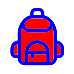
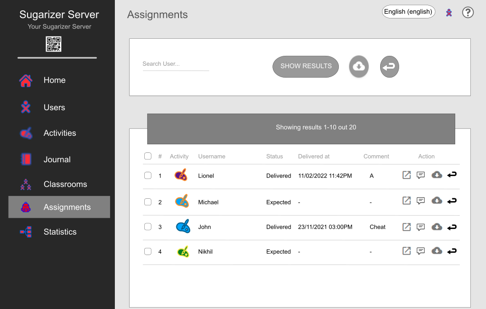
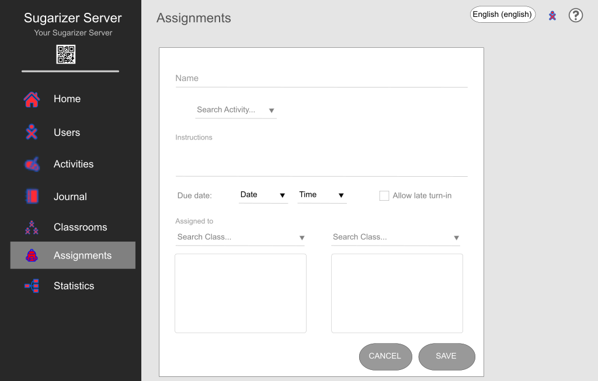
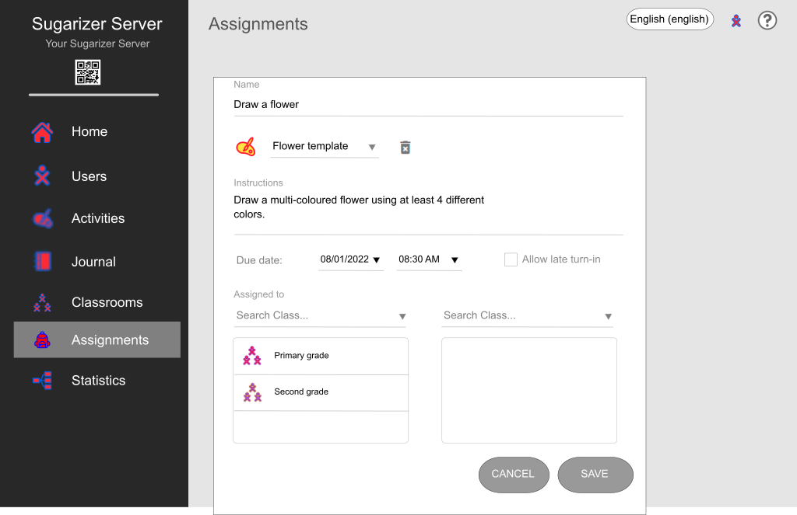
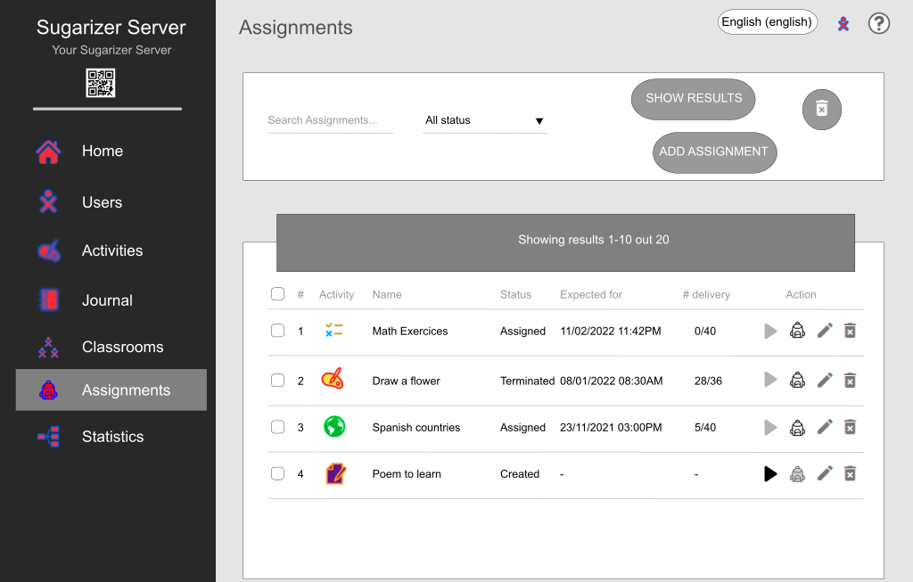

# GSoC 2022 Ideas

[Administrative notes](#administrative-notes)

------------

## Improve and maintain 15 Sugar activities

**Prerequisites** 
 - Experience with Python
 - Strong experience with Sugar activities
 - Experience with maintaining activities on ASLO and ASLO-v4

**Description** 
Sugar has a lot of activities, with 250+ on GitHub, and more
elsewhere. These have scope for improvement; bugs,
features, updated human translations, and release.  This project will involve
working on **at least 15** activities to improve them. Students can choose
activities on their own, and are encouraged to select activities which
are either a part of Fructose or have a strong pedagogical value. To
understand how to locate and work on activities, see our guide to
[Modifying
Activities](https://github.com/sugarlabs/sugar-docs/blob/master/src/contributing.md#modifying-activities)

In their proposal, students may mention _some_ of the issues they will
work on.  Any new feature suggestion should be discussed on GitHub
Issues or on the mailing list before being added to a proposal.

Since there are a lot of activities to work on, **more than one instance
of this project may be selected**.

**Suggested Issues to work on:** 
 - jukebox-activity: [#22 Add collaboration for sharing playlist items](https://github.com/sugarlabs/jukebox-activity/issues/22)

Other issues will have been raised since.

Suggesting or adding features, fixing bugs, or releasing activities
will help you to gain experience

**Coding Mentors** 
[Ibiam Chihurumnaya](https://github.com/chimosky/)

**Assisting Mentors** 
To be added.

------------

## Port Sugar and core activities to Python 3

**Prerequisites** 
 - Experience with Python
 - Experience with porting telepathy bindings
 - Strong experience with
   [Sugar Desktop](https://github.com/sugarlabs/sugar) and activities

**Description**  Support for Python 2 was withdrawn by the Python
Foundation, so we need to finish the move to Python 3.  The move was
started in GSoC 2018, and continued in GSoC 2020, but there is still
work to be done.  Sugar 0.116 runs on Python 2 or Python 3.  Core
activities run on Python 3.  Many other activities run on Python 2.
Many regressions have been seen as a result of code not being tested.

We have a [Python 3 Porting
Guide](https://github.com/sugarlabs/sugar-docs/blob/master/src/python-porting-guide.md)
which describes the process for activities.

**Project Task Checklist** 
 - Review the Sugar source code changes since 0.112 that were made for porting to Python 3,
 - Design tests and iterate until the tests have sufficient [coverage](https://github.com/sugarlabs/sugar-docs/blob/master/src/python-coverage-guide.md) for the code changes identified about,
 - Fix regressions in Sugar, the Toolkit, and the Datastore,
 - For affected activities, port Telepathy bindings to TelepathyGLib, see [Port to TelepathyGLib](https://github.com/orgs/sugarlabs/projects/4).
 - For affected activities, port to the latest Sugargame or CollabWrapper library,
 - Port activities to Python 3, fixing any problems that prevent them from being ported or used,

See GitHub Project [Port to Python 3 via
six](https://github.com/orgs/sugarlabs/projects/1) for some open
issues and pull requests.  Most activities do not have issues.  Some
activities have problems that prevent them from being ported.

The Telepathy library is used by some activities for network
collaboration between Sugar users.  The library does not have static
bindings for Python 3, so porting Telepathy to the PyGObject binding
is a prerequisite, see GitHub Project [Port to
TelepathyGLib](https://github.com/orgs/sugarlabs/projects/4).

**Coding Mentors** 
[Ibiam Chihurumnaya](https://github.com/chimosky/)

**Assisting Mentors** 
To be added.

------------

## Sugarizer Assignments

**Prerequisites** 
- Experience with JavaScript/HTML5 development
- Experience with MongoDB
- Experience with node.js and EJS framework

**Description** 
Objective: Add features to Sugarizer/Sugarizer Server to allow teachers to give assignments to students.

Questions:

* What is an assignment? Something to do by a student in a period of time.
* What could be represented as an assignment in Sugarizer?
 Every activity that could have a context. However it's better if activities have a clear context or result. A document (image, PDF, …) can't be an assignment because it's stateless.
* What are characteristics of an assignment?
   * An activity instance with its context
   * A set of instruction
   * A delivery date/time
   * A state: assigned, started, submitted
* What's the difference between an assignment and a standard journal instance?
   * An assignment should be identified as such
   * An assignment should be submitted once done
   * An assignment can't be change once submitted

**Tasks** 

* Update to implement on [Sugarizer Server](https://github.com/llaske/sugarizer-server):
   * Create new database collection for assignments
   * Create new API for handling assignments
   * Dashboard screens
      * Add assignment counts and an array with latest assignments in the Home screen
      * Create List assignment screen

      * Create Create/Edit assignment screen

      * Create List deliveries screen

* Update to implement on [Sugarizer](https://github.com/llaske/sugarizer):
   * Store assignments in the remote Journal of the user (will be synchronized when the user will be connected)
   * Add a assignments icon and a popup to notify an user that some assignment are expected for him
   * Update the Journal view:
      * Add a specific icon on assignment
      * Change date to indicate the delay to submit (instead of the modification date?)
      * Add an help button to see instructions
      * Add a submit button
      * Add a new filter to search for assignments only
      * Forbid actions? Delete, Copy, Duplicate
   * Update datastore library to forbid storage if assignment and submitted

* Inspiration:
   * Microsoft Teams Assignments: https://www.classpoint.io/assignments-in-microsoft-teams/
   * Google Assignments: https://www.youtube.com/watch?v=cjKwRnG9I3o  

**First steps to starts** 

* Complete the [Sugarizer Vanilla Javascript activity development tutorial](https://github.com/llaske/sugarizer/blob/dev/docs/tutorial/VanillaJS/tutorial.md) to understand how Sugarizer work  
* Install Sugarizer Server and dashboard
* Create different Sugarizer users/teachers/classrooms and see how the dashboard work
* Study the source code of dashboard, try to fix bug or, propose improvement

**Mentor** 
Nikhil Mehra

**Backup mentor** 
Lionel Laské

------------

# Administrative notes

Above are a list of ideas we've planned for GSoC 2022 projects.
If you have any ideas which can be useful to us, but are not in the
list, we'd love to hear from you.  You need not be a potential
student or a mentor to suggest ideas.

   * [Criteria for Ideas](#criteria-for-ideas)
   * [Coding Mentors](#coding-mentors)
   * [Assisting Mentors](#assisting-mentors)
   * [Everyone Else](#everyone-else)
   * [Suggested Issues](#suggested-issues)

## Criteria for Ideas
1. Does it fill an empty pedagogy niche in the activity set for Sugar
   or Sugarizer,
2. Does it increase quality of our software products (Sugar, activities,
   Music Blocks, or Sugarizer),
3. Does it _not_ involve any project infrastructure, e.g. not another
   app store, web site, or developer landing page,
4. Do we have a developer _now_ who would be willing and able to do it
   if a student was not available, and who can _promise_ to do it if a
   student is not selected; these are shown as a _coding mentor_,

## Coding Mentors
For each idea, we must have offers from one or more _coding mentors_
willing and able to assist students with coding questions.

Requirements for a _coding mentor_ are a demonstrated coding ability
in the form of contributions of code to Sugar Labs.

Mentors for a project will be assigned after proposals are received.

## Assisting Mentors For each idea, we may have offers from
mentors _who do not code_ willing to assist students in various
other ways, such as gathering requirements, visual design,
testing, and deployment; these are shown as an _assisting
mentor_.

The only requirement for an _assisting mentor_ is _knowledge of
the project_.

Mentors for a project will be assigned after proposals are received.

## Everyone Else

Everyone else in Sugar Labs may also be involved with these
projects, through mailing lists, Wiki, and GitHub.

The difference between a _mentor_ and _everyone else_, is that a
_mentor_ is obliged to respond when a student has a question,
even if the answer is "I don't know."

When a _mentor_ receives a question for which the best forum is
_everyone else_, then they are to respectively redirect the
student to ask _everyone else_.  See [Be
flexible](https://github.com/sugarlabs/sugar-docs/blob/master/src/CODE_OF_CONDUCT.md#be-flexible)
and [When you are unsure, ask for
help](https://github.com/sugarlabs/sugar-docs/blob/master/src/CODE_OF_CONDUCT.md#when-you-are-unsure-ask-for-help)
in our Code of Conduct.

## Suggested Issues

For some ideas, there is a list of 'Suggested issues to work on'.
These may help you to get familiar with the project.  The more
you work on these issues, the more experienced you will be for
the project.  However, this is not a strict list.  You _should_
try and explore other issues as well.
