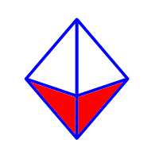

# GSoC 2024 Ideas

## Project Ideas
* [Math Games](#math-games)
* [Improve and maintain 12 Sugar activities](#improve-and-maintain-12-sugar-activities)
* [Improve and maintain 6 Sugar activities](#improve-and-maintain-6-sugar-activities)
* [Port Sugar and core activities to Python 3](#port-sugar-and-core-activities-to-python-3)
* [Musical ideation through Generative AI](#musical-ideation-through-generative-ai)
* [Make your own Lesson Plan for Music Blocks](#make-your-own-lesson-plan-for-music-blocks)
* [Maintain/port 12 Sugar activities to FlatPak](#maintain-port-12-sugar-activities-to-flatpak)
* [Maintenance/bug fixes for Music Blocks 3](#maintenancebug-fixes-for-music-blocks-3)
* [Sugarizer VueJS App](#sugarizer-vuejs-app)
* [Sugarizer 3D Volume activity](#sugarizer-3d-volume-activity)
* [Sugar on Raspberry Pi](#gtk4-exploration)
* [GTK4 exploration](#sugar-on-raspberry-pi)

[Administrative notes](#administrative-notes)

------------

## Math Games

**Prerequisites** 
 - Experience with Python
 - Experience with Sugar activities
 - Interest in math puzzles and games

**Description** 
While Sugar has lots of activities, you can never have enough math games and puzzles. There is a great website with lots of ideas (See https://www.cut-the-knot.org/) for Sugar acitvities. This project (either medium or large) would be do develop 4 to 8 new activities based on some of Bogomolny's ideas.

In the proposal, please mention _some_ specific ideas for games.

**Project Length** 

Either **175** or **350** hours

**Difficulty** 

**Medium**

**Coding Mentors** 
[Ibiam Chihurumnaya](https://github.com/chimosky/)

**Assisting Mentors** 
[Walter Bender](https://github.com/walterbender/)

------------

## Improve and maintain 12 Sugar activities

**Prerequisites** 
 - Experience with Python
 - Strong experience with Sugar activities
 - Experience with maintaining activities on ASLO and ASLO-v4

**Description** 
Sugar has a lot of activities, with 250+ on GitHub, and more
elsewhere. These have scope for improvement; bugs,
features, updated human translations, and release.  This project will involve
working on **at least 12** activities to improve them. Students can choose
activities on their own, and are encouraged to select activities which
are either a part of Fructose or have a strong pedagogical value. To
understand how to locate and work on activities, see our guide to
[Modifying
Activities](https://github.com/sugarlabs/sugar-docs/blob/master/src/contributing.md#modifying-activities)

In their proposal, students may mention _some_ of the issues they will
work on.  Any new feature suggestion should be discussed on GitHub
Issues or on the mailing list before being added to a proposal.

Since there are a lot of activities to work on, **more than one instance
of this project may be selected**.

**Suggested Issues to work on:** 
 - jukebox-activity: [#22 Add collaboration for sharing playlist items](https://github.com/sugarlabs/jukebox-activity/issues/22)

Other issues will have been raised since.

Suggesting or adding features, fixing bugs, or releasing activities
will help you to gain experience

**Project Length** 

**350** hours

**Difficulty** 

**Medium**

**Coding Mentors** 
[Ibiam Chihurumnaya](https://github.com/chimosky/)

**Assisting Mentors** 
To be added.

------------

## Improve and maintain 6 Sugar activities

**Prerequisites** 
 - Experience with Python
 - Strong experience with Sugar activities
 - Experience with maintaining activities on ASLO and ASLO-v4

**Description** 
Sugar has a lot of activities, with 250+ on GitHub, and more
elsewhere. These have scope for improvement; bugs,
features, updated human translations, and release.  This project will involve
working on **at least 6** activities to improve them. Students can choose
activities on their own, and are encouraged to select activities which
are either a part of Fructose or have a strong pedagogical value. To
understand how to locate and work on activities, see our guide to
[Modifying
Since there are a lot of activities to work on, **more than one instance
of this project may be selected**.

**Suggested Issues to work on:** 
 - jukebox-activity: [#22 Add collaboration for sharing playlist items](https://github.com/sugarlabs/jukebox-activity/issues/22)

Other issues will have been raised since.

Suggesting or adding features, fixing bugs, or releasing activities
will help you to gain experience.

**Project Length** 
**175** hours

**Difficulty** 

**Medium**

**Coding Mentors** 
[Ibiam Chihurumnaya](https://github.com/chimosky/)

**Assisting Mentors** 
To be added.

------------

## Port Sugar and core activities to Python 3

**Prerequisites** 
 - Experience with Python
 - Experience with porting telepathy bindings
 - Strong experience with
   [Sugar Desktop](https://github.com/sugarlabs/sugar) and [Activities](https://github.com/sugarlabs/sugar-docs/blob/master/src/contributing.md#modifying-activities)

**Description**  Support for Python 2 was withdrawn by the Python
Foundation, so we need to finish the move to Python 3.  The move was
started in GSoC 2018, and continued in GSoC 2020, but there is still
work to be done.  Sugar 0.116 runs on Python 2 or Python 3.  Core
activities run on Python 3.  Many other activities run on Python 2.
Many regressions have been seen as a result of code not being tested.

We have a [Python 3 Porting
Guide](https://github.com/sugarlabs/sugar-docs/blob/master/src/python-porting-guide.md)
which describes the process for activities.

**Project Task Checklist** 
 - Review the Sugar source code changes since 0.112 that were made for porting to Python 3,
 - Design tests and iterate until the tests have sufficient [coverage](https://github.com/sugarlabs/sugar-docs/blob/master/src/python-coverage-guide.md) for the code changes identified about,
 - Fix regressions in Sugar, the Toolkit, and the Datastore,
 - For affected activities, port Telepathy bindings to TelepathyGLib, see [Port to TelepathyGLib](https://github.com/orgs/sugarlabs/projects/4).
 - For affected activities, port to the latest Sugargame or CollabWrapper library,
 - Port activities to Python 3, fixing any problems that prevent them from being ported or used,

See GitHub Project [Port to Python 3 via
six](https://github.com/orgs/sugarlabs/projects/1) for some open
issues and pull requests.  Most activities do not have issues.  Some
activities have problems that prevent them from being ported.

The Telepathy library is used by some activities for network
collaboration between Sugar users.  The library does not have static
bindings for Python 3, so porting Telepathy to the PyGObject binding
is a prerequisite, see GitHub Project [Port to
TelepathyGLib](https://github.com/orgs/sugarlabs/projects/4).

**Project Length** 

**350** hours

**Difficulty** 

**Hard**

**Coding Mentors** 
[Ibiam Chihurumnaya](https://github.com/chimosky/)

**Assisting Mentors** 
To be added.

----

# Maintain Port 12 Sugar Activities to Flatpak

**Prerequisites** 
 - Experience with Python
 - Strong experience with
   [Sugar Desktop](https://github.com/sugarlabs/sugar) and [Activities](https://github.com/sugarlabs/sugar-docs/blob/master/src/contributing.md#modifying-activities)

**Description** We have a number of Sugar Activities bundled with
  [Flatpak](https://flatpak.org/) as a way to reach a broader audience
  within the Linux community. We'd like to both keep those activities
  up to date and also port more.

We'd love to add more Sugar activities to the Flatpak
collection, a search for sugar on [flathub](https://flathub.org/apps/search?q=sugar) shows
we have about 27 activities on flathub and we'd like to increase that number.

We have a [guide](https://github.com/tchx84/sugarapp/blob/master/flatpak-guide.md) that shows
you how to port Sugar activities to Flatpak, you'll also need to [submit](https://docs.flathub.org/docs/for-app-authors/submission/) the activity to flatpak.

**Project Length** 

**350** hours

**Difficulty** 

**Medium**

**Coding Mentors** 
[Martin Abente](https://github.com/tchx84/)
[Ibiam Chihurumnaya](https://github.com/chimosky/)
[Walter Bender](https://github.com/walterbender/)

-------------

# Maintenance/bug fixes for Music Blocks 3

**Prerequisites** 
 - Strong experience with JavaScript
 - Experience with basic music concepts

**Description** We are largely in maintenance mode for [Music
  Blocks 3.0](https://github.com/sugarlabs/musicblocks) while we
  continue to move forward on [Musick Blocks
  4.0](https://github.com/sugarlabs/musicblocks-v4). That said, there
  are a number of small bugs/regressions that would be worth fixing.

  See [low-hanging
  fruit](https://github.com/sugarlabs/musicblocks/issues?q=is%3Aissue+is%3Aopen+label%3A%22Good+first+issue%22)
  for a list of issues we'd like to close out during GSoC 2024.

**Project Length** 

**175** hours

**Difficulty** 

**Low**

**Coding Mentors** 
[Walter Bender](https://github.com/walterbender/)
[Devin Ulibarri](https://github.com/pikurasa/)

-------------

# Musical ideation through Generative AI

**Prerequisites** 
 - Experience with JavaScript
 - Experience with musical composition
 - Experience with large language models (LLMs)

**Description** We would like to deploy generative AI in support of
  musical composition. The basic idea is to use AI to generate
  possible modifications of a phrase (or phrases) generated by the
  user. In other words, the user would start the composition and the
  AI would then present different possibilities for enriching the
  composition to which the user would react and further enhance.

**Project Length** 

**350** hours

**Difficulty** 

**High**

**Coding Mentors** 
[Walter Bender](https://github.com/walterbender/)
[Devin Ulibarri](https://github.com/pikurasa/)

-------------

# Make your own Lesson Plan for Music Blocks

**Prerequisites** 
 - Experience with JavaScript
 - Experience with large language models (LLMs)

**Description** We would like to deploy generative AI in support of
  converting Music Blocks projects into lesson plans. An LLM would be
  used to convert the musical and computational ideas expressed in a
  project to auto-generate the first draft of lesson plan.

  Some examples of lesson plans can be found
  [here](https://drive.google.com/drive/folders/17dWeTTlA4Sv-KdQ4__9d2W6H0_3cu8EQ?usp=sharing)
  and [here](https://mapflc.com/lesson-plans/).

**Project Length** 

**175** hours

**Difficulty** 

**Medium**

**Coding Mentors** 
[Walter Bender](https://github.com/walterbender/)
[Devin Ulibarri](https://github.com/pikurasa/)

-------------

# GTK4 Exploration

**Prerequisites** 
- Experience with C
- Experience with Python
- Experience with GTK
- Good understanding of Sugar Core architecture

**Project length** 
**350** hours

**Difficulty:** 
**Hard**

**Description** 
Sugar 0.120 runs on GTK3 and needs to be ported to GT4, we need to port Sugar and it's core activities to support GTK4 before GTK3 gets to its EOL.

**Project Task Checklist**
- Migrate minimal [sugar-toolkit-gtk3](https://github.com/sugarlabs/sugar-toolkit-gtk3) components to support Hello World activity, in particular the activity and graphics classes.
- Migrate [Hello World](https://github.com/sugarlabs/hello-world) activity.
- Document migration strategy based on extending any existing upstream GTK3 to GTK4 porting documentation.
- Migrate remaining toolkit components.
- Extend Hello World to use remaining toolkit components, and rename as a Toolkit Test activity,
- Migrate [Sugar](https://github.com/sugarlabs/sugar).
- Migrate the [Fructose](https://wiki.sugarlabs.org/go/Development_Team/Release/Modules) activity set, as time permits.

**Steps to start**
- Plan migration.
- Setup a [live build](https://github.com/sugarlabs/sugar/blob/master/docs/development-environment.md#sugar-live-build) development environment.
- See the [GTK4 migrating](https://docs.gtk.org/gtk4/migrating-3to4.html#stop-using-direct-access-to-gdkevent-structs) doc.

**Coding Mentors** 
[Ibiam Chihurumnaya](https://github.com/chimosky/)

-------------

## Sugar on Raspberry Pi

**Prerequisites** 

**Project length** 
**175** hours

**Difficulty** 

**Easy**

**Description** 
Sugar runs on RPi and we should take advantage of that to reach the
Maker community. This project involves ensuring that Sugar runs w/o
any issues; that it is packaged in a way that is suiable for inclusion
on the [Raspberry Pi operating system images](https://www.raspberrypi.com/software/operating-systems/).
Also, there are any number of Sugar activities that could be enhanced by
knowing some of the details of the RPi, such as Turtle Blocks,
Measure, and Pippy, all of which could be tailored to take advantage
of the sensors available on RPi.

**Mentor** 
Walter Bender

**Backup mentor** 
Alex Perez

-------------

# Sugarizer VueJS App

**Prerequisites** 
- Experience with JavaScript/HTML5 development
- Experience with Vue.js framework development
- Good understanding of Sugarizer Core architecture

**Project length** 
**175** hours

**Difficulty:** &#9733; &#9733; &#9734; (medium)

**Description** Sugarizer Core UI rely on EnyoJS, a deprecated frameworks initially developed for WebOS.  
 
Last year a GSoC project built first screens of Sugarizer Core using VueJS.
 
The idea of this new project is to finalize the implementation to have a really working Sugarizer VueJS App.  

**Tasks**  

- Implement remaining screens: 
  - Neighborhood view 
  - Journal View 
- Implement the tutorial
- Port the Electron part to be able to work with the new implementation
- Build Sugarizer for Android and test the new implementation to ensure it works

**First steps to starts** 

- Complete both the [Sugarizer Vanilla Javascript activity development tutorial](https://github.com/llaske/sugarizer/blob/dev/docs/tutorial/VanillaJS/tutorial.md) and the [Sugarizer Vue.js activity development tutorial](https://github.com/llaske/sugarizer/blob/dev/docs/tutorial/VueJS/tutorial.md).
- Install the current Sugarizer Vue.js implementation from branch  [feature/v2](https://github.com/llaske/sugarizer/tree/feature/v2):
    - See README to understand how to install and run it 
    - Test it from file:// 
    - Test if from a local Sugarizer Server 
    - Identify differences with the legacy Sugarizer implementation 
    - Check for bug or for unexpected behavior 
    - Suggest improvement or fix 
- Install and test [Sugarizer APK Builder](https://github.com/llaske/sugarizer-apkbuilder) to generate Sugarizer for Android.

**Mentor** 
[Lionel Laské](https://github.com/llaske/)

-------------

# Sugarizer 3D Volume activity

**Prerequisites** 
- Experience with JavaScript/HTML5 development
- Experience with Vue.js framework development
- Understanding of 3D graphics and experience with a 3D engine

**Project length** 
**175** hours

**Difficulty:** &#9733; &#9733; &#9734; (medium)

**Description**  The objective of this project is to create a new Sugarizer activity to explore volume using dices.  
 
Features: 
* Display volumes 
* Zoom in/out button (or touch) 
* Rotate board button (or touch) 
* Choose color for facets and text (default is buddy colors) 
* Choose volume size : 4, 6, 8, 10, 12, 20 (default is 6) 
* Choose volume type : semi-transparent, without number (default), with number 
* Choose board background: neutral (default), green playmat, red playmat, wood – friction depend of the background 
* Add a volume on board 
* Remove a volume on board 
* Shake board: clicking on the button or shaking the device if an accelerator is included 
* Share the activity: every users connected can do everything on board 
* Display total: for volumes with number, when the app stop shaking 

Inspirations:
* Regular volumes (10 is irregular) 

  - 4 Tetrahedron https://www.cut-the-knot.org/Curriculum/Geometry/Polyhedra/tetrahedron.shtml  
  - 6 Cube https://www.cut-the-knot.org/Curriculum/Geometry/Polyhedra/cube.shtml  
  - 8 Octahedron https://www.cut-the-knot.org/Curriculum/Geometry/Polyhedra/octahedron.shtml  
  - 12 Dodecahedron https://www.cut-the-knot.org/Curriculum/Geometry/Polyhedra/dodecahedron.shtml  
  - 20 Icosahedron https://www.cut-the-knot.org/Curriculum/Geometry/Polyhedra/icosahedron.shtml  

* Dice simulators 

  - https://dice-simulator.com/  
  - https://heckadecimal.com/  

* Existing Sugarizer activities 

  - Physics JS because it allows handling of 2D objects in a board and use device accelerator 
  - Fraction because it allows to customize the board 
  - Planets because it's an activity to handle planets in 3D  

**First steps to starts** 

* Complete both the [Sugarizer Vanilla Javascript activity development tutorial](https://github.com/llaske/sugarizer/blob/dev/docs/tutorial/VanillaJS/tutorial.md) and the [Sugarizer Vue.js activity development tutorial](https://github.com/llaske/sugarizer/blob/dev/docs/tutorial/VueJS/tutorial.md).
* Choose a JS 3D Framework: it should be open source, lightweight and be compatible with all Sugarizer platforms 
* Try to create a Sugarizer activity displaying 3D objects
* Create a mockup of the activity

**Mentor** 
[Lionel Laské](https://github.com/llaske/)

-------------

# Administrative notes

Above are a list of ideas we've planned for GSoC 2024 projects.
If you have any ideas which can be useful to us, but are not in the
list, we'd love to hear from you.  You need not be a potential
student or a mentor to suggest ideas.

   * [Criteria for Ideas](#criteria-for-ideas)
   * [Coding Mentors](#coding-mentors)
   * [Assisting Mentors](#assisting-mentors)
   * [Everyone Else](#everyone-else)
   * [Suggested Issues](#suggested-issues)

## Criteria for Ideas
1. Does it fill an empty pedagogy niche in the activity set for Sugar
   or Sugarizer,
2. Does it increase quality of our software products (Sugar, activities,
   Music Blocks, or Sugarizer),
3. Does it _not_ involve any project infrastructure, e.g. not another
   app store, web site, or developer landing page,
4. Do we have a developer _now_ who would be willing and able to do it
   if a student was not available, and who can _promise_ to do it if a
   student is not selected; these are shown as a _coding mentor_,

## Coding Mentors
For each idea, we must have offers from one or more _coding mentors_
willing and able to assist students with coding questions.

Requirements for a _coding mentor_ are a demonstrated coding ability
in the form of contributions of code to Sugar Labs.

Mentors for a project will be assigned after proposals are received.

## Assisting Mentors For each idea, we may have offers from
mentors _who do not code_ willing to assist students in various
other ways, such as gathering requirements, visual design,
testing, and deployment; these are shown as an _assisting
mentor_.

The only requirement for an _assisting mentor_ is _knowledge of
the project_.

Mentors for a project will be assigned after proposals are received.

## Everyone Else

Everyone else in Sugar Labs may also be involved with these
projects, through mailing lists, Wiki, and GitHub.

The difference between a _mentor_ and _everyone else_, is that a
_mentor_ is obliged to respond when a student has a question,
even if the answer is "I don't know."

When a _mentor_ receives a question for which the best forum is
_everyone else_, then they are to respectively redirect the
student to ask _everyone else_.  See [Be
flexible](https://github.com/sugarlabs/sugar-docs/blob/master/src/CODE_OF_CONDUCT.md#be-flexible)
and [When you are unsure, ask for
help](https://github.com/sugarlabs/sugar-docs/blob/master/src/CODE_OF_CONDUCT.md#when-you-are-unsure-ask-for-help)
in our Code of Conduct.

## Suggested Issues

For some ideas, there is a list of 'Suggested issues to work on'.
These may help you to get familiar with the project.  The more
you work on these issues, the more experienced you will be for
the project.  However, this is not a strict list.  You _should_
try and explore other issues as well.
