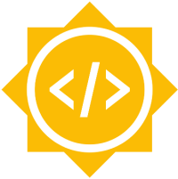
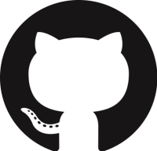

# GSoC @Sugar Labs

## Shortcuts

|[GSoC'20 Ideas](Ideas-2020.md)| [Proposal Template](Template.md) | [Sugar Labs @GitHub](https://github.com/sugarlabs) |
|:-------------------------:|----------------------|----------------------|
| |  |  |

## Introduction
Google Summer of Code is a *global program focused on bringing
more student developers into open source software development*.
See [GSoC 2020
timeline](https://developers.google.com/open-source/gsoc/timeline?hl=vi).

Sugar Labs is applying to Google Summer of Code 2020 as a
mentor organisation. We will be informed on February 20, 2020 if our
organization has been accepted to participate as a mentor organization.

Our archives of GSoC Projects:
[2009](https://wiki.sugarlabs.org/go/Summer_of_Code/2009) |
[2010](https://wiki.sugarlabs.org/go/Summer_of_Code/2010) |
[2011](https://wiki.sugarlabs.org/go/Summer_of_Code/2011) |
[2012](https://wiki.sugarlabs.org/go/Summer_of_Code/2012) |
[2013](https://wiki.sugarlabs.org/go/Summer_of_Code/2013) |
[2014](https://wiki.sugarlabs.org/go/Summer_of_Code/2014) |
[2015](https://wiki.sugarlabs.org/go/Summer_of_Code/2015) |
[2016](https://wiki.sugarlabs.org/go/Summer_of_Code/2016) |
[2017](https://wiki.sugarlabs.org/go/Summer_of_Code/2017) |
[2018](https://wiki.sugarlabs.org/go/Summer_of_Code/2018) |
[2019](Ideas-2020.md)

## Want to work with us ?
It is too late to apply, sorry.

See our [proposed ideas](Ideas-2019.md) page.  We would love to hear
your own ideas as well.  You may familiarise yourself with our code,
by reporting and fixing bugs.

## How to talk to us ?
We use the
[sugar-devel@](http://lists.sugarlabs.org/listinfo/sugar-devel)
mailing list for communication. Join to participate in the discussion
and ask for help.  Allow some days for reply.  See
[Community etiquette](https://github.com/sugarlabs/GSoC#community-etiquette).

Do not write secretly to mentors or developers unless they have asked
you to.  This varies by idea.  Check the list of coding mentors for
each idea.

## How to Contribute

At Sugar Labs we have
[opportunities for contributing](https://github.com/sugarlabs/sugar-docs/blob/master/src/contributing.md)
with many different
[programming languages and libraries](https://github.com/sugarlabs/sugar-docs/blob/master/src/languages.md).

## Getting Help
Got a problem? Ask your mentors, ask other students, or ask the
Sugar Labs community.

The Sugar Labs community is large, and there are people who are
not mentors in the contest. Mentors are listed. Everyone else
you talk with may be a non-mentor.

Students should keep in mind that some people are non-mentors,
and cannot see the contest progress, dates, or information
about students. When communicating widely, be sure to;
 - Introduce yourself, the first time,
 - Talk about the task as if you want to do it yourself, not
   because of the contest,
 - Defend your technical decisions without using the contest as
   a defense,
 - Non-mentors may give good guidance on technical decisions,
   but bad guidance on how they think a task is judged. Always
   consult with your mentors as well.

## Community etiquette
Everyone in the community has to be polite and respectful, and
consider everyone else a member of a team and not a competitor.

One should be considerate to everyone else's time. We would like
to have quality discussions, and not answer questions that are
already documented, or available on stackoverflow. This doesn't
mean you can't ask questions, but a clueless user and a lazy
developer are two different things.

Tell things as you see them. Be polite, but don't sugar coat it.
You don't have to apologize everytime you make a mistake; but
avoid repeating it again ;-)

Also see our [Code of
Conduct](https://github.com/sugarlabs/sugar-docs/blob/master/src/CODE_OF_CONDUCT.md)
