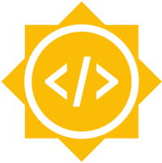
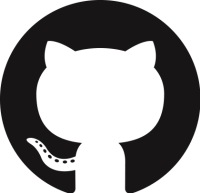

# Google Summer of Code (GSoC) at Sugar Labs

## Shortcuts

|[Ideas for 2026](Ideas-2026.md)| [Proposal Template](Template.md) | [Sugar Labs @GitHub](https://github.com/sugarlabs) |
|:-------------------------:|----------------------|----------------------|
| |  |  |

## Introduction

Google Summer of Code is a *global program focused on bringing more
student developers into open source software development*.
See [how it works](https://summerofcode.withgoogle.com/how-it-works).

Sugar Labs is a Google Summer of Code 2026 mentoring organisation.

Our archives of GSoC Projects:
[2009](https://wiki.sugarlabs.org/go/Summer_of_Code/2009) |
[2010](https://wiki.sugarlabs.org/go/Summer_of_Code/2010) |
[2011](https://wiki.sugarlabs.org/go/Summer_of_Code/2011) |
[2012](https://wiki.sugarlabs.org/go/Summer_of_Code/2012) |
[2013](https://wiki.sugarlabs.org/go/Summer_of_Code/2013) |
[2014](https://wiki.sugarlabs.org/go/Summer_of_Code/2014) |
[2015](https://wiki.sugarlabs.org/go/Summer_of_Code/2015) |
[2016](https://wiki.sugarlabs.org/go/Summer_of_Code/2016) |
[2017](https://wiki.sugarlabs.org/go/Summer_of_Code/2017) |
[2018](https://wiki.sugarlabs.org/go/Summer_of_Code/2018) |
[2019](archives/Ideas-2019.md) |
[2020](archives/Ideas-2020.md) |
[2021](archives/Ideas-2021.md) |
[2022](archives/Ideas-2022.md) |
[2023](archives/Ideas-2023.md) |
[2024](archives/Ideas-2024.md) |
[2025](archives/Ideas-2025.md)

## Want to Work with Us?

Please get involved. Familiarise yourself with our codebase by
reporting and fixing bugs.

See our [ideas](Ideas-2026.md) page. We would love to hear
your own ideas as well.

You may use our [proposal template](Template.md) or create your own.

In addition to the [Google Summer of Code requirements for a proposal](https://google.github.io/gsocguides/student/writing-a-proposal), proposals for Sugar Labs must meet the following criteria:

* They must be your own work, and not the work of others — except where the work of others is minimal, duly credited, and quoted.
* They must demonstrate fluency in the programming language required for the project.
* They must include your assessment of your mentors' competency.
* They should be posted to our [sugar-devel@](https://lists.sugarlabs.org/mailman3/lists/sugar-devel.lists.sugarlabs.org/) mailing list as GitHub Markdown or PDF, with responses to any follow-up questions.
* They should **not** be posted as Google Docs links — a document can be edited after submission, can disappear, may have exports disabled, and we do not want to require members to use Google Docs.

If you wish to be able to delete your proposal after an unsuccessful application, please do not post it on the mailing list. Our decisions are based on the contents of the final PDF proposal and our interactions with the applicant.

## How to Talk to Us

We use the
[sugar-devel@](https://lists.sugarlabs.org/mailman3/lists/sugar-devel.lists.sugarlabs.org/)
mailing list for communication. Join to participate in discussions
and ask for help. Allow a few days for replies. See
[Community etiquette](https://github.com/sugarlabs/GSoC#community-etiquette).

We also have a [Matrix channel](https://matrix.to/#/#sugar:matrix.org) where you can talk with
other community members.

Do not contact mentors or developers privately unless they have explicitly
asked you to. This varies by idea — check the list of coding mentors for
each project for their preferred contact method.

## How to Contribute

At Sugar Labs we have
[opportunities for contributing](https://github.com/sugarlabs/sugar-docs/blob/master/src/contributing.md)
across many different
[programming languages and libraries](https://github.com/sugarlabs/sugar-docs/blob/master/src/languages.md).

## Getting Help

Got a problem? Ask your mentors, ask other students, or ask the
Sugar Labs community.

The Sugar Labs community is large and includes many people who are
not GSoC mentors. Mentors are listed explicitly. Keep in mind that others
you communicate with may be non-mentors who cannot see contest progress,
dates, or student information. When communicating broadly, be sure to:

- Introduce yourself the first time you reach out.
- Discuss the task as something you personally want to work on — not just because of the contest.
- Defend your technical decisions on their merits, not by citing the contest.
- Non-mentors may offer good technical guidance but unreliable advice on how tasks are evaluated. Always consult your mentors as well.

## Community Etiquette

Everyone in the community must be polite and respectful, treating
each other as teammates rather than competitors.

Be considerate of everyone's time. We value quality discussions and
prefer that you search existing documentation and resources like
Stack Overflow before asking questions. That said, there is a clear
difference between a new user who is learning and a developer who
simply hasn't done the groundwork.

Be honest. Be polite, but don't soften things unnecessarily.
You don't need to apologise every time you make a mistake — just
try not to repeat it.

Also see our [Code of
Conduct](https://github.com/sugarlabs/sugar-docs/blob/master/src/CODE_OF_CONDUCT.md).

## Right Fit

During the application period, we look for the following qualities in candidates:

* You have a GitHub profile with a history of commits, pull requests, and issues — in our project, other projects, or personal projects.
* You apply every suggestion made during pull request reviews, patiently and thoroughly.
* You care about the project beyond your specific task — including documentation, tests, releases, and issues.
* Your conversations with us flow naturally beyond just the task at hand.
* You engage in substantive technical discussions and appreciate their value.
* You don't simply do what a mentor says — you think critically and push back when appropriate.
* You are interested in our community and follow our code of conduct and guidelines.
* You continue contributing even if you are not selected.
* You have contributed to our project before the application period begins.
* You engage actively in design discussions and proposal feedback loops.
* You do not ask others to write your proposal for you.
* You are familiar with our software and understand what our project does.
* You communicate in public and never contact a mentor privately unless asked.
* You work on what the community needs, not just what personally interests you.
* You get involved in others' work, not just your own issues.

*(Abstracted by @quozl from a work-in-progress document shared among mentors of several organisations, titled "Tips for finding the right GSoC student for your org".)*

## Cheating

If we suspect cheating, we will report it to the GSoC coordinator.
We maintain a list of behaviours we watch for, which we do not publish.

Your proposal, source code, and all other submissions must be your own
work. The work of others must be minimal, clearly credited, and quoted.
See [Cheating](https://google.github.io/gsocguides/mentor/selecting-students-and-mentors#cheating-and-proposals-from-outer-space).

Thanks for reading all the way to the end!