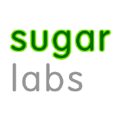

# GSoC @Sugar Labs

## Shortcuts

|[GSoC'19 Ideas](Ideas-2019.md)| [Proposal Template](Template.md) | [Sugar Labs @GitHub](https://github.com/sugarlabs) | [Sugar Labs @IRC](https://webchat.freenode.net) |
|:-------------------------:|----------------------|----------------------|--------------------------|
| |  |  | |

## Introduction
Google Summer of Code is a *global program focused on bringing
more student developers into open source software development*.
Sugar Labs will be applying in Google Summer of Code 2019 as a
mentor organisation. See [GSoC 2019
timeline](https://developers.google.com/open-source/gsoc/timeline?hl=vi)
for more details

Checkout our archives of GSoC Projects:
[2009](https://wiki.sugarlabs.org/go/Summer_of_Code/2009) |
[2010](https://wiki.sugarlabs.org/go/Summer_of_Code/2010) |
[2011](https://wiki.sugarlabs.org/go/Summer_of_Code/2011) |
[2012](https://wiki.sugarlabs.org/go/Summer_of_Code/2012) |
[2013](https://wiki.sugarlabs.org/go/Summer_of_Code/2013) |
[2014](https://wiki.sugarlabs.org/go/Summer_of_Code/2014) |
[2015](https://wiki.sugarlabs.org/go/Summer_of_Code/2015) |
[2016](https://wiki.sugarlabs.org/go/Summer_of_Code/2016) |
[2017](https://wiki.sugarlabs.org/go/Summer_of_Code/2017) |
[2018](https://wiki.sugarlabs.org/go/Summer_of_Code/2018)

## Want to work with us ?
We have a lot of interesting project ideas for you. There is
Sugar OS, Sugar Activities, Music Blocks and Sugarizer. You
can start by going through them and see what would you like
to work on. 
After that, you can go through our [Ideas](Ideas-2019.md) page
to see our proposed ideas. We would love to hear your own ideas
as well.

You should familiarise yourself with our code, by reporting and
fixing bugs. This will assure us that you will be able to work
on the project ;-)

Before you start writing your proposal, go through our [Proposal
Template](Template.md).

## How to talk to us ?
We use `#sugar` and `#sugar-meeting` channels on
[IRC](https://webchat.freenode.net) and 
[sugar-devel@](http://lists.sugarlabs.org/listinfo/sugar-devel)
mailing list for communication. You can join our IRC channels
and mailinig list to participate in the discussions and asking
for help.

## Getting Help
Got a problem? Ask your mentors, ask other students, or ask the
Sugar Labs community.

The Sugar Labs community is large, and there are people who are
not mentors in the contest. Mentors are listed. Everyone else
you talk with may be a non-mentor.

Students should keep in mind that some people are non-mentors,
and cannot see the contest progress, dates, or information
about students. When communicating widely, be sure to;
 - Introduce yourself, the first time,
 - Talk about the task as if you want to do it yourself, not
   because of the contest,
 - Defend your technical decisions without using the contest as
   a defense,
 - Non-mentors may give good guidance on technical decisions,
   but bad guidance on how they think a task is judged. Always
   consult with your mentors as well.

## Community etiquette
Everyone in the community has to be polite and respectful, and
consider everyone else a member of a team and not a competitor.

One should be considerate to everyone else's time. We would like
to have quality discussions, and not answer questions that are
already documented, or available on stackoverflow. This doesn't
mean you can't ask questions, but a clueless user and a lazy
developer are two different things.

Tell things as you see them. Be polite, but don't sugar coat it.
You don't have to apologize everytime you make a mistake; but
avoid repeating it again ;-)

Also see our [Code of
Conduct](https://github.com/sugarlabs/sugar-docs/blob/master/src/CODE_OF_CONDUCT.md)
