# Sugar Activity on Demand: GSoC 2026 Final Report

## Google Summer of Code 2026

**Name:** [Ashutosh Singh](https://github.com/Ashutoshx7)<br>
**Project:** [Sugar Activity on Demand](https://github.com/sugarlabs/GSoC/blob/master/Ideas-2026.md#sugar-activity-on-demand)<br>
**Mentors:** [Walter Bender](https://github.com/walterbender), [Ibiam Chihurumnaya](https://github.com/chimosky)<br>
**Organization:** [Sugar Labs](https://www.sugarlabs.org)<br>
**Project Repository:** [sugarlabs/Sugar-activity-on-Demand](https://github.com/sugarlabs/Sugar-activity-on-Demand)<br>
**Reporting Period:** May 2026 to August 24, 2026

---

## Abstract

My GSoC project began with a simple question: could a learner describe an idea in everyday language and receive a real Sugar activity that they could run, inspect, improve, and share?

The difficult part was never just asking an AI model to write Python. A Sugar activity has its own lifecycle, bundle structure, Journal integration, interface conventions, and learning purpose. Code can look convincing and still fail as soon as it is launched. I wanted the result to feel like part of Sugar, not like a generic code generator with a Sugar label added at the end.

Over twelve weeks, I built **Sugar Activity Studio**, a standalone desktop application for Activity on Demand. A learner can start with a short idea or a visual reference, clarify what they want, generate an activity, run it through several checks, preview it, request focused changes, compare revisions, and package it as an installable Sugar activity.

The project now lives in the Sugar Labs organization and has five tagged releases through [v1.4.0](https://github.com/sugarlabs/Sugar-activity-on-Demand/releases/tag/v1.4.0). It also received contributions from other community members, which was one of the most encouraging outcomes of the summer.

<p align="center">
  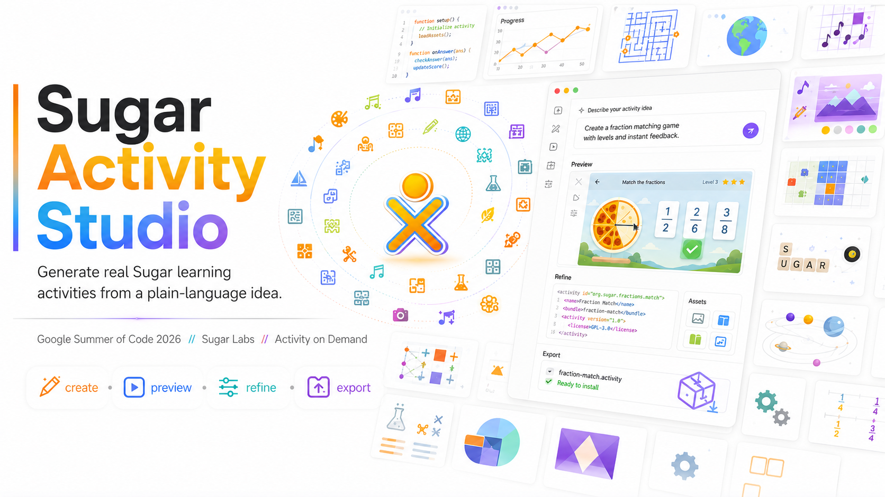
</p>

---

## Why This Project Matters

Sugar encourages learners to use, modify, and create. Developing a new activity, however, usually assumes that someone already understands Python, GTK, Sugar bundles, Journal behavior, and command-line tools. That creates a large first step between having an idea and seeing it run.

Activity on Demand tries to make that first step smaller without hiding the creative process. A learner can begin with something as short as "make a fraction matching game," but the result does not stay trapped inside a chat response. They can play it, inspect the source, see how the plan changed, ask for a specific improvement, return to an earlier revision, and export the activity.

That distinction shaped the whole project. The AI should help the learner become an author. It should not turn the learner into a spectator.

---

## What I Proposed and What I Built

| Area | Initial Goal | Final Outcome |
|---|---|---|
| Creation | Turn a text prompt into a Sugar activity | Text prompts, prompt enhancement, guided questions, multiple learning areas, templates, and visual references |
| Generation | Produce a valid activity scaffold | Complete Sugar projects grounded in real Sugar patterns through local retrieval |
| Correctness | Check syntax and bundle structure | Static checks, request-fidelity checks, isolated runtime execution, delayed-state testing, Journal round-trips, critique, and repair |
| Modification | Let learners ask for changes | Click-to-refine, focused patches, guided reflection, code review, and revision history |
| Distribution | Build installable `.xo` bundles | `.xo` export, direct installation, Flatpak source export, Sugar ring installation, and a portable AppImage |
| Model access | Support an online model | OpenRouter, Gemini, OpenAI, Claude, DeepSeek, Qwen, Moonshot, Ollama, and an offline template path |
| Sustainability | Complete a GSoC prototype | A standalone Sugar Labs repository with releases, documentation, tests, and community contributors |

---

## The Final Workflow

```text
Learner idea or image
        |
        v
Enhance and clarify the idea
        |
        v
Create an activity plan
        |
        v
Retrieve relevant Sugar patterns
        |
        v
Generate the activity
        |
        v
Validate, run, critique, and repair
        |
        v
Preview and reflect
        |
        v
Refine, compare versions, install, or export
```

Keeping these stages separate made the project much easier to reason about. It also stopped provider code, generation logic, validation, and interface behavior from growing into one large component that nobody could safely change.

---

## System Architecture

The standalone studio follows a layered architecture. The GTK interface talks to a service facade instead of calling the generation code directly. The service owns background jobs, cancellation, saved sessions, and revisions. The generation layer then coordinates model access, retrieval, validation, repair, project assembly, and packaging.

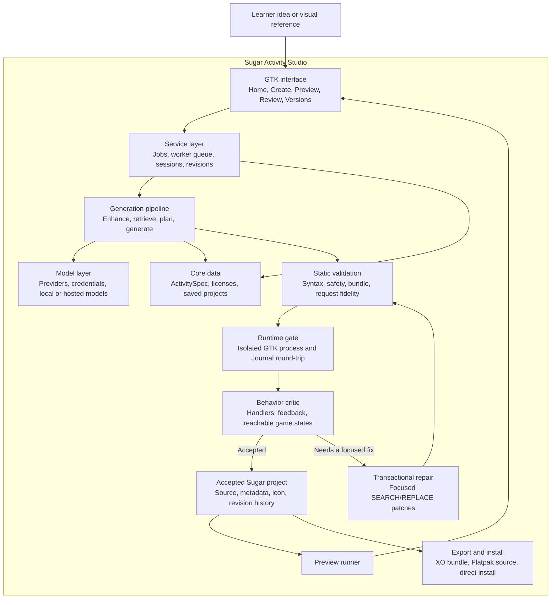

The arrows also show the important trust boundary. Generated code cannot move to preview or export until it passes the acceptance pipeline. If the critic finds a focused problem, the repair is applied transactionally and sent through the checks again. The original working candidate remains available if a patch fails.

---

## Phase 1: Finding the Learner Journey, Weeks 1 and 2

I started with the part a learner would see. The first GTK prototype included a Prompt Screen for describing an idea and a Reflective Studio for previewing, reviewing, and modifying the generated activity.

<p align="center">
  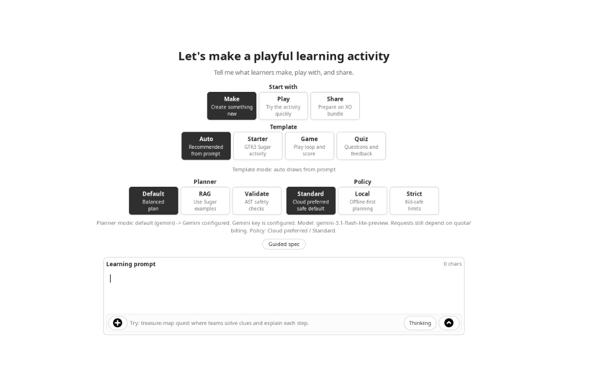
</p>

The first version taught me that a technically complete screen can still ask the wrong questions. My original categories reflected implementation details more than learner intentions. Walter's feedback moved the design toward areas such as Logic and Math, Science, Language, Tools, Games, and Creation.

I also added an explicit license choice. If a generated activity is meant to be studied, changed, and shared, its license cannot be an afterthought.

<p align="center">
  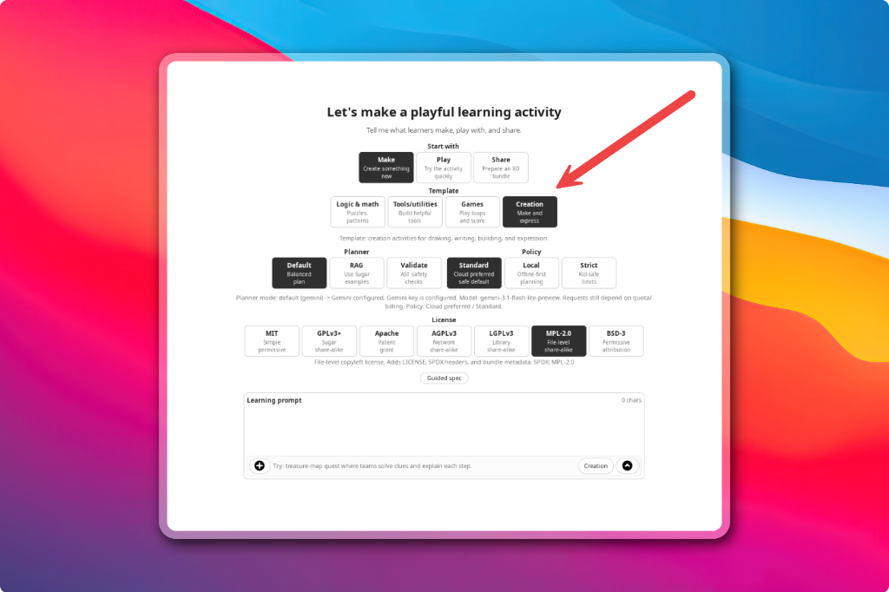
</p>

During Week 2, the backend produced its first complete Sugar bundles. Each generated project included `activity.info`, `setup.py`, an activity entry point, metadata, Journal hooks, and a README. This was the first moment when the interface stopped being only a prototype and began creating something Sugar could actually install.

### Phase 1 output

- The Use, Modify, Create learner journey
- Prompt, preview, review, and version interfaces
- Learner-centered activity categories
- License selection
- Complete Sugar bundle scaffolding

---

## Phase 2: Generation, Providers, and Validation, Weeks 3 to 5

The next challenge was teaching a general model enough about Sugar to generate a real activity instead of a generic GTK application.

I designed a structured generation specification around Sugar's activity lifecycle, allowed GTK and Sugar APIs, Journal behavior, bundle layout, safety rules, licensing, and the learner's selected category. I then tested several providers and kept provider setup separate from the rest of the application. This meant the studio did not have to depend on one model company.

The first validation pipeline used Python AST parsing, import checks, bundle checks, license checks, and safety rules. Ten different prompts reached installable `.xo` bundles during the first structured test pass.

<p align="center">
  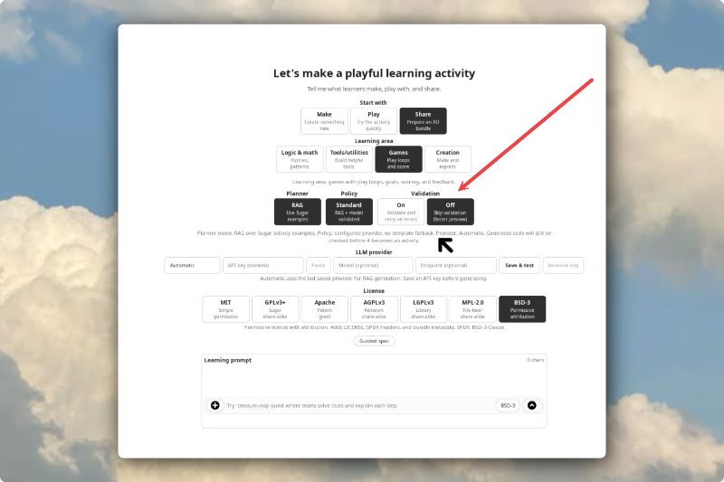
</p>

Validation improved reliability, but it also made generation slower. I exposed the choice in the interface so a tester could use a quick preview while iterating or the complete path when checking a serious candidate. I also added provider settings for keys, model overrides, and local endpoints, then prepared Flatpak packaging so mentors and testers could run the project without rebuilding my exact development setup.

### Phase 2 output

- A Sugar-specific system prompt and structured activity specification
- Provider-independent model configuration
- Static syntax, import, safety, license, and bundle checks
- A retry path for invalid candidates
- Flatpak packaging and a visible validation choice

---

## Phase 3: Real Users, a Standalone Repository, and Runtime Checks, Weeks 6 and 7

User testing changed the project more than any private test could. I had been writing careful prompts with rules and examples. Real users typed things like "math game" or "typing practice." The weak result was not only a model problem. The studio was accepting an unfinished thought as if it were a complete specification.

I added prompt enhancement and guided clarification so a short idea could grow into a useful brief while keeping the learner's original intention. I also built local retrieval over installed Sugar activities. When a relevant activity is available, the generator can use real Sugar patterns instead of relying only on general model knowledge.

The largest architectural change was moving Activity on Demand out of my Sugar shell fork and into its own repository. Sugar Activity Studio uses the Sugar toolkit as a library, but it does not require the complete Sugar shell to be running. This made normal installation, independent releases, and outside contributions practical.

Static checks were still not enough. Some activities parsed correctly and crashed immediately when opened. I built a runtime gate that launches a candidate in a separate process, pumps GTK events, and tests a Journal save and restore round-trip. A failure is converted into structured repair feedback instead of appearing to the learner as a blank or broken window.

<p align="center">
  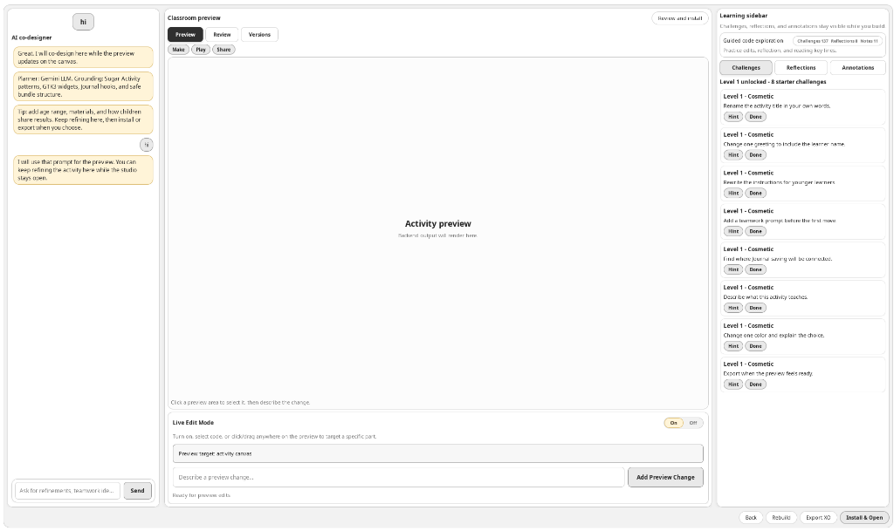
</p>

This was the point where I stopped treating generated output as text and started treating it as software that had to prove it could run.

---

## Phase 4: Refinement, Packaging, and the First Releases, Weeks 8 and 9

Once generation became more dependable, I focused on what happens after the first preview.

A learner can click a part of the preview and describe a focused change. The studio applies that request as a patch rather than generating the complete file again. Every accepted change becomes a new revision, so trying an idea does not destroy the last working version.

<p align="center">
  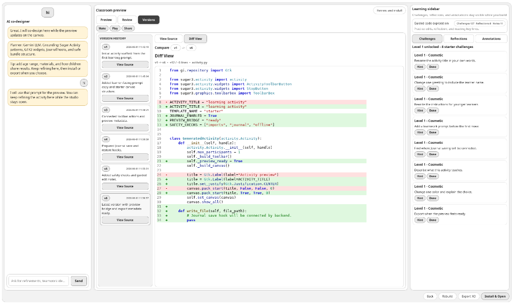
</p>

I packaged the studio as a portable AppImage and published the first releases under Sugar Labs. Putting a release in front of other people exposed details I had stopped noticing.

Walter created a Periodic Table Explorer and pointed out that there was no clear place to name an activity. The generated title could therefore feel random. That observation later became a community contribution that asks for a name before installation or export.

This phase made one lesson very clear to me: a release is not the end of testing. It is the moment testing becomes honest.

---

## Phase 5: Visual References, Sugar-Native Design, and Reliability, Weeks 10 to 12

The final phase brought together visual input, a more native Sugar identity, community contributions, and a deeper reliability pass.

### Week 10: Making the Interface Feel Like Sugar

Activities can belong to more than one learning area, so I carried multiple selections through storage, clarification, prompt enhancement, planning, and generation.

Walter also told me that the first category icons still felt too generic. He was right. They communicated their meaning, but they did not look at home beside the rest of Sugar. I reworked them around Sugar's simpler silhouettes, rounded strokes, strong outlines, and familiar visual language.

<p align="center">
  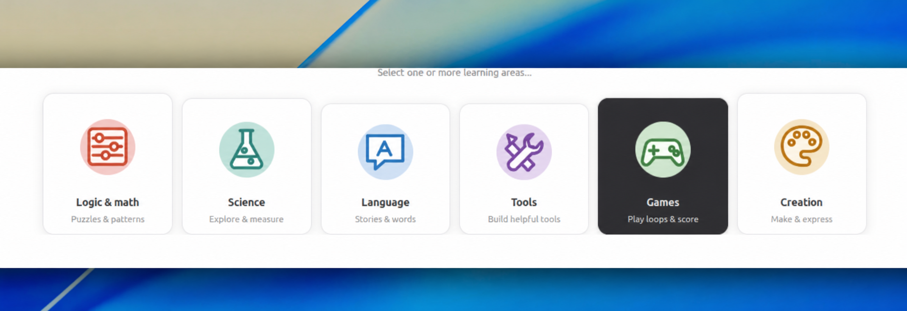
</p>

That change was small compared with the generation pipeline, but it mattered. If the tool is asking children to create for Sugar, the tool itself should feel like it belongs there.

### Week 11: From a Mockup to a Running Activity

I added visual references so a learner could attach a sketch, worksheet, photograph, or interface mockup beside the written prompt. The symmetry garden example became my end-to-end test for this workflow.

This was the original mockup. It described the layout, drawing tools, symmetry modes, challenge panel, progress indicators, colors, and the Check My Garden action.

<p align="center">
  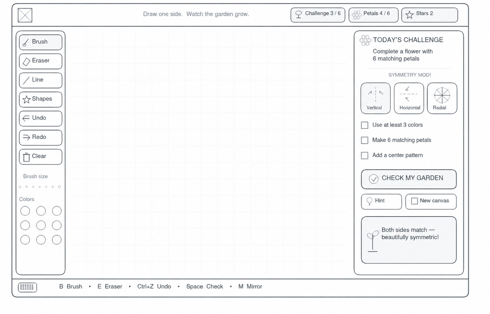
</p>

This was the running result generated from the idea and visual reference. It kept the important interactions from the mockup, including drawing tools, brush sizes, colors, vertical, horizontal, and radial symmetry modes, challenge requirements, and a Check Garden action.

<p align="center">
  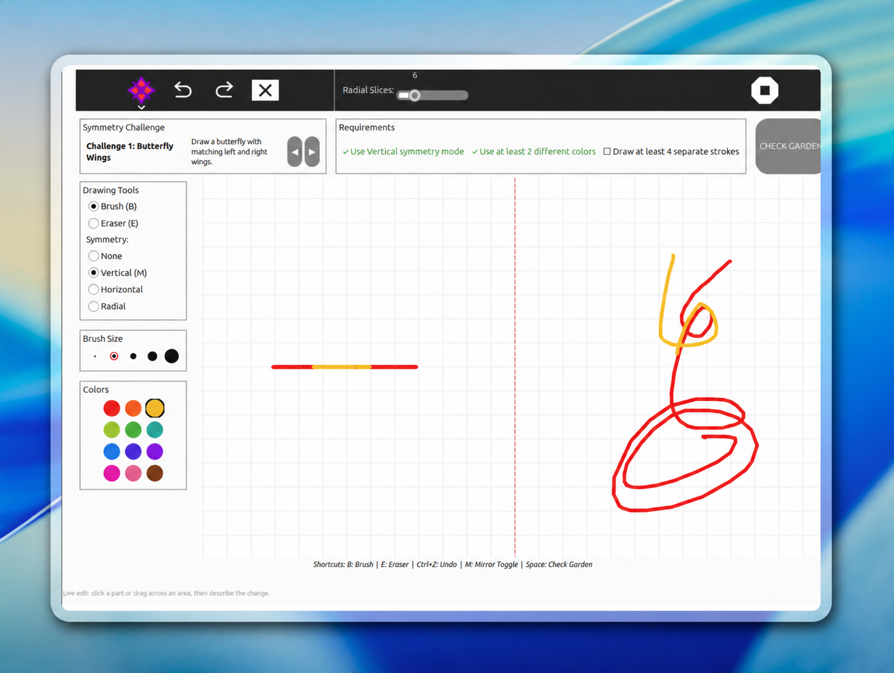
</p>

The result was not a pixel-for-pixel copy, and that was not the goal. What mattered was that a rough design could become a runnable Sugar activity and remain open to further refinement. Seeing those two screenshots together made the progress feel real in a way that a list of implementation details could not.

### Week 12: The Final Reliability Pass

During the last week, I strengthened request-fidelity checks, provider routing, image fallbacks, interaction-specific retrieval, deterministic Sugar API repairs, delayed runtime testing, revision diagnostics, and refinement repair.

I also redesigned the review tools around short reflection prompts. Instead of placing a learner in front of an empty box and expecting them to know exactly what to change, the studio can ask what they notice, what they want to improve, and what would make the activity clearer or more fun.

<p align="center">
  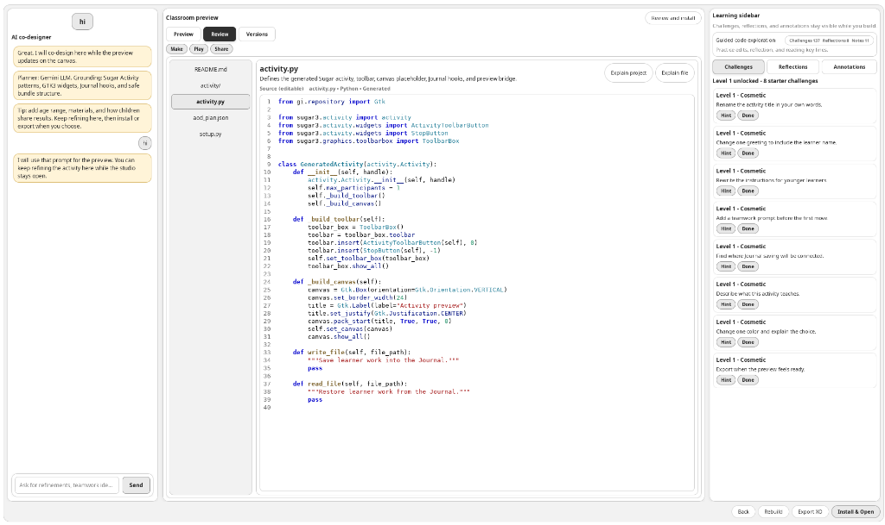
</p>

---

## How a Generated Activity Is Accepted

The final pipeline does not trust a candidate simply because a model says it is finished.

| Gate | What it checks |
|---|---|
| Specification | Required metadata, learning areas, license, and requested mechanics |
| Static validation | Syntax, imports, bundle structure, blocked calls, and Sugar API use |
| Request fidelity | Whether the requested interaction and delayed behavior are present |
| Runtime harness | Startup, GTK events, delayed callbacks, and process isolation |
| Journal round-trip | Saving and restoring learner state |
| Behavior critic | Reachable interactions, handlers, feedback, and game states |
| Transactional repair | Focused patches, complete revalidation, and rollback of bad changes |

The complete activity is generated once. Later fixes are focused patches against that candidate. This keeps working code in place, makes errors easier to understand, and preserves the learner's refinement instead of throwing away the whole result.

---

## Final Results

As of August 24, 2026, the project has reached the following state:

| Result | Current State |
|---|---|
| Tagged releases | 5, from v1.0.0 through v1.4.0 |
| Repository history | 147 commits |
| Contributors | 4 |
| Tracked files | 113 |
| Python source and test size | About 40,850 lines |
| Automated test collection | 448 tests |
| Model paths | 8 hosted or local providers, plus offline templates |
| Distribution | Source, AppImage, Sugar ring installation, `.xo`, direct install, and Flatpak source export |

The numbers show the size of the work, but the result I care about is simpler. Someone can download the studio, describe or show an idea, receive a real Sugar activity, see how it was made, and continue changing it.

---

## Releases

| Release | Date | Main Milestone |
|---|---|---|
| [v1.0.0](https://github.com/sugarlabs/Sugar-activity-on-Demand/releases/tag/v1.0.0) | July 17 | Portable AppImage build |
| [v1.1.0](https://github.com/sugarlabs/Sugar-activity-on-Demand/releases/tag/v1.1.0) | July 19 | Guided studio flow and first public release |
| [v1.2.0](https://github.com/sugarlabs/Sugar-activity-on-Demand/releases/tag/v1.2.0) | July 30 | Improved preview and version review |
| [v1.3.0](https://github.com/sugarlabs/Sugar-activity-on-Demand/releases/tag/v1.3.0) | August 3 | Visual-reference workflow |
| [v1.4.0](https://github.com/sugarlabs/Sugar-activity-on-Demand/releases/tag/v1.4.0) | August 20 | Guided refinement suggestions |

---

## Pull Requests and Community Contributions

The standalone repository began with a series of focused pull requests for the generation and guided studio flow.

| PR | Work |
|---|---|
| [#1](https://github.com/sugarlabs/Sugar-activity-on-Demand/pull/1) | Transactional repair-only generation and audit hardening |
| [#2](https://github.com/sugarlabs/Sugar-activity-on-Demand/pull/2) | Correct Claude defaults and provider behavior |
| [#3](https://github.com/sugarlabs/Sugar-activity-on-Demand/pull/3) | Clarifying questions and activity planning helpers |
| [#4](https://github.com/sugarlabs/Sugar-activity-on-Demand/pull/4) | Provider resolution through the credential store |
| [#5](https://github.com/sugarlabs/Sugar-activity-on-Demand/pull/5) | Questions-first guided studio and live progress steps |
| [#6](https://github.com/sugarlabs/Sugar-activity-on-Demand/pull/6) | Integrated guided studio service and interface |
| [#7](https://github.com/sugarlabs/Sugar-activity-on-Demand/pull/7) | A child-friendly helper voice and activity-name correction |
| [#8](https://github.com/sugarlabs/Sugar-activity-on-Demand/pull/8) | Preserve confirmed learner answers through generation |
| [#9](https://github.com/sugarlabs/Sugar-activity-on-Demand/pull/9) | Reflection prompts and source annotations |

One of the best outcomes was seeing the repository become shared work.

| PR | Contributor | Contribution |
|---|---|---|
| [#13](https://github.com/sugarlabs/Sugar-activity-on-Demand/pull/13) | [Rakshit Yadav](https://github.com/rakshityadav1868) | Dedicated Sugar Activity Studio icon and desktop identity |
| [#14](https://github.com/sugarlabs/Sugar-activity-on-Demand/pull/14) | [Rakshit Yadav](https://github.com/rakshityadav1868) | Activity naming before installation and export |
| [#16](https://github.com/sugarlabs/Sugar-activity-on-Demand/pull/16) | [Rakshit Yadav](https://github.com/rakshityadav1868) | Clearer generation and preview error cards |
| [#17](https://github.com/sugarlabs/Sugar-activity-on-Demand/pull/17) | [Rakshit Yadav](https://github.com/rakshityadav1868) | API-key validation with useful error messages |
| [#19](https://github.com/sugarlabs/Sugar-activity-on-Demand/pull/19) | [Akshay Nazare](https://github.com/akkki007) | Dead-code cleanup and regression coverage |

Reviewing these contributions taught me that maintainership is also part of implementation. A useful review explains the learner experience behind a requested change, not only the line of code that needs editing.

---

## What Was Hard

### Sugar has a small public code footprint

General-purpose models know Python and GTK much better than they know Sugar's lifecycle and Journal patterns. Structured prompting helped, but retrieving examples from installed Sugar activities made grounding much more practical.

### Valid code can still be broken software

AST checks catch syntax and import problems. They cannot tell me whether a window will open, whether a callback will fire later, whether a game can be completed, or whether Journal state will be restored. The runtime harness and behavior critic grew directly from that gap.

### Safety and iteration pull in different directions

Complete validation makes generation slower. Skipping checks makes previews quicker but less trustworthy. I exposed the choice during development, then introduced focused repairs so a later attempt would not regenerate everything.

### Helpful AI can erase learner intent

Enhancement, clarification, retrieval, image analysis, and repair can all make an activity look more polished while quietly changing the original request. I had to keep the learner's own words and requested mechanics visible throughout the pipeline, then check fidelity at the end.

### A feature is not complete when only I understand it

Moving the code into a standalone repository, splitting it by domain, documenting setup, adding tests, publishing releases, and reviewing outside contributions took time away from visible features. It was still essential. The project can continue only if another person can enter the codebase safely.

---

## What I Learned

The biggest technical lesson was to treat generated code like any other untrusted program. It needs isolation, explicit gates, useful diagnostics, and rollback.

The biggest product lesson came from watching people type very short prompts. Users were not failing to describe their ideas. The studio was failing to meet them where they were. Prompt enhancement and guided clarification came from accepting that.

The biggest community lesson was that feedback matters most when it closes a loop. Walter noticed the category language, licensing, activity naming, icon style, testing, and reflection flow. Each observation became a concrete change. Later, contributors implemented several of those changes and improved them through review.

Most of all, I learned that AI-assisted creation works best when the process stays visible. The plan, source, preview, errors, and revisions should remain available to the learner. A finished answer is less valuable than a starting point they understand and can change.

---

## Future Scope

- Test with more learners and teachers across different Sugar environments
- Improve accessibility and complete keyboard navigation
- Add more trusted Sugar interaction patterns to local retrieval
- Expand runtime interaction testing beyond startup and delayed callbacks
- Make AppImage compatibility clearer across older Linux distributions
- Keep the offline template path useful as hosted providers change
- Continue turning learner feedback into small, reviewable issues

GSoC is complete, but I do not see the repository as finished. The useful next version will come from more learners trying it, finding the confusing parts, and showing us which pieces genuinely help them create.

---

## Project Resources

- [Source repository](https://github.com/sugarlabs/Sugar-activity-on-Demand)
- [Latest release](https://github.com/sugarlabs/Sugar-activity-on-Demand/releases/latest)
- [Architecture documentation](https://github.com/sugarlabs/Sugar-activity-on-Demand/blob/main/docs/ARCHITECTURE.md)
- [Child usability notes for Activity Tools](https://github.com/sugarlabs/Sugar-activity-on-Demand/blob/main/docs/CHILD_USABILITY_TEST_ACTIVITY_TOOLS.md)
- [Test suite](https://github.com/sugarlabs/Sugar-activity-on-Demand/tree/main/tests)
- [GSoC 2026 project idea](https://github.com/sugarlabs/GSoC/blob/master/Ideas-2026.md#sugar-activity-on-demand)

---

## Weekly Blogs

| Entry | Date | Report |
|---|---|---|
| Community Bonding | May 23 | [Understanding Sugar and defining the problem](https://github.com/sugarlabs/www-v2/pull/850) |
| Week 1 | June 3 | [Building the Prompt Screen and Reflective Studio](https://github.com/sugarlabs/www-v2/pull/864) |
| Week 2 | June 10 | [Backend generation, learner-centered templates, and licensing](https://github.com/sugarlabs/www-v2/pull/881) |
| Week 3 | June 17 | [System prompting, model integration, and the test strategy](https://github.com/sugarlabs/www-v2/pull/884) |
| Week 4 | June 25 | [Model comparison, validation, and ten installable bundles](https://github.com/sugarlabs/www-v2/pull/923) |
| Week 5 | July 1 | [Provider controls, optional validation, and Flatpak packaging](https://github.com/sugarlabs/www-v2/pull/924) |
| Week 6 | July 8 | [User testing, prompt enhancement, retrieval, and the standalone move](https://github.com/sugarlabs/www-v2/pull/979) |
| Week 7 | July 15 | [Runtime checks, self-repair, and behavior critique](https://github.com/sugarlabs/www-v2/pull/980) |
| Week 8 | July 22 | [Live refinement, version history, AppImage, and v1.1.0](https://github.com/sugarlabs/www-v2/pull/981) |
| Week 9 | July 29 | [Real-user feedback and focused annotations](https://github.com/sugarlabs/www-v2/pull/982) |
| Week 10 | August 5 | [Multiple learning areas, Sugar-native icons, and visual references](https://github.com/sugarlabs/www-v2/pull/1036) |
| Week 11 | August 12 | [Mockup to result, community branding, and activity naming](https://github.com/sugarlabs/www-v2/pull/1037) |
| Week 12 | August 20 | [Final reliability pass, reflection, and v1.4.0](https://github.com/sugarlabs/www-v2/pull/1038) |

---

## Acknowledgments

Thank you to Walter Bender for repeatedly bringing the project back to learners, constructionism, and the question of whether a feature actually helps someone make something. His feedback changed the categories, licensing, activity naming, icon design, testing, and reflection flow.

Thank you to Ibiam Chihurumnaya for the technical guidance and steady review throughout the program. Thank you to Rakshit Yadav and Akshay Nazare for contributing to the repository, responding to review, and helping the project become shared work.

Thank you to everyone who tested a release, shared an activity, reported confusing behavior, or reviewed an idea. I am also grateful to Sugar Labs and Google Summer of Code for giving me the time and community to turn a proposal into software that people can continue using and changing.

---

## Connect with Me

- GitHub: [@Ashutoshx7](https://github.com/Ashutoshx7)
- Email: [ashutoshx002@gmail.com](mailto:ashutoshx002@gmail.com)
- Matrix: [@Ashutoshx7:matrix.org](https://matrix.to/#/@Ashutoshx7:matrix.org)
