### Google Summer of Code 2026

**Project:** [Music Blocks Performance](https://github.com/sugarlabs/GSoC/blob/master/Ideas-2026.md#music-blocks-performance)  
**Mentors:** [Walter Bender](https://github.com/walterbender), [Om Santosh Suneri](https://github.com/omsuneri)  
**Organization:** [Sugar Labs](https://sugarlabs.org)  
**Reporting Period:** May 26, 2026 – August 24, 2026

---


## Abstract

This project presents a systematic, benchmark-driven performance optimization of Music Blocks, a visual programming environment for music creation. The work followed a data-driven **measure → identify → optimize → validate** methodology across project loading, runtime execution and audio playback, and notation export. Initial profiling showed that the Logo execution engine was not the primary bottleneck; instead, browser timer-based audio scheduling emerged as a major source of callback latency and synchronization drift, particularly during long, multi-voice playback.

The key optimization replaced non-zero-delay `setTimeout()` scheduling with `Tone.Transport`. In the Frère Jacques benchmark, this reduced mean callback latency from approximately 44.95 ms to 11.73 ms, worst-case latency from 1861.5 ms to 327.3 ms, and cumulative scheduling drift from approximately 29.8 s to 7.8 s. Overall, the project resulted in 36 pull requests submitted and 28 merged, covering execution, audio scheduling, rendering, memory management, project loading, and notation export, and established a repeatable, measurement-driven approach to performance engineering in Music Blocks.

<p align="center">
  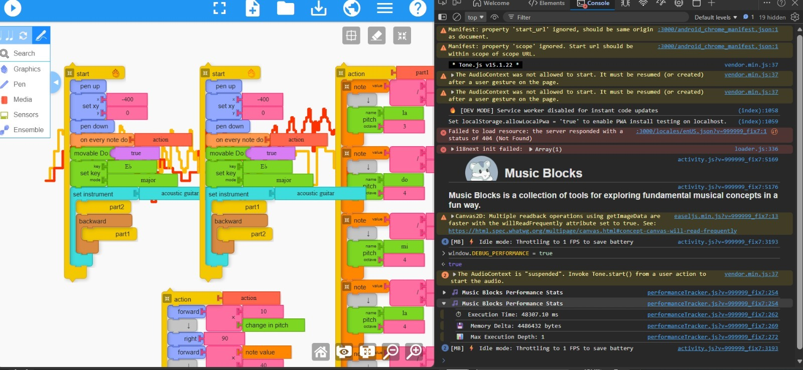
</p>
 
## Why Performance Matters in Music Blocks
 
> *"For a child learning through creation, every second spent waiting is a moment taken away from exploration."*
 
Music Blocks is built to make programming approachable through music, especially for young learners. That makes performance more than a technical detail , a project that takes too long to load, notes that drift out of time, a canvas that freezes, or an export that takes tens of seconds can quietly interrupt the creative and learning process itself.
 
This project focused on identifying and fixing the performance and correctness issues that most directly shaped the experience of creating, running, and sharing Music Blocks programs.
 

### The Problems, at a Glance

| Problem | Symptom | Root Cause |
|---|---|---|
| **Slow project loading** | Rainbow Connection (5,716 blocks) took ~19.4s to load | 33,482 invisible canvas re-renders behind the loading overlay |
| **Audio timing drift** | Notes drifted out of sync in long, multi-voice pieces | `setTimeout()`-based scheduling tied to the browser event loop |
| **Canvas rendering overhead** | Playback stutter with the workspace visible | `stage.update()` traversing off-screen containers; unbounded canvas dims |
| **Runtime instability** | Crashes and visual distortion after repeated runs | "Zombie" timers and inconsistent cleanup between Stop and natural completion |
| **Note duplication** | Notes played twice in polyrhythmic projects | "On every note do" queued in two places simultaneously |
| **Slow notation export** | Rainbow Connection took ~33.6s to export | Full block-program re-execution, with a `setTimeout()` round-trip per block |
 
---
 
## Results: Before and After

<p align="center">
  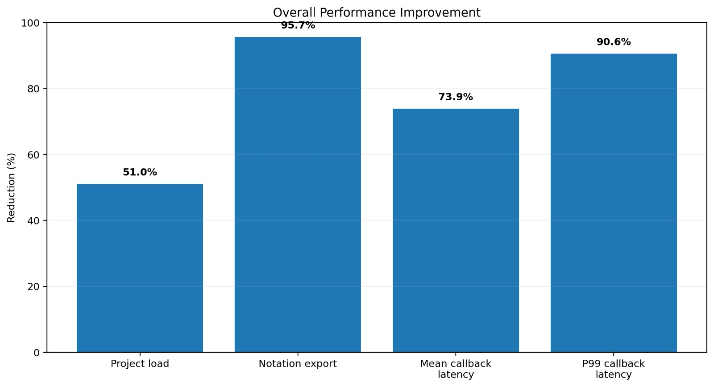
</p>
 
The following table summarizes the cumulative impact of every optimization shipped across the program:
 
| Metric | Before | After | Improvement |
|---|---|---|---|
| Project load time (Rainbow Connection) | ~19.4 s | ~9.5 s | ~51% reduction |
| Notation export time (Rainbow Connection) | ~33,624 ms | ~1,460 ms | ~23x speedup |
| Mean audio callback latency (Frère Jacques) | ~44.95 ms | ~11.73 ms | ~4x improvement |
| P99 audio callback latency | ~704.9 ms | ~66.17 ms | ~10x improvement |
| `stage.update()` average (Crabcanon-Plot) | ~4.807 ms | ~1.972 ms | ~59% reduction |
| `stage.update()` maximum (Crabcanon-Plot) | ~19.000 ms | ~4.100 ms | ~78% reduction |
| Canvas renders during project load | ~33,482 | ~1 (final) | almost eliminated |
| Graph distortion after repeated runs | Appears at 6–7 runs | Stable through 20+ runs | Resolved |
 

 
---
 
## Technical Implementation
 
### Core Innovation: An Instrument-First Methodology 
 
The defining trait of this project was discipline: 
> "Every suspected bottleneck was instrumented and measured before a single line of optimization code was written."

This loop prevented wasted effort on false leads, for example, early profiling showed the Logo interpreter accounted for **less than 1%** of total playback time, saving weeks that might otherwise have gone into micro-optimizing the wrong subsystem. Every fix was then validated through before/after benchmarks across representative projects and browsers, using workload fingerprinting and repeated runs to catch regressions before merge.

The optimization work followed a structured five-step methodology, moving from execution-path analysis to runtime stability. Each step was driven by profiling data and validated through representative benchmarks before implementation.

<p align="center">
  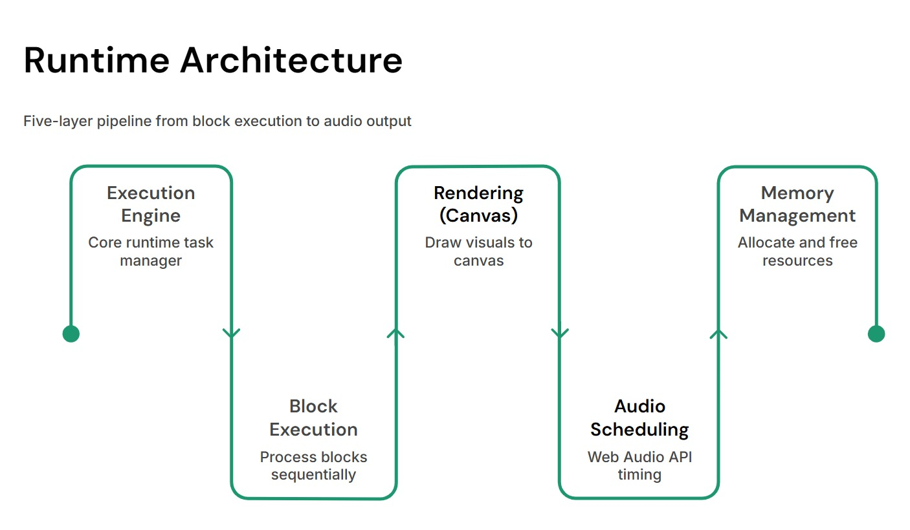
</p>
 
---

## Phase 1: Benchmarking and Profiling (Weeks 1–3)

I spent the first three weeks building a reliable understanding of the system before making any optimizations. This measurement-first approach gave me the baseline and instrumentation I needed to guide the later phases.

### Building the Instrumentation Framework

<p align="center">

  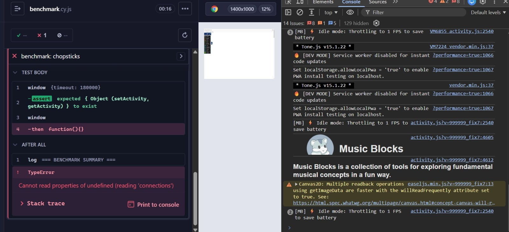

</p>

I built automated benchmarking suites using Playwright and Cypress to make performance measurements reproducible across runs. My benchmark workflow could:

- Launch Music Blocks in a controlled browser environment
- Load standardized benchmark projects from fixtures
- Trigger playback or export and wait for completion
- Capture performance metrics and reproducible artifacts
- Verify execution fingerprints to ensure identical workloads across runs

### Detailed Profiling Coverage

To ensure I covered different execution patterns, I profiled five flagship projects, each chosen to stress a different part of the system:

| Project | Profiling Focus | Primary Stress |
|---|---|---|
| Musical-Tree | Runtime stability & recursion | Branching and recursion-heavy execution |
| Crabcanon-Plot | Canvas & audio | Combined music and graphics workload |
| In-C | Large-scale execution | 800+ blocks and memory pressure |
| Frère Jacques | Audio scheduling | Long, multi-voice playback |
| Rainbow Connection | Loading & export | Largest project at 5,716 blocks |

I also established three baseline tiers for general execution-time regression testing:

<p align="center">

  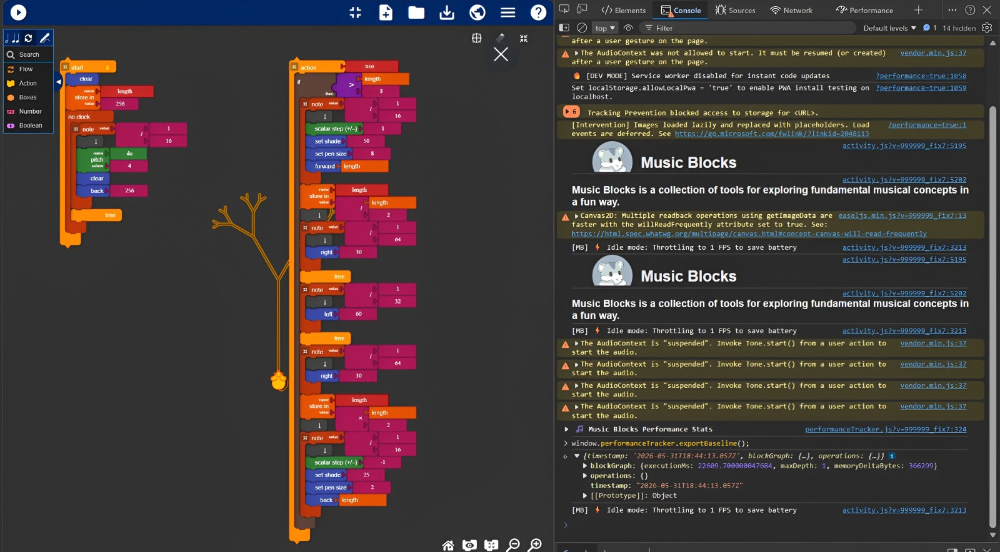

</p>

| Project | Complexity | Execution Time |
|---|---|---:|
| Hot-Cross-Buns | Small | ~9.54 s |
| Musical-Tree | Medium | ~23.91 s |
| In-C | Large | ~82.1 s |

### The Crabcanon-Plot Investigation

I conducted my most detailed profiling on Crabcanon-Plot, a large project combining music and graphics that showed significant playback slowdown when the block workspace remained visible. I instrumented eight runtime areas to identify the source of the degradation.

<p align="center">

  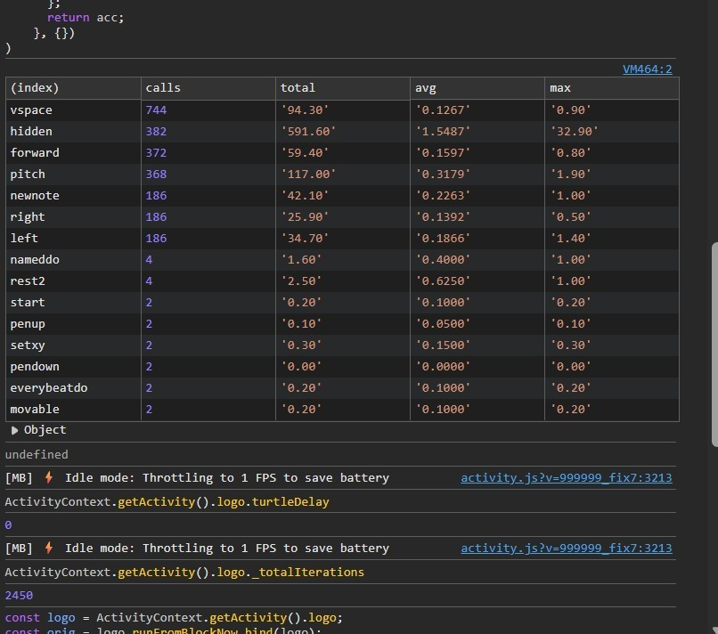

</p>

### Block Highlighting Investigation

Walter observed that performance was degraded noticeably when blocks were visible, suggesting that block highlighting or rendering could be contributing to the slowdown. To investigate this, I reduced the associated updateCache() calls by approximately 90%, but overall execution improved by less than 1%. This indicates that updateCache() itself is not the primary bottleneck, while the broader rendering path remains worth investigating.

### Key Finding

My profiling showed that Crabcanon-Plot's degradation was not caused by a single continuously accumulating bottleneck. Instead, I found that the user-visible jank was primarily associated with intermittent main-thread pressure from garbage collection and browser scheduling delays.

My Firefox profiling provided a more specific rendering finding: `drawImage()` compositing accounted for approximately 83.9% of `stage.update()` time. This redirected my subsequent optimization work toward the canvas rendering pipeline rather than block highlighting.

<p align="center">

  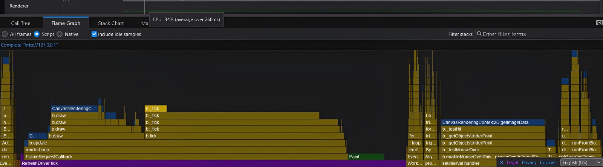

</p>


---

### Phase 2: Logo Execution Engine Optimization (Weeks 4–5)
 
With Phase 1 instrumentation in place, the next target was the Logo execution engine , the core interpreter loop driving block-by-block playback.
 
**Is the Interpreter the Bottleneck?**
 
Measurement said no, decisively. Across five benchmark projects, interpreter execution represented less than 1% of total playback time:
 
| Project | Block Time | Wall Time | Block % |
|---|---|---|---|
| Crab Canon | ~304 ms | ~50.2 s | 0.60% |
| Zelda | ~468 ms | ~82.3 s | 0.57% |
| Crabcanon-Plot | ~441 ms | ~50.2 s | 0.88% |
| 12 Bar Blues | ~347 ms | ~37.3 s | 0.93% |
| Ascending Notes / Color Spiral | ~117 ms | ~19.2 s | 0.61% |
 
> Even eliminating the interpreter entirely would save less than 1% of total playback time.

This was one of the most important findings of the whole project: the real runtime cost was dominated by Tone.js audio synthesis, Singer processing, EaselJS canvas rendering, and browser scheduling not block execution. Any further interpreter work would be a micro-optimization with limited end-to-end impact.
 
**What Was Actually Shipped**
 
Despite the sub-1% finding, targeted micro-optimizations were still worth shipping for their cumulative effect across the entire execution path:

<p align="center">
  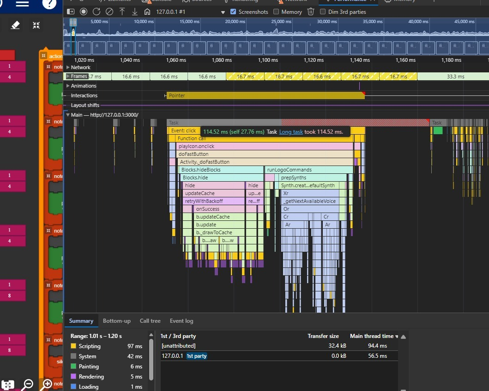
</p>

 
- **Synth Initialization Memoization (PR #7582):** Added an `_synthsInitialized` guard in `prepSynths()` to prevent redundant synth initialization on repeated Play clicks — cutting main-thread long tasks during Play startup from 232–221 ms to 114–121 ms. A follow-up regression (PR #7643) was caught when Devin reported that turtles created *during* execution were never initialized; the fix replaced the blanket skip with a lightweight per-turtle check.
- **Interpreter Micro-Optimizations (PR #7668):** Four mechanical improvements inside `runFromBlockNow()`:
  1. Replaced an incrementing `_totalIterations` counter with a decrementing `_iterationBudget`
  2. Moved the per-call `recordBlockTiming` closure into `Logo._recordBlockTiming()`
  3. Guarded `performanceTracker.enterBlock()` / `exitBlock()` calls behind profiling checks
  4. Corrected the call order for `enterBlock()`
Cumulative impact of the optimization series:
 
| Project | Baseline | Optimized | Improvement |
|---|---|---|---|
| Crab Canon | 303.5 ms | 255.1 ms | 16% faster |
| Zelda | 468.2 ms | 459.5 ms | 2% faster |
 
Small numbers in isolation but these optimizations stripped mechanical overhead from a path that executes thousands of times per playback, and set the stage for the much larger audio-scheduling win that followed.

---

### Phase 3: Turtle and Music Execution Optimization (Week 6)

In Week 6, I shifted my investigation from the interpreter to the audio scheduling pipeline. My instrumentation confirmed that browser timer scheduling was the primary source of playback latency and cumulative timing drift.

In Frère Jacques (268 notes, 4 voices), I found that `setTimeout()` callbacks consistently arrived late, with delays accumulating as each callback scheduled the next one. Cumulative drift reached approximately 29.8 seconds.

<p align="center">
  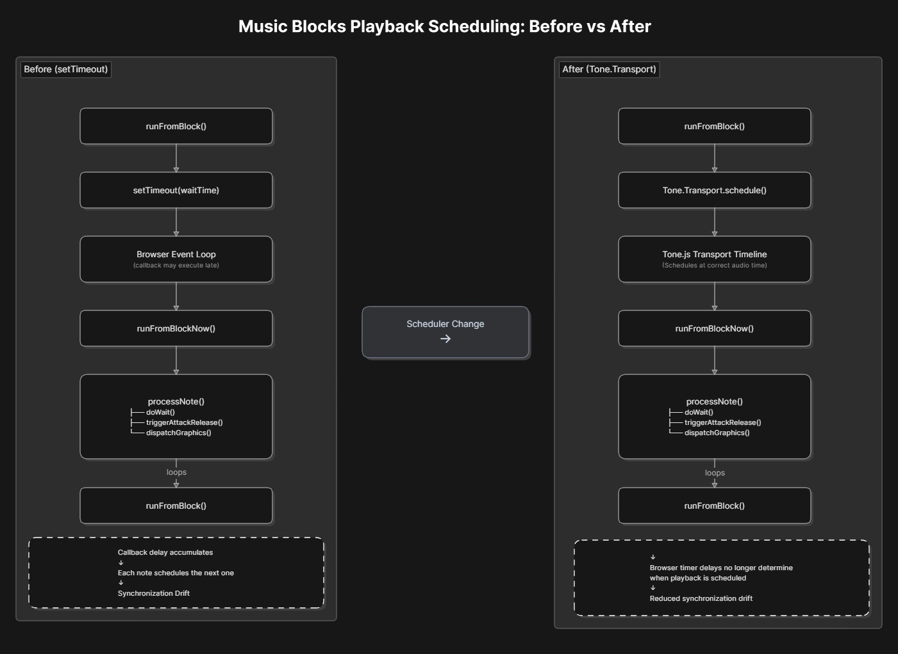
</p>

I replaced delayed `setTimeout()` scheduling with `Tone.Transport.schedule()`, moving playback timing from the browser event loop to Tone.js's audio clock. I retained the existing timer path for zero-delay execution, step mode, and fallback scenarios, and isolated transport operations behind a wrapper in `synthutils.js`.

| Metric | Before | After | Improvement |
|---|---:|---:|---:|
| Mean callback latency | ~44.95 ms | ~11.73 ms | ~4× better |
| P99 callback latency | ~704.9 ms | ~66.17 ms | ~10× better |
| Worst callback latency | ~1,861.5 ms | ~327.3 ms | ~6× better |
| Cumulative scheduling drift | ~29.8 s | ~7.8 s | ~4× better |

This change substantially improved playback scheduling precision while leaving the interpreter and graphics pipeline unchanged.
 
 ---

### Phase 4: Canvas Rendering Optimization (Weeks 7–8)

<p align="center">
  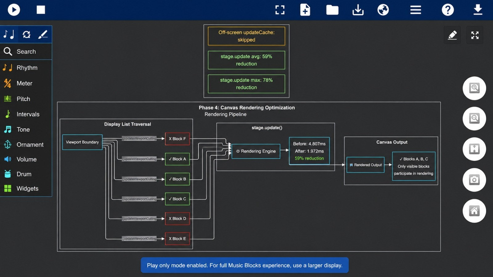
</p>

With audio scheduling fixed, I turned my focus to the rendering pipeline, the other major source of playback overhead.

**Viewport Culling for Off-Screen Blocks**

Walter reported a noticeable playback slowdown in Crabcanon-Plot whenever the block workspace was visible. I profiled it and found that every `stage.update()` traversed the entire EaselJS display list, causing off-screen block containers to pass through the rendering pipeline despite not being visible.

I introduced AABB-based viewport culling:
- Added a `_viewportVisible` flag to blocks, integrated into `container.isVisible()`.
- Introduced `_updateViewportCulling()` to hide off-screen blocks using an axis-aligned bounding box test.
- Cached container positions so culling is recomputed only after pan, scroll, or resize operations.

```
Viewport Culling

┌── Visible Viewport ──────────────────────┐
│  [Block A]  [Block B]  [Block C]         │  ← rendered (visible)
└───────────────────────────────────────────┘
  [Block D]  [Block E]  [Block F]            ← skipped (off-screen)

Before: all blocks pass through stage.update()
After:  only visible blocks participate in rendering
```

Benchmark (Crabcanon-Plot, blocks visible during playback):

| Metric | Before | After | Improvement |
|---|---|---|---|
| stage.update() average | 4.807 ms | 1.972 ms | 59% reduction |
| stage.update() maximum | 19.000 ms | 4.100 ms | 78% reduction |

I also skipped `updateCache()` and `markStageDirty()` for off-screen blocks, which further reduced the cost of the rendering pipeline.

While viewport culling significantly reduced stage.update() cost, it did not resolve the overall playback slowdown. This indicated that canvas traversal was only one component of the bottleneck, prompting further investigation into other rendering and main-thread costs.


---

## Phase 5: Memory Management and Runtime Stability (Weeks 7–8)

Running alongside the rendering work, I focused Phase 5 on runtime cleanup, repeated-run stability, and memory behavior.

### Separating Natural Completion and Stop

I traced several runtime issues to a shared cleanup path handling both natural playback completion and explicit Stop. These paths have different requirements: natural completion must preserve the canvas for export, while Stop must clear visual state and cancel active runtime resources.

I separated the shared audio, transport, and instrument cleanup from Stop-specific behavior and added independent reset paths to ensure cleanup consistently executes.

### Resolving Graph Distortion**

The cleanup issue manifested as canvas distortion after repeated runs. Musical Tree accumulated visible artifacts after 6–7 consecutive runs. After the fix, I observed no distortion across 20+ consecutive runs.

### Memory Profiling

<p align="center">
  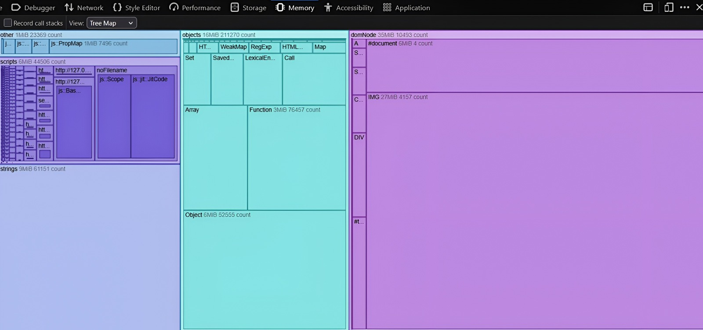
</p>

I also profiled Musical Tree and Hilbert Recursive using repeated heap snapshots in Chrome and Firefox.

| Project | Initial Heap | After First Run | Peak Heap |
|---|---:|---:|---:|
| Musical Tree | ~34.74 MB | ~43.69 MB | ~46.31 MB |
| Hilbert Recursive | ~34.74 MB | ~43.20 MB | ~42.70 MB |

The snapshots showed an expected initialization increase followed by largely stable usage, with no clear evidence of a retained-heap memory leak.

---

## Phase 6: Project Load Time and Notation Export (Week 9-11)

I tackled two remaining performance issues, slow project loading and slow notation export, and found they traced back to the same root cause: the interpreter was re-rendering the canvas far more often than necessary.

### Load time: eliminating redundant renders

I profiled the Rainbow Connection project (5,716 blocks) and found that every one of 33,482 `refreshCanvas()` calls fired while the loading overlay still covered the canvas. Each block's bitmap-ready callback was triggering a redraw independently, so thousands of invisible renders were accumulating during load.

<p align="center">
  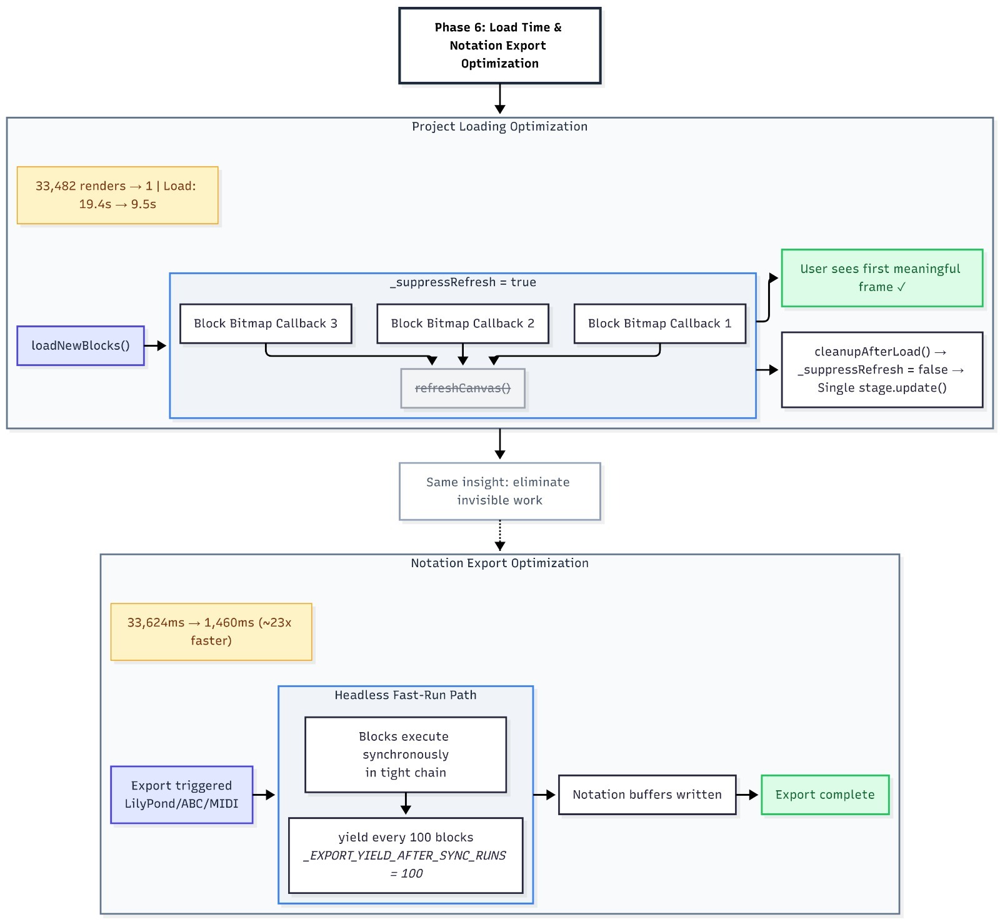
</p>

**Fix:** I added a `_suppressRefresh` flag that gets set at the start of `loadNewBlocks()`. Redraw calls return immediately while it's active, and it clears once loading completes, triggering a single final render. I built in three separate reset paths (normal completion, exception, early exit) to guarantee the flag is never left stuck.

| Metric | Before | After |
|---|---|---|
| Load time | 19.4 s | 9.5 s |
| `refreshCanvas()` calls | 33,482 | 1 |

### Export performance: headless fast-run mode

LilyPond, ABC, MusicXML, and MIDI export all re-run the block program through the standard interpreter, scheduling each block transition with its own `setTimeout`, meaning one event-loop round-trip per block. On large projects with chord stacks and repeats, this made export very slow.

**Fix:** I added an export-only fast-run mode that executes block transitions synchronously, yielding to the event loop every 100 transitions instead of every one.

| Metric | Before | After |
|---|---|---|
| Execution time | 33,624.7 ms | 1,460.2 ms (~23x faster) |
| Yield interval | Every block | Every 100 transitions |

---

## Future Scope

- **AI-Assisted Performance Analysis:** A future extension could integrate PerfSense AI (my personal project) to automatically analyze benchmark and profiling data, identify potential performance regressions, correlate metrics across runs, and suggest areas for investigation. This could make the performance workflow more proactive and reduce the manual effort required to interpret profiling results.

---

## Project Resources and Documentation

### Source Code
- **Repository:** [Music Blocks](https://github.com/sugarlabs/musicblocks)
- **Primary contributor:** [@ssz2605](https://github.com/ssz2605)

### Key Architecture Files
- [js/activity.js](https://github.com/sugarlabs/musicblocks/blob/master/js/activity.js) 
- [js/logo.js](https://github.com/sugarlabs/musicblocks/blob/master/js/logo.js) 
- [js/utils/synthutils.js](https://github.com/sugarlabs/musicblocks/blob/master/js/utils/synthutils.js) 
- [js/block.js](https://github.com/sugarlabs/musicblocks/blob/master/js/block.js) 
- [js/blocks.js](https://github.com/sugarlabs/musicblocks/blob/master/js/blocks.js) 
- [js/turtleactions/RhythmActions.js](https://github.com/sugarlabs/musicblocks/blob/master/js/turtleactions/RhythmActions.js) 
- [js/activity/alert-renderer.js](https://github.com/sugarlabs/musicblocks/blob/master/js/activity/alert-renderer.js) 

### Investigation Reports
- [Crabcanon-Plot Runtime Bottleneck Report](https://docs.google.com/document/d/1Kmx8WVCXzhbySVbYrz7CWLGcngm4Gk_Si-xoDkt6Z2w/edit?usp=sharing) 
- [Firefox Performance Investigation Report: Full Analysis](https://docs.google.com/document/d/1sVVFc620a4MbxsBtp-Dg0wP4kr6kPTN4US4aZBR3U8c/edit?usp=sharing) 
- [Block Execution Analysis Report](https://docs.google.com/document/d/1GBLlqj1BliyYaH-GzM6HmWMnot5JK_64_r7iyXwTtqc/edit?usp=sharing) 
- [Playback Scheduling Synchronization Investigation Report](https://docs.google.com/document/d/1nFWIswAdXjaU1mFpLa_wxaTn1CGgscrR_55qjK9sOU4/edit?usp=sharing)
- [Performance Investigation: Block Highlighting](https://docs.google.com/document/d/1y7rgFBAM86nibpL1QYtFb-bJU5m-YOaz7BDNM4VC8m0/edit?usp=sharing)
- [Memory Profiling Report: Musical Tree & Hilbert Recursive (Firefox)](https://docs.google.com/document/d/1Fzv_UVI1GzzNcmbldt8wUDz0MGG6NgRGd_CQlnV97B0/edit?usp=sharing)
- [Memory Profiling Report: Musical Tree (Chrome)](https://docs.google.com/document/d/1oEGNx-u_OXqWORjbxy_jnsvd-DhlDhnNCD3yUBM_LiE/edit?usp=sharing) 
- [Eliminating Unnecessary Canvas Renders During Project Loading](https://www.sugarlabs.org/news/developer-news/2026-08-28-gsoc-26-shreya-saxena-week10)

### Audit Docs
- [Musical-Tree](https://docs.google.com/document/d/1oEGNx-u_OXqWORjbxy_jnsvd-DhlDhnNCD3yUBM_LiE/edit?usp=sharing)
- [Crabcanon-plot](https://docs.google.com/document/d/1dFID3FZA3LMOLEOxmkw2_Kf1KkGomPLjol6QyI6uh_U/edit?usp=sharing)

### Additional References
- **Benchmarking Notes:** [Project Documentation](https://docs.google.com/document/d/19OoI3Ke4wjH267EKrSf_SEVC4XxAMJOL4tqYnkj4BdI/edit?usp=sharing)
- **Crabcanon Performance Profiling Research:** [Initial Profiling and Instrumentation Notes](https://docs.google.com/document/d/1Gf53RNNLc0IDzUPz8uInUBqBPkSda8KbJC5uAa2S9mI/edit?usp=sharing)
- **LilyPond:** [LilyPond – Music Notation for Everyone](https://lilypond.org)
- **LilyPond Documentation:** [musicblocks/lilypond/README.md](https://github.com/ssz2605/musicblocks/blob/master/lilypond/README.md)
- **MIDI Documentation:** [MIDI 1.0 Detailed Specification](https://midi.org/midi-1-0-detailed-specification)

### Automation Frameworks
- [Cypress](https://www.cypress.io/) / [Electron headless](https://www.electronjs.org/docs/latest/tutorial/testing-on-headless-ci)
- [Playwright](https://playwright.dev/)

### Benchmark Load

| # | Benchmark Workload | File (Music Blocks repo) |
|---|---------------------|---------------------------|
| 1 | Crabcanon-Plot | [crabcanon-plot.html](https://github.com/sugarlabs/musicblocks/blob/master/examples/crabcanon-plot.html) |
| 2 | Rainbow Connection | [RainbowConnection.html](https://github.com/sugarlabs/musicblocks/blob/master/examples/RainbowConnection.html) |
| 3 | In C | [In-C.html](https://github.com/sugarlabs/musicblocks/blob/master/examples/In-C.html) |
| 4 | Hot Cross Buns | [Hot-Cross-Buns.html](https://github.com/sugarlabs/musicblocks/blob/master/examples/Hot-Cross-Buns.html) |
| 5 | Ascend Spiral | [ascending-notes-color-spiral.html](https://github.com/sugarlabs/musicblocks/blob/master/examples/ascending-notes-color-spiral.html) |
| 6 | Drum Polyrhythms | [polyrhythms-drums.html](https://github.com/sugarlabs/musicblocks/blob/master/examples/polyrhythms-drums.html) |
| 7 | Musical Tree | [musical-tree.html](https://github.com/sugarlabs/musicblocks/blob/master/examples/musical-tree.html) |
| 8 | Frere Jacques | [Frere-Jacques.html](https://github.com/sugarlabs/musicblocks/blob/master/examples/Frere-Jacques.html) |

*Repository:* [sugarlabs/musicblocks](https://github.com/sugarlabs/musicblocks) — all files live under `/examples`.

---

## Pull Requests and Weekly Blogs

#### Pull Requests

| S. No. | PR | Description |
|---:|---|---|
| 1 | [#7481](https://github.com/sugarlabs/musicblocks/pull/7481) | Reduced unnecessary idle canvas re-rendering |
| 2 | [#7485](https://github.com/sugarlabs/musicblocks/pull/7485) | Improved Planet search and disabled infinite scroll |
| 3 | [#7578](https://github.com/sugarlabs/musicblocks/pull/7578) | Added Firefox viewport size warning |
| 4 | [#7582](https://github.com/sugarlabs/musicblocks/pull/7582) | Reduced redundant Logo engine lookups |
| 5 | [#7617](https://github.com/sugarlabs/musicblocks/pull/7617) | Optimized Logo execution engine |
| 6 | [#7643](https://github.com/sugarlabs/musicblocks/pull/7643) | Fixed synth initialization for runtime turtles |
| 7 | [#7668](https://github.com/sugarlabs/musicblocks/pull/7668) | Reduced per-block execution overhead |
| 8 | [#7703](https://github.com/sugarlabs/musicblocks/pull/7703) | Replaced `setTimeout` scheduling with `Tone.Transport` |
| 9 | [#7738](https://github.com/sugarlabs/musicblocks/pull/7738) | Added viewport culling for off-screen blocks |
| 10 | [#7755](https://github.com/sugarlabs/musicblocks/pull/7755) | Improved error message display |
| 11 | [#7776](https://github.com/sugarlabs/musicblocks/pull/7776) | Added handling for stopped Transport clock |
| 12 | [#7815](https://github.com/sugarlabs/musicblocks/pull/7815) | Skipped `updateCache()` for off-screen blocks |
| 13 | [#7832](https://github.com/sugarlabs/musicblocks/pull/7832) | Ran stop callbacks on natural completion |
| 14 | [#7848](https://github.com/sugarlabs/musicblocks/pull/7848) | Separated runtime cleanup from visual reset |
| 15 | [#7923](https://github.com/sugarlabs/musicblocks/pull/7923) | Suppressed intermediate renders during project loading |
| 16 | [#7946](https://github.com/sugarlabs/musicblocks/pull/7946) | Prevented duplicate note triggering |
| 17 | [#7970](https://github.com/sugarlabs/musicblocks/pull/7970) | Added headless fast-run for notation exports |
| 18 | [#8026](https://github.com/sugarlabs/musicblocks/pull/8026) | Removed dead `_enqueue` parameter |
| 19 | [#8065](https://github.com/sugarlabs/musicblocks/pull/8065) | Guarded `updatePluginObj` loops |


### Weekly Blogs

| Week | Date | Title |
|---|---|---|
| 1 | 2026-05-30 | [Baseline Benchmarking & Instrumentation](https://github.com/sugarlabs/www-v2/pull/856) |
| 3 | 2026-06-14 | [Crabcanon-Plot Investigation & Idle Rendering Fix](https://github.com/sugarlabs/www-v2/pull/890) |
| 4 | 2026-06-22 | [Firefox Investigation, Synth Memoization & Phase 2 Roadmap](https://github.com/sugarlabs/www-v2/pull/900) |
| 5 | 2026-06-29 | [Block Execution Analysis & Interpreter <1% Finding](https://github.com/sugarlabs/www-v2/pull/917) |
| 6 | 2026-07-06 | [Tone.Transport Migration & Scheduling Accuracy](https://github.com/sugarlabs/www-v2/pull/934) |
| 7 | 2026-07-14 | [Viewport Culling, Error Handling & Memory Profiling](https://github.com/sugarlabs/www-v2/pull/951) |
| 8 | 2026-07-21 | [Runtime Cleanup & Graph Distortion Fix](https://github.com/sugarlabs/www-v2/pull/963) |
| 9 | 2026-07-27 | [GSoC Alumni Camp & Project Progress](https://github.com/sugarlabs/www-v2/pull/984) |
| 10 | 2026-08-03 | [Project Load Time Optimization & Note Duplication Fix](https://github.com/sugarlabs/www-v2/pull/996) |
| 11 | 2026-08-10 | [23× Notation Export Speedup](https://github.com/sugarlabs/www-v2/pull/1005) |
| 12 | 2026-08-23 | [Final Results & Project Report](https://github.com/sugarlabs/www-v2/pull/1032)|

---

## Acknowledgments

This project was completed under the mentorship of Walter Bender and Om Santosh Suneri as part of Google Summer of Code 2026 with Sugar Labs. I’m grateful to Walter for his deep knowledge of Music Blocks and guidance throughout the project, and to Devin Ulibarri for his valuable feedback, bug reports, and real-world test cases. Thanks to the broader Sugar Labs community for their reviews and support, and to Google Summer of Code for making this contribution possible.

---
