# AI Reflection in the Sugar Journal

**Google Summer of Code 2026 · Sugar Labs**

| | |
|---|---|
| **Author** | [Shubham Sharma](https://github.com/vyagh) (@vyagh) |
| **Project** | [AI Reflection in the Sugar Journal](https://github.com/sugarlabs/GSoC/blob/master/Ideas-2026.md), 350 hours, May 25 to August 24, 2026 |
| **Mentors** | [Walter Bender](https://github.com/walterbender), [Ibiam Chihurumnaya](https://github.com/chimosky) |
| **Assisting mentors** | [Sumit Srivastava](https://github.com/sum2it), [Mebin J Thattil](https://github.com/mebinthattil), [Diwangshu Kakoty](https://github.com/Commanderk3), [Harshit Verma](https://github.com/therealharshit), [Aman Naik](https://github.com/AmanNaik) |
| **Code** | [sugarlabs/reflection-engine v0.1.0](https://github.com/sugarlabs/reflection-engine/releases/tag/v0.1.0) · [the pull requests](#pull-requests) |

## Summary

Sugar's Journal saves everything a child makes, and every entry has a description box that stays empty in practice. Sugar's principles are share, discover and reflect. The first two have software behind them; reflect doesn't.

<p align="center">
  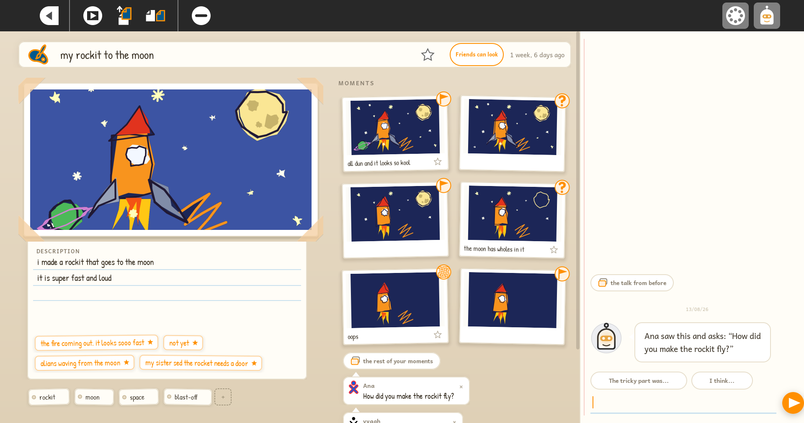
</p>

<p align="center"><em>The rebuilt entry page: the drawing, the child's own starred line as the description, moments in the middle, and a question from a friend in Jo's rail.</em></p>

This project adds **Jo**, a companion that asks the child one open question about the thing they just made, and never answers for them. If the child stars something they said, that line becomes the entry's description, word for word. Getting there took more than an AI feature: the Journal itself had to be rebuilt first, because there was nothing on the entry page worth talking about.

I opened **17 pull requests** across four Sugar Labs repos, released the engine as [sugarlabs/reflection-engine v0.1.0](https://github.com/sugarlabs/reflection-engine/releases/tag/v0.1.0) with a locked spec, and added a `/reflect/chat` endpoint to sugar-ai. I also found **19 defects in Sugar's existing code**; one of them silently deletes saved data. Thirteen of the sugar PRs form one stacked series that reads bottom-up from [#1111](https://github.com/sugarlabs/sugar/pull/1111).

---

## The problem

> *Give the kid a good question and get out of the way.*

Constructionism says you learn by making something and then thinking about what you made. Sugar is built for the first half. The Journal keeps every artifact automatically. Nothing happens after that. Nothing asks the child what they were trying to do, what surprised them, what they'd change. An 8-year-old isn't going to type *"I learned that loops make spirals"* into a blank form field on their own.

An assistant that answers teaches a child to wait for answers, so that was the thing to avoid. So three rules were fixed from the start, and the engine's spec enforces them: **ask, never tell**. **The child owns the description**. **No gamification**.

| What stood in the way | What was built |
|---|---|
| Nothing ever asked when work ended | An invitation after real work, and never twice for the same entry ([#1121](https://github.com/sugarlabs/sugar/pull/1121)) |
| The description was a blank form | A conversation whose answers the child keeps, word for word ([#1119](https://github.com/sugarlabs/sugar/pull/1119)) |
| The Journal showed rows, not work | A grid of the child's own previews, and a timeline ([#1114](https://github.com/sugarlabs/sugar/pull/1114)–[#1116](https://github.com/sugarlabs/sugar/pull/1116)) |
| The entry page led with metadata | An entry page that opens on the child's work ([#1120](https://github.com/sugarlabs/sugar/pull/1120)) |
| No server meant no reflection | Built-in questions in the shell, so Jo works offline ([#1117](https://github.com/sugarlabs/sugar/pull/1117)) |

---

## What a child sees

<p align="center">
  
</p>

**The invite.** An activity closes and a card shows up with that entry's own preview. It only appears after real work; an early build fired on every launch, forever, so now it's gated. *Not now* is always one tap away, and it never asks twice about the same entry.

<p align="center">
  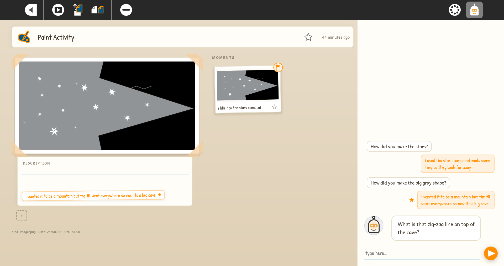
</p>

**Jo's rail.** One question at a time, always about the work. The child stars what's worth keeping, and a starred line becomes the description, verbatim. When the child is done, Jo says goodbye and stops. Going quiet never ends the session by itself.

<p align="center">
  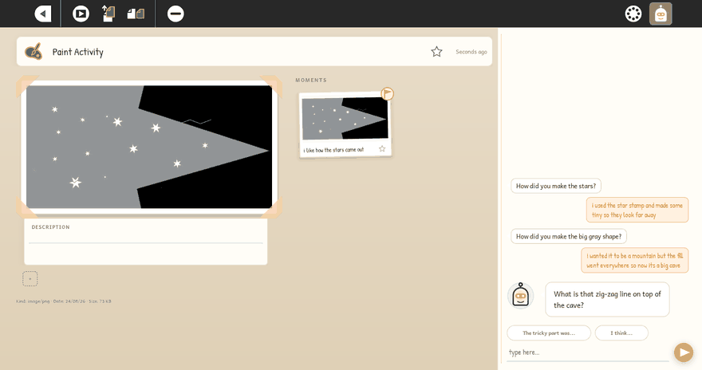
</p>

<p align="center"><em>Starring a line puts it straight into the description.</em></p>

<p align="center">
  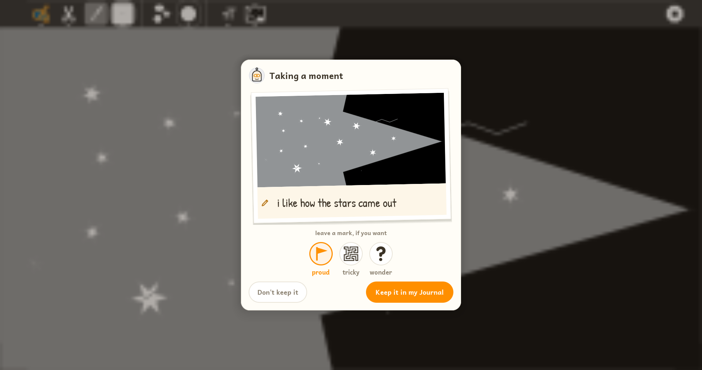
</p>

**Taking a moment.** Mid-activity, the Frame holds Jo's icon: one tap and the child gets a snapshot card to caption in their own words, with a *proud*, *tricky* or *wonder* mark if they want one. Kept moments land in the entry's Moments column, so there's something specific to talk about later.

<p align="center">
  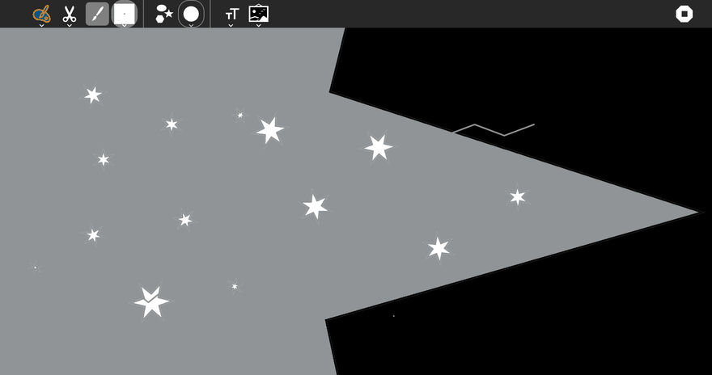
</p>

<p align="center"><em>Opening a moment card from the Frame, without leaving Paint.</em></p>

**Video:** [the week 11 demo on real hardware](https://www.youtube.com/watch?v=W1SIuY696nc)

<p align="center">
  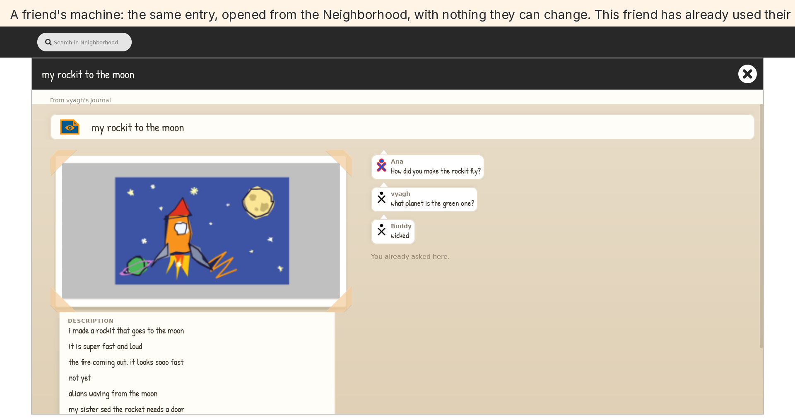
</p>

**Peer reflection.** A child can let friends look at one entry. A friend opens it from the Neighborhood, can't change anything, and can leave one question. Jo tells the child a friend asked something, and the child decides whether to hear it, in the friend's name, never Jo's own words. With no network at all, Jo still asks whether there's someone nearby worth showing the work to ([#1117](https://github.com/sugarlabs/sugar/pull/1117)).


---

## Results

<p align="center">
  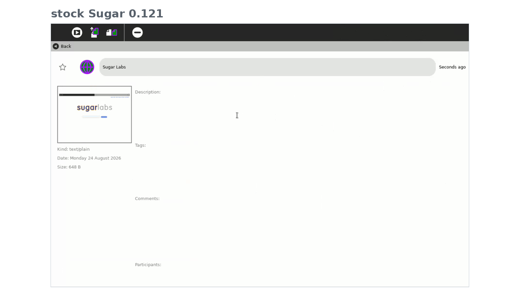
</p>

<p align="center">
  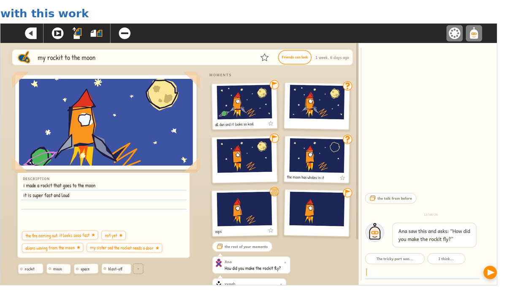
</p>

<p align="center"><em>Stock Sugar 0.121 on top, the rebuilt page below. Stock opens on a metadata form. The rebuilt page opens on the drawing, with the child's own words underneath.</em></p>

What I measured:

| What changed | Before | After |
|---|---:|---:|
| Activity preview size (toolkit) | 300 × 225 | **720 × 540**, about six times the pixels |
| The ten defects [#1111](https://github.com/sugarlabs/sugar/pull/1111) targets in the list, chooser and detail view | 10 | **0** |
| Reflection data surviving another activity's re-save | silently deleted | **kept** |

The guard for that ships in [#1118](https://github.com/sugarlabs/sugar/pull/1118). All of them were measured on the PR series.

One bar I'd set before the run was that the new engine should never score worse than my first one at the same point in a conversation; it didn't hold. Wrap-up offers turned out to fire mostly at a fixed turn count instead of responding to the child; that one was still unfixed at release. And a punctuation-based quality guard got deleted after it passed every labeled turn, including the bad ones.

---

## How the pieces fit

The Journal owns every word a child sees, and all the history. The engine, on the server side of sugar-ai's `/reflect/chat`, is stateless: one call per turn, no memory, no strings of its own. That's why the same engine can serve other surfaces.

Only these fields cross the wire: title, description, activity id, the turns so far, the child's last next-step line, and the entry's context. Every field has a length limit. The raw metadata never leaves the machine, and child text isn't logged. With no server, or on any failure, the shell answers with one of its built-in questions and the surface looks exactly the same.

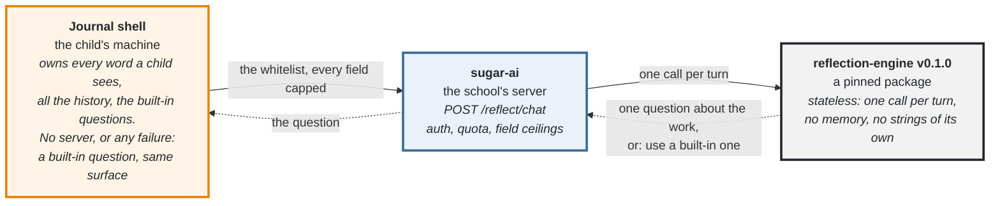

What the engine checks before a turn reaches a child:

| Check | What it rejects |
|---|---|
| Question shape | anything that isn't one question about the work |
| Quiet or one-word answers | treating a quiet or one-word answer as the child leaving; a "no" just continues, and a way out is only offered after repeated refusals |
| Ending | any stop other than the child's own: closing the entry is the only guaranteed end |
| Carrying words forward | anything that isn't the child's own earlier words; if there are none, nothing |
| What Jo won't say | praise or evaluation of the work; answers and instruction; invented detail about the work; therapy and diagnosis language; dependency lines like "I missed you" |
| What Jo won't ask for | names, places, secrets or family details |

---

## How it was built

| Phase | Weeks | What came out of it |
|---|---|---|
| The prototype | 1–2 | Sugarizer fork, the first reflection backend, four activities working |
| Instruments and the engine | 3–7 | the question sheet in a child's voice, the engine spec, the realism check, the first three mockup passes |
| Onto the real Sugar | 8–11 | the Journal rebuilt: grid, timeline, entry page, moments; the first judged eval |
| Peer reflection | 11–13 | a child can share one entry with the machines nearby; a friend can leave one question |
| Release | 12–13 | the datastore bug guarded, the PR series up, engine v0.1.0 out |

### The prototype (weeks 1–2)

A standalone mock had nothing to reflect on, so I forked Sugarizer, the web port of Sugar, and had real activities and real Journal data in days. It settled early that activities don't each need a context extractor: the toolkit's `get_preview()` and shared metadata already cover the AI path.

### Instruments and the engine (weeks 3–7)

This phase looked slow, and the rest of the summer depended on it.

- **Prior art first.** Papert's 1971 memos, Ken Kahn's writings, Brennan and Resnick's interview protocol. Jots mattered most: a 2009 MIT system whose small pilot found that kids barely reflect unless someone nudges them. That's the finding this project is built on.
- **A question sheet, labeled by mentors.** 26 candidate questions, two mentors labeling independently instead of trusting my own read; where they disagreed, the items stayed open.
- **The sheet read like a textbook**, because an adult wrote it. Real children hedge more and explain less, and published child writing made that measurable. So I rewrote every line in a child's voice and built a realism check to keep adult phrasing out.
- **One rule came straight out of the labeling round:** don't sum up who the child is as a person. So Jo asks about the work.

### Onto the real Sugar (weeks 8–11)

Around the midpoint the mentors said to build on the real codebase, on a fork, simplest version first, and that decided the rest of the summer. The Journal had to be rebuilt before it could host Jo: the grid view, the list redrawn as a timeline, the entry page redesigned, and ten stock defects fixed before any of it could land.

<p align="center">
  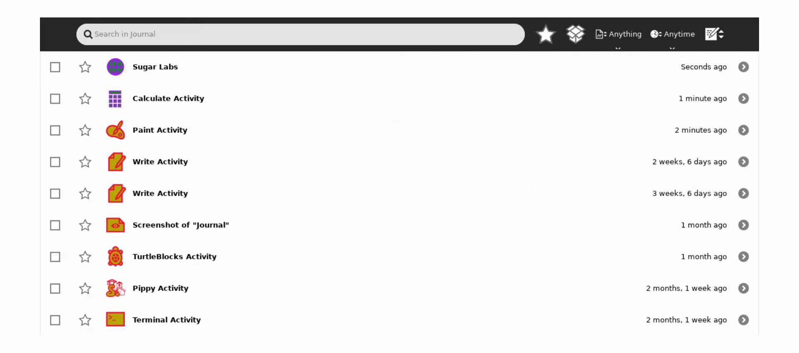
</p>

<p align="center">
  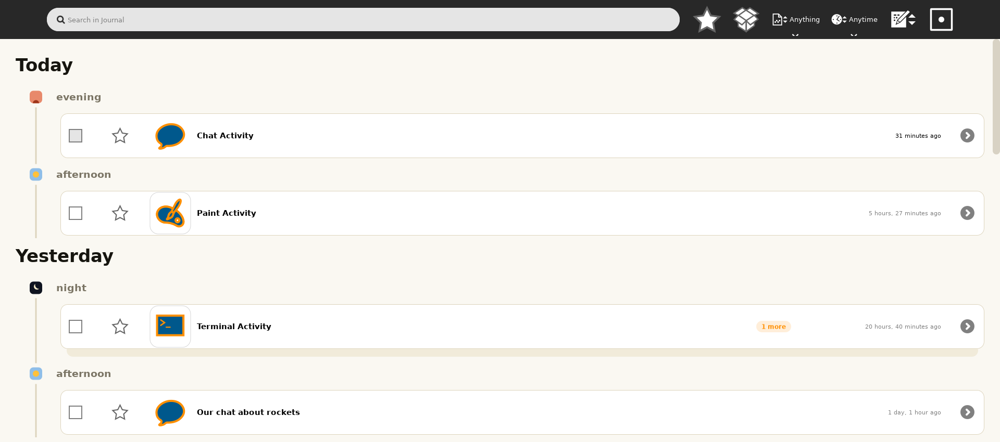
</p>

<p align="center">
  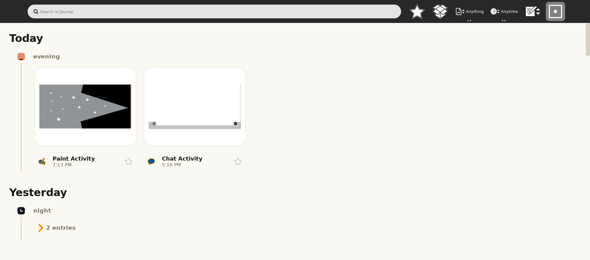
</p>

<p align="center"><em>Top: a Journal as stock Sugar shows it. Below it, mine: the list redrawn as a timeline, and the grid where the child's own work is the thumbnail. One toolbar toggle switches the two.</em></p>

- **The mentors read the first two builds as still thin**, so the entry view was rebuilt from the written design spec. Real hardware then found four bugs in my own views that the VM never showed.
- **A probe harness**, because shell views can't be unit-tested normally. It renders the real `GridView` offscreen, was checked against the VM before I trusted it, and cut the iteration cycle from a two-minute VM restart to 0.4 seconds. It caught a half-pixel drift between grid and list.

### The engine

The engine went through three iterations: a backend inside the Sugarizer prototype, then a standalone package that built the evaluation instruments, then the spec-driven `v0.1.0` that shipped.

It names five mechanisms: question, disengagement, ending, feed-forward, and a safety stack that looks for broken replies, not good ones.

The design decisions that shape it:

- The child picks what to keep; Jo never writes the description.
- Jo never praises or evaluates the work. Stricter than the evaluation labels require, and easier to loosen later once Jo has been watched with real children.
- One companion, no personas. The constructionist reading pointed the same way.
- Feed-forward only ever uses the child's own words.

### Peer reflection (weeks 11–13)

Two children reflecting together sat queued behind the single-child work from week 6 to week 9. The obvious design was the networked one, and the first version of it got dropped: presence between two machines wasn't reliable, and most of the work was fighting that rather than building the feature. What got built first was the version that needs no network at all, Jo nudging the child toward someone nearby.

- **Sugar's own collaboration stack held** once telepathy-salut was rebuilt from source. An entry gets its own share switch. Flip it and the entry shows up in the Neighborhood, around its owner's icon; a friend opens it and gets the owner's own entry page, with nothing they can change.
- **One question, in the friend's name.** The friend can leave one question. It lands in the owner's comments, where Sugar already keeps what people say about an entry, and the next time that entry's conversation opens, Jo mentions that a friend asked something. The child hears the words only on asking. There's nothing on the page to rate the work with.
- **Open as [#1124](https://github.com/sugarlabs/sugar/pull/1124) and [#1125](https://github.com/sugarlabs/sugar/pull/1125).** Tested between two machines: sharing, unsharing, opening the page, asking, and reconnecting after a drop.

### Freeze and ship (weeks 12–13)

The work was carved into a reviewable series and verified byte-identical to the working tree. Before the PRs went out, a security review of the AI panel returned four blocking findings; all were fixed before the first push, and the service defaults to off.


## Evaluation

150 conversations from the shipped engine: three models, ten personas, five kinds of work. Thirty more from my first engine, as a baseline. That's **934 turns, each judged twice** on a 1 to 10 scale for four things: does Jo ask rather than tell, does the question build on what the child just said, does it stay with what the child actually said instead of presuming details, and does Jo hold back. The primary judge shares a model family with the cloud model, so a second judge from a different family re-graded every turn, and those are the numbers I'd stand behind.

| Model | Primary judge | Independent judge |
|---|---:|---:|
| My first engine (llama-3.2-3b) | 6.16 | **6.27** |
| gemini-3.7-flash (cloud) | 7.94 | **7.04** |
| gemma-3-12b (local, a school's own box) | 7.18 | **6.90** |
| qwen3-vl-30b (cloud, rentable) | 6.90 | **6.26** |

The plain reading: the shipped engine scores clearly above my first one with the cloud model, a little above it on the local model, and level with it on the rentable one. One caveat on that last column: when a model's reply fails the checks, Jo falls back to a built-in question, and the judge skips those turns. That happened 18 times for the rentable model and once or twice for the others, so its number is a little kinder than it should be.

The averages hide the shape, so it's worth splitting the four criteria out:

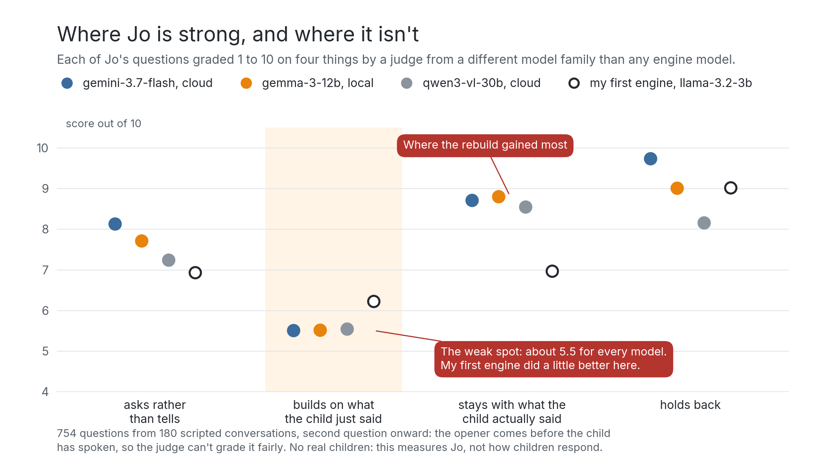

*Jo asks instead of telling and holds back, and the rebuild's biggest gain was staying with what the child said. No version does well at building on what the child just said, and my first engine was slightly better at it. That was the first thing left on the engine's list.*

That run sits on a summer of instrument work, and every measured run after July had its pass bar written before the data existed. That run rests on four things I built first:

- the 26-item question sheet, rewritten into a child's voice
- a judge that has to pass the same written test again whenever its model changes
- a test set for telling when a child actually wants to stop
- mutation testing that exposed 12 real gaps in the test suite, closed

The main limit: no child has talked to Jo yet. Every child line in these runs was scripted, so the numbers say how the engine behaves, not how children respond to it. The scripted lines were checked against real children's published writing, so they sound like kids and not like an adult playing one. There's a second limit. The judge reads the conversation, not the Journal entry, so Jo's opening question, asked before the child has said anything, gets marked down for mentioning the work. That penalty lands on every model equally, and it's why the averages sit lower than the conversations read.

---

## Children's data

- The AI service is off by default. Someone has to turn it on in the control panel.
- Images reach a model only where a deployment sets an explicit flag. Whether a school ever turns that on is a consent question, and it isn't settled.
- Unanswered at release: what Jo should say if a child says something like feeling sad. That needs an answer before any child uses this.

<p align="center">
  
</p>

<p align="center"><em>The AI settings. It's one tile among Sugar's own, with a checkbox, a server address, a key and a connection check inside. Until someone ticks that box, Jo asks only its built-in questions.</em></p>

---

## Quality

| Suite | Covers | Count | Result |
|---|---|---:|---|
| Journal (sugar) | the rebuilt Journal, end to end | 493 | passing |
| reflection-engine | the engine's whole contract | 118 | passing |
| sugar-ai | the `/reflect/chat` endpoint | 39 | passing |

The Journal number is the count at the tip of the PR stack.

Every user-visible string goes through `_()`. The shell's question check also accepts the question marks Arabic, Greek, Armenian and Ethiopic actually use, instead of assuming `?`.

---

## Defects found in stock Sugar

Nineteen defects that predate this project, plus a distro packaging gap. All of them, with causes down to the file and line: [every defect](#every-defect).

**The datastore bug.** This is the serious one:

- **What happens:** the datastore treats every save as the whole truth. `update()` deletes any metadata key the caller doesn't mention, so an activity re-saving a stale copy silently erases whatever anyone else wrote to that entry.
- **Who it hits:** any activity that saves metadata, and it's been there for years.
- **How I found it:** saved reflections started vanishing between sessions, and I spent a while assuming the bug was mine.
- **The fix:** a workaround ships in [#1118](https://github.com/sugarlabs/sugar/pull/1118); the real fix is one change in the datastore, written up as a proposal for the maintainers.

| Component | Defect | Status |
|---|---|---|
| datastore | `update()` deletes every metadata key the caller omits | guarded in [#1118](https://github.com/sugarlabs/sugar/pull/1118); datastore fix drafted |
| journal | ten defects in the list, chooser and detail view | fixed in [#1111](https://github.com/sugarlabs/sugar/pull/1111) |
| sugar-ai | uncaught `StopIteration` in the quota check | guarded in [#163](https://github.com/sugarlabs/sugar-ai/pull/163); upstream fix to file |
| shell | `Animator.stop()` can emit `completed` for an interrupted run, on the legacy timeout path | worked around in [#1118](https://github.com/sugarlabs/sugar/pull/1118) |
| toolkit | palette highlight painted the whole surface | fixed on a branch, to PR |
| packaging, not Sugar | collaboration stack absent from the distros tested (Debian 13, Ubuntu 24.04) | telepathy-salut built from source; related upstream: [sugar #996](https://github.com/sugarlabs/sugar/issues/996) |

Six of the nineteen hadn't been filed upstream when this was written, including one from 2022 where renaming an entry kills the Journal's keyboard shortcuts for the rest of the session.

---

## Proposed vs delivered

| Proposed | Delivered | Note |
|---|---|---|
| Stop an activity → notification → click through to the Journal | **Done** | invite gated on real work |
| 3–5 turn conversation; best answer offered as the description | **Done, changed** | the child stars the line to keep, instead of the system picking it |
| Feed-forward banner in the next session | **Partly**, in the engine | in the child's own words or not at all |
| Works for all activities, no per-activity configuration | **Done** | one small offline question-bank table; unknown activities just work |
| `/reflect/chat` in sugar-ai | **Open**, [#163](https://github.com/sugarlabs/sugar-ai/pull/163) | conversation logic lives in the standalone engine |
| `/reflect/summary` for teachers | **Not built** | open question for the mentors |
| "Reflection Sparks", 50+ offline prompts | **Changed** | about a dozen built-in questions in the shell, which is what runs when there's no server |
| Tests, 85% coverage | **Changed** | counted tests instead; coverage on shell drawing code isn't measurable |
| Turtle Art and Write extractors *(stretch)* | **Not built** | generic first, for every activity; a per-activity frameworks layer was tried early and dropped |
| Developer, deployment and teacher guides | **Partly** | README, SPEC.md, deployment notes in #163 |
| Weekly reports | **Done**, 13 written, 12 published | week 12 was sent as [a pull request](https://github.com/sugarlabs/www-v2/pull/1042) |
| Peer reflection between two children | **Open**, [#1124](https://github.com/sugarlabs/sugar/pull/1124) and [#1125](https://github.com/sugarlabs/sugar/pull/1125) | shared with the machines nearby, the way activities already are; a friend's question offered in the friend's name; seen working between two machines |
| *Not proposed* | The Journal rebuild, moments, the probe and eval harnesses, the stock-Sugar defects | the proposal assumed the Journal could host Jo as it was, and it couldn't, so that came first |

---

## My reflections

I came in thinking the hard part was the AI. It turned out to be the Journal, and then most of the summer went on working out whether what I was measuring meant anything.

**What I believed in March.** I thought reflection just needed a nudge, and that the AI should ask and never answer. Both of those held. I also thought the web prototype had proven the design and the summer would mostly be porting it into Sugar. Porting turned out to be the small part.

**What changed in how I think.**

- I used to treat my own "confirmed" as final. This summer a number I'd signed off on was wrong on a second look. So I stopped trusting my own sign-off. Now I write the pass bar before the run, and I click the thing myself before calling it done.
- The entry view went from a reskin to a rebuild because I'd been reading the word ambitious backwards. It doesn't mean more on the screen, it means taking on more of the journey and keeping each screen simple.
- The mentors labeled my question sheet and disagreed with each other. My first instinct was to settle it my way. The disagreements stayed in and became the rubric.
- The data-loss bug I spent days blaming on myself was years old and hit every activity. I'd read the datastore code before writing a line and still hadn't seen it.

**The three that cost the most time.**

- **Data that vanished between sessions.** The datastore deletes every key a save doesn't mention. The guard is in [#1118](https://github.com/sugarlabs/sugar/pull/1118); the real fix is drafted for upstream.
- **Focus over a fullscreen activity.** Typed text lands in the activity, not in a shell overlay. It took a throwaway build to find that out, and it decided where the whole conversation lives.
- **The judge had already seen the conversations.** The judge had already seen the conversations it was scoring, and I'd made the same mistake in an earlier one. Both are tested on conversations they've never seen.

**What it added for me.** I rebuilt the engine from scratch in week 4 and landed on nearly the same design, which is a big part of why I trust it. Reading full transcripts caught what per-turn scores hid. And the questions I couldn't answer myself went to the mentors as a short list. What I still can't say is whether any of this holds up with a real child in front of it.

---

## What is next

The queue when this was written:

- Review and merge of the pull requests
- Engine: the wrap-offer timing defect, the agreed self-disclosure line (Jo says plainly it's AI and can be wrong, and points at a friend or teacher), and whether it goes to PyPI
- Peer reflection: try the two-child flow in a classroom
- File the remaining defects; send the datastore proposal upstream
- For the mentors: whether reflection starts switched on
- For schools, parents and children: consent for sending a child's preview to a server


---

## Resources

### Pull requests

Thirteen of the `sugar` PRs are one stacked series, each based on the one before it, with [#1111](https://github.com/sugarlabs/sugar/pull/1111) at the bottom and [#1125](https://github.com/sugarlabs/sugar/pull/1125) at the tip; [#1122](https://github.com/sugarlabs/sugar/pull/1122) stands on its own.

| # | Repo | PR | What it does |
|---:|---|---|---|
| 1 | sugar | [#1111](https://github.com/sugarlabs/sugar/pull/1111) | Fix ten journal defects in the list, chooser and detail view |
| 2 | sugar | [#1112](https://github.com/sugarlabs/sugar/pull/1112) | Add timeline helpers and a row-facts cache for the journal views |
| 3 | sugar | [#1114](https://github.com/sugarlabs/sugar/pull/1114) | Redraw the journal list as a timeline on a shared view base |
| 4 | sugar | [#1115](https://github.com/sugarlabs/sugar/pull/1115) | Add a grid view of the journal |
| 5 | sugar | [#1116](https://github.com/sugarlabs/sugar/pull/1116) | Switch the journal between list and grid |
| 6 | sugar | [#1117](https://github.com/sugarlabs/sugar/pull/1117) | Add the offline reflection floor and the privacy strip rule |
| 7 | sugar | [#1118](https://github.com/sugarlabs/sugar/pull/1118) | Add the moment card and Jo's place in the Frame |
| 8 | sugar | [#1119](https://github.com/sugarlabs/sugar/pull/1119) | Add the reflection rail |
| 9 | sugar | [#1120](https://github.com/sugarlabs/sugar/pull/1120) | Redesign the journal entry page |
| 10 | sugar | [#1121](https://github.com/sugarlabs/sugar/pull/1121) | Invite reflection when an activity closes |
| 11 | sugar | [#1123](https://github.com/sugarlabs/sugar/pull/1123) | AI server configuration panel in the settings menu |
| 12 | sugar | [#1124](https://github.com/sugarlabs/sugar/pull/1124) | Share a journal entry with the neighborhood |
| 13 | sugar | [#1125](https://github.com/sugarlabs/sugar/pull/1125) | The pages for a shared journal entry |
| 14 | sugar | [#1122](https://github.com/sugarlabs/sugar/pull/1122) | Scale chooser previews to classic cells |
| 15 | sugar-ai | [#163](https://github.com/sugarlabs/sugar-ai/pull/163) | Add a `POST /reflect/chat` endpoint for journal reflection |
| 16 | sugar-datastore | [#30](https://github.com/sugarlabs/sugar-datastore/pull/30) | Keep snapshots and reflections out of the search index |
| 17 | sugar-toolkit-gtk3 | [#520](https://github.com/sugarlabs/sugar-toolkit-gtk3/pull/520) | Raise preview size to 720 × 540 |

The engine isn't a pull request; it's its own repository, [sugarlabs/reflection-engine](https://github.com/sugarlabs/reflection-engine), tagged `v0.1.0`, consumed by sugar-ai as a pinned dependency.

### Where the code runs

Tested end to end on a Debian 13 VM running Sugar 0.121 from distro packages, and on real hardware in the week 11 video. An Ubuntu 24.04 laptop confirmed the packaging caveat below.

- The Journal work, Jo's rail and the offline questions are the `sugar` pull requests above, with sugar-datastore #30 and toolkit #520 alongside; they need nothing else in the shell.
- The AI path needs sugar-ai with #163, and the AI section of the control panel filled in.
- Neither tested distro packages `telepathy-salut` any more, so Sugar collaboration, peer reflection included, needed it built from source.

The engine also runs on its own:

```sh
git clone --branch v0.1.0 https://github.com/sugarlabs/reflection-engine && cd reflection-engine
uv sync
uv run pytest -q                                                   # 118 tests, fake provider
uv run python -m evals.smoke openrouter google/gemini-3.7-flash    # scripted children, real model
```

### The full record

| Page | What is in it |
|---|---|
| [the Journal work](#the-journal-work-pr-by-pr) | The Sugar shell work, PR by PR, and the design process |
| [the measurement record](#the-measurement-record) | The eval runs, the judge studies, and the research questions behind the design |
| [every defect](#every-defect) | All nineteen defects: cause, fix, status |
| [looking back](#looking-back) | The proposal read again in August, phase by phase, what I still doubt |

Where the tests live: the Journal tests came in across the PR stack; the engine tests are in [sugarlabs/reflection-engine/tests](https://github.com/sugarlabs/reflection-engine/tree/v0.1.0/tests); the endpoint tests come with [sugar-ai #163](https://github.com/sugarlabs/sugar-ai/pull/163).

[SPEC.md](https://github.com/sugarlabs/reflection-engine/blob/v0.1.0/SPEC.md) is the engine's contract and [evals/measurements.md](https://github.com/sugarlabs/reflection-engine/blob/v0.1.0/evals/measurements.md) is the dated record behind the published runs. The design artifacts, online at release: [mockups](https://gsoc-html-share.vercel.app/mockups) · [the June 24 spec](https://gsoc-html-share.vercel.app/spec) · [the proposal prototype](https://journal-reflection-demo.vercel.app)

### Sources this design leans on

- Seymour Papert, *Teaching Children Thinking* (MIT AI Memo 247, 1971), and Papert & Solomon, *Twenty Things to Do With a Computer* (AIM-248, 1971)
- Eric Rosenbaum's *Jots* (MIT MS thesis, 2009): the finding that children rarely reflect unless nudged, and that the nudging doesn't fade on its own
- Brennan & Resnick's computational-thinking [interview protocol](https://scratched.gse.harvard.edu/ct/files/Student_Interview_Protocol.pdf) and [assessment rubric](https://scratched.gse.harvard.edu/ct/files/Student_Assessment_Rubric.pdf) (AERA 2012), the spine of the question sheet
- *PoKi: A Large Dataset of Poems by Children* (Hipson & Mohammad, 2020, [arXiv:2004.06188](https://arxiv.org/abs/2004.06188)), used to keep the eval sheet in a child's voice
- Ken Kahn's published writings on children, programming and AI, read as prior art before any child-AI pattern here was designed

### Weekly blogs

| Week | Date | Post |
|---:|---|---|
| 0 | 2026-05-23 | [Introduction](https://www.sugarlabs.org/news/developer-news/2026-05-23-gsoc-26-vyagh-week00) |
| 1 | 2026-06-03 | [A working prototype on Sugarizer](https://www.sugarlabs.org/news/developer-news/2026-06-03-gsoc-26-vyagh-week01) |
| 2 | 2026-06-08 | [Four activities, one preview](https://www.sugarlabs.org/news/developer-news/2026-06-08-gsoc-26-vyagh-week02) |
| 3 | 2026-06-15 | [Prior art, and rebuilding the engine](https://www.sugarlabs.org/news/developer-news/2026-06-15-gsoc-26-vyagh-week03) |
| 4 | 2026-06-22 | [Re-deriving the design blind](https://www.sugarlabs.org/news/developer-news/2026-06-22-gsoc-26-vyagh-week04) |
| 5 | 2026-06-29 | [The spec, and resetting the eval sheet](https://www.sugarlabs.org/news/developer-news/2026-06-29-gsoc-26-vyagh-week05) |
| 6 | 2026-07-06 | [Children's voice, real corpora](https://www.sugarlabs.org/news/developer-news/2026-07-06-gsoc-26-vyagh-week06) |
| 7 | 2026-07-13 | [The engine builds](https://www.sugarlabs.org/news/developer-news/2026-07-13-gsoc-26-vyagh-week07) |
| 8 | 2026-07-20 | [Onto the real Sugar](https://www.sugarlabs.org/news/developer-news/2026-07-20-gsoc-26-vyagh-week08) |
| 9 | 2026-07-27 | [Two tracks, and the first eval run](https://www.sugarlabs.org/news/developer-news/2026-07-27-gsoc-26-vyagh-week09) |
| 10 | 2026-08-03 | [Grid and timeline](https://www.sugarlabs.org/news/developer-news/2026-08-03-gsoc-26-vyagh-week10) |
| 11 | 2026-08-10 | [Hardening, performance, reflection with a peer](https://www.sugarlabs.org/news/developer-news/2026-08-10-gsoc-26-vyagh-week11) |
| 12 | 2026-08-17 | [The datastore bug, and the PRs going up](https://github.com/sugarlabs/www-v2/pull/1042) (as a pull request) |

---

## Acknowledgments

**Walter Bender** and **Ibiam Chihurumnaya** mentored this project. Walter pushed me onto the real codebase, read through two engine rebuilds and a scrapped evaluation, and put real hours into labeling question sheets. Ibiam kept the practical side honest: what was in scope, and how to build things so they last.

Thanks to my assisting mentors, Sumit Srivastava, Mebin J Thattil, Diwangshu Kakoty, Harshit Verma and Aman Naik, and to Aman and Diwangshu, who labeled evaluation sheets by hand when I needed a second read I could trust.

Thanks to Devin Ulibarri, who reviewed the designs with a close eye for how children actually see them. Thanks to Ken Kahn, whose writings on children, programming and AI this design was checked against. And thanks to Jonas Smedegaard, for months of Matrix discussions about what reflection means in a constructionist context.

Thanks to Sugar Labs for the summer, and for letting me work on something children might actually use.

---

*Shubham Sharma · GitHub [@vyagh](https://github.com/vyagh) · Matrix [@vyagh:matrix.org](https://matrix.to/#/@vyagh:matrix.org)*

---

## The Journal work, PR by PR

<details>
<summary><b>Open the full record</b></summary>

### The PR stack

[#1122](https://github.com/sugarlabs/sugar/pull/1122) is on its own, and depends on the toolkit change in #520.

| order | PR | base | +/- | files | tests |
|---|---|---|---|---|---|
| 1 | [#1111](https://github.com/sugarlabs/sugar/pull/1111) | master | +45/-28 | 6 | none yet (suite starts in #1112) |
| 2 | [#1112](https://github.com/sugarlabs/sugar/pull/1112) | [#1111](https://github.com/sugarlabs/sugar/pull/1111) | +1196/-13 | 8 | 76 new, 76 total |
| 3 | [#1114](https://github.com/sugarlabs/sugar/pull/1114) | [#1112](https://github.com/sugarlabs/sugar/pull/1112) | +1469/-221 | 6 | 15 new, 91 total |
| 4 | [#1115](https://github.com/sugarlabs/sugar/pull/1115) | [#1114](https://github.com/sugarlabs/sugar/pull/1114) | +2212/-0 | 4 | 21 new, 112 total |
| 5 | [#1116](https://github.com/sugarlabs/sugar/pull/1116) | [#1115](https://github.com/sugarlabs/sugar/pull/1115) | +107/-24 | 2 | 0 new, 112 total |
| 6 | [#1117](https://github.com/sugarlabs/sugar/pull/1117) | [#1116](https://github.com/sugarlabs/sugar/pull/1116) | +1864/-0 | 6 | 109 new, 221 total |
| 7 | [#1118](https://github.com/sugarlabs/sugar/pull/1118) | [#1117](https://github.com/sugarlabs/sugar/pull/1117) | +2194/-2 | 13 | 17 new, 238 total |
| 8 | [#1119](https://github.com/sugarlabs/sugar/pull/1119) | [#1118](https://github.com/sugarlabs/sugar/pull/1118) | +1217/-0 | 3 | 0 new, 238 total |
| 9 | [#1120](https://github.com/sugarlabs/sugar/pull/1120) | [#1119](https://github.com/sugarlabs/sugar/pull/1119) | +1808/-300 | 5 | 0 new, 238 total |
| 10 | [#1121](https://github.com/sugarlabs/sugar/pull/1121) | [#1120](https://github.com/sugarlabs/sugar/pull/1120) | +493/-0 | 5 | 18 new, 256 total |
| 11 | [#1123](https://github.com/sugarlabs/sugar/pull/1123) | [#1121](https://github.com/sugarlabs/sugar/pull/1121) | +1995/-99 | 12 | 68 new, 324 total |
| 12 | [#1124](https://github.com/sugarlabs/sugar/pull/1124) | [#1123](https://github.com/sugarlabs/sugar/pull/1123) | +2807/-50 | 9 | 129 new, 453 total |
| 13 | [#1125](https://github.com/sugarlabs/sugar/pull/1125) | [#1124](https://github.com/sugarlabs/sugar/pull/1124) | +2339/-63 | 14 | 40 new, 493 total |
| - | [#1122](https://github.com/sugarlabs/sugar/pull/1122) | master, independent | +9/-4 | 1 | none |

Run at the tip: `PYTHONPATH=/usr/lib/python3/dist-packages:src python3 -m unittest discover -s tests/journal -t .`. Drawing code needs a running GTK and has no unit harness, so everything below was also walked by eye in a live shell.

#### Defect fixes ([#1111](https://github.com/sugarlabs/sugar/pull/1111))

- **Notable:** merges on its own, no dependency on the rest of the stack. `make test` was already red on master before this PR, and the journal suite itself only arrives in the next one.

#### Timeline groundwork ([#1112](https://github.com/sugarlabs/sugar/pull/1112))

- **What:** `timeline.py`, date math and a rounded-rectangle drawing helper that the list, grid and moment card all use later in the series. Also a "sitting" key, which groups entries made in one stretch of work in the same activity, and a row-facts cache in the list model so drawing stops re-reading the datastore per cell.
- **Notable:** an entry with a broken timestamp now shows "No date" instead of a date computed from timestamp 0. This is where `tests/journal` starts, on plain unittest, with no new dependency.

#### Timeline list ([#1114](https://github.com/sugarlabs/sugar/pull/1114))

- **What:** `basejournalview.py`, a shared base that handles query, selection and visibility for both the list and the grid coming after it, with the list redrawn on top of it as day-banded, foldable sittings. A shared base keeps that logic from forking.
- **Notable:** the timeline draws on top of the existing `TreeView` instead of a rebuild on `FlowBox`, because `FlowBox` can't break a row on a group boundary. Checked live: timeline renders, sittings fold and unfold, the view updates on add or change.

#### Grid view ([#1115](https://github.com/sugarlabs/sugar/pull/1115))

- **What:** cards grouped by sitting inside the same day bands as the list, subclassing `BaseJournalView`, which gives the Journal a second, image-forward view next to it.
- **Notable:** row breaking is hand-rolled for the same `FlowBox` reason as the list, and animations run on `add_tick_callback` loops. The 21 new tests are all on the grouping logic; the drawing itself has no unit coverage.

#### List and grid switch ([#1116](https://github.com/sugarlabs/sugar/pull/1116))

- **What:** a toolbar toggle switching the Journal between list and grid, one view shown at a time, selection kept across the switch. The hidden view keeps its query running so the switch is instant, which costs a second live result set.

#### Offline reflection engine ([#1117](https://github.com/sugarlabs/sugar/pull/1117))

- **What:** `reflection.py`, the offline engine: Jo's built-in questions, session storage, and the acceptance bar for a turn. Plus `reflection.strip_private`, which clears reflections, next steps and moment snapshots on writes to external volumes, while an in-place rewrite on the entry's own volume keeps them. Copying an entry to a USB stick shouldn't carry the child's conversation with it.
- **Notable:** Jo's only memory across a session is an echo of the entry title or the newest caption, once, never mid-conversation. [sugar-datastore #30](https://github.com/sugarlabs/sugar-datastore/pull/30) has to land first, or the reflection text becomes searchable in the Journal.

#### Moment card ([#1118](https://github.com/sugarlabs/sugar/pull/1118))

- **What:** the first child-visible piece. Jo gets a Frame icon, and tapping it opens a moment card with a snapshot, a mark, and a line in the child's own words. The marks borrow Sugar's own icons: tricky is the maze, wonder the question emblem, proud a flag. Also `reflectstyle.py` (shared palette and type), Jo's glyph, `reflectguard.py`, and a completion callback on `Frame.hide()`.
- **Notable:** `reflectguard` is a declared workaround for the datastore delete-by-omission bug. The mid-retract race isn't scriptable, so that one path is reasoned about rather than observed.

#### Jo's rail ([#1119](https://github.com/sugarlabs/sugar/pull/1119))

- **What:** `reflectionview.py`, Jo's side of the entry page: one question at a time beside the child's work, the whole talk as scrollback, and the child, never Jo, ending the conversation.
- **Notable:** the request path runs on a worker thread with a generation counter even though the offline call returns immediately. That's where a later server layer plugs in without touching this file. VM test: old talk renders as scrollback, the built-in questions run out cleanly, goodbye fires once, state holds across leaving and returning.

#### Entry page ([#1120](https://github.com/sugarlabs/sugar/pull/1120))

- **What:** the expanded entry page rebuilt, navigation moved to the toolbar; moments, tags, kept lines and comments each get their own visual form, with room made at the side for the rail. The child's work leads the page and the conversation sits beside it.
- **Notable:** lands as two commits, primitives first, then the page moves onto them.

#### Invite on close ([#1121](https://github.com/sugarlabs/sugar/pull/1121))

- **What:** when a child closes an activity, Jo offers to talk, gated on a non-empty file and a minute of focused time, measured through the toolkit's own spent-times. It never blocks the close.
- **Notable:** VM test: 28 seconds of resume-and-quit produces no note; about 75 seconds of drawing produces a note with a thumbnail and buttons.

#### AI settings panel ([#1123](https://github.com/sugarlabs/sugar/pull/1123))

- **What:** an AI section in the control panel (enable switch, server address, key); the Journal speaks the reflection engine's typed wire format and packs entry context (preview, moment snapshots, tags, time spent) into the request.
- **Notable:** about 1,050 of the diff's roughly 2,000 lines are tests. Answers to Jo's "who was with you" questions stay on the machine, and a starred description is never sent. flake8 clean on the new files.

#### Chooser previews ([#1122](https://github.com/sugarlabs/sugar/pull/1122))

- **What:** sizes the object chooser's grid cells from the toolkit's `PREVIEW_SIZE` constant, so raising that constant doesn't also grow the chooser's cells. It keeps the chooser's classic 300 × 225 cells once [sugar-toolkit-gtk3 #520](https://github.com/sugarlabs/sugar-toolkit-gtk3/pull/520) raises the preview size to 720 × 540, which has to merge first.

### Design process

- A design bake-off built 35 comparison cards out of Sugar's own `gtk.css` tokens, across three visual theses. The shipped direction was composed from the strongest pieces, and it went into an easel spec with 20 reference screens that every later VM build got compared against.
- Four mockup passes followed, from early wireframes to a complete-flow prototype to a rebuild around Sugar-native patterns; all four passes are at [gsoc-html-share.vercel.app/mockups](https://gsoc-html-share.vercel.app/mockups).
- Four possible flows for two children reflecting together went to the mentors. The read that came back was that the AI-heavier ones didn't obviously need AI at all, and that one shared view for both children was the simpler design. The version that survived is the smallest one that works: a child reflects at their laptop, another child is nearby, and Jo asks whether there's anyone near them worth talking to.
- A throwaway GTK test typed directly into the VM settled where the conversation can live: text typed over a fullscreen activity lands in the activity, not in a shell-owned overlay, because the window manager keeps the keyboard. A tap does transfer focus. That is why Jo's short replies sit over the activity and the typing happens in the Journal.

### The probe harness

A host-side test harness that renders the real, unmodified `jarabe.journal.gridview.GridView` against a synthetic fixture directory, instead of against the live Sugar datastore or shell.

- **Speed:** a VM round trip to check a Journal layout change takes about two minutes. A probe reload takes 0.4 seconds.
- **Shims:** exactly three things, each documented: the bundle registry, mount-point detection, and activity resume. Anything else the code touches raises.
- **Checkers:** about eighteen in all, from `selftest.py` (headless pass/fail invariants) through `css_states.py` (23 CSS states rendered for before/after diffing) to `timeline_align.py`, which pixel-measures whether list and grid draw the shared timeline spine on identical pixels.
- **Fixtures:** 11 fixture sets, 15 to 66 files apiece, each paired with the checker that reads it.
- **Fidelity:** ground colour, card width, timeline spine position and scrollbar metrics at 1920 wide came out identical between the probe harness and the VM, so I iterated on the probe and checked everything in the VM before calling it done.

### The peer PRs ([#1124](https://github.com/sugarlabs/sugar/pull/1124), [#1125](https://github.com/sugarlabs/sugar/pull/1125))

The last two PRs of the stack, opened 2026-08-24.

- **What:** `peershare.py` shares a Journal entry the way Sugar already shares an activity: the entry announces itself to the machines nearby, a friend's request for it comes back on a private channel, and their one question lands in the entry's comments. `peerview.py` is the page a visitor sees: the owner's own entry page, with nothing they can change, plus one ask box. A shell that doesn't know about shared entries ignores the announcement.
- **Notable:** the friend's question is offered, never spoken. Jo mentions that a friend asked something and keeps the words out of sight; the child hears them only on asking, in the friend's name. Comment cards take the asker's colours from the owner's own presence record, never from the wire, and nothing reaches the datastore untrusted: the friend's name and id, the file type, tags, question length and comment count are all bounded on the owner's side.
- **Three stock fixes ride in front:** the Neighborhood no longer reports itself ready before it is, a buddy arriving out of order no longer half-processes, and a preview padded with transparency isn't trimmed as if it were a wide image.

</details>

---

## The measurement record

<details>
<summary><b>Open the full record</b></summary>

What was measured this summer. Where a record is public, it's linked.

Hedge rate was the measure that worked: real children hedge far more per line than the adult-written sheet did. Length and reading grade didn't separate them.

### The eval program

The instruments took longer to build than the engine did.

- **Whole conversations (July 8 to August 17).** The second engine ran its own eval program, and two of its results turned out to be overclaims: one measure was really tracking length, and one comparison didn't survive a re-run. Both were retracted, which is why every run after that has its bar written before the data exists.

### Engine evaluation

The dated record behind these runs is evals/measurements.md.

- **The judged run.** The bar I'd set beforehand, that the new engine never score below the old one at the same point in a conversation, failed for every model.
- **The cross-family check.** Every turn re-graded by gpt-5.6-luna, in case the judge was favouring its own family.
- **Stop-read design.** 34 labeled child lines, 4 models, 2 designs, 3 repetitions: 816 calls. Five of the 34 lines are indirect exits. A dedicated reader caught all of them where a single call caught 7, but it also stopped sessions on quiet answers that weren't exits, so the single call stayed.
- **Stop-read wording, re-measured.** Same 34 lines, majority of 3: exit detection went from 7/15 to 11/15 with no quiet-line regressions.
- **The shape guard.** 26 mentor-labeled turns, 17 good and 9 bad: the punctuation-and-shape check passed all 26 regardless of label. It didn't separate them at all.
- **Typed protocol on small models.** 8 scripted moods against phi-4, qwen3-14b and gemma-3-12b: two clean, one rejected reply on gemma. The reply now comes back in a fixed shape the host can check, instead of marker words hidden inside text a child might see ([SPEC.md](https://github.com/sugarlabs/reflection-engine/blob/v0.1.0/SPEC.md)).
- **Wrap-offer timing.** In the judged run, 92% of wrap-up offers fire at a fixed turn number regardless of engagement. Open defect.

### The judge itself

- **Calibration.** The two mentors agreed on 20 of 26; the judge is checked against those labels.
- **A failed migration.** Two candidate judges were tried against a bar written beforehand; both failed, and so I kept the existing judge. When the judge's model retired, two replacements were run through the same written test; both passed, and 3.7-flash won on the separation rule set before the run.
- **The whole-conversation judge** was rebuilt more than once, each version caught by a stress test the one before had passed. The version in use is the one that won above.

The judge is the piece I trust least, so it re-takes a written test every time its model changes. Most candidates have failed it.

### Robustness

- **Mutation testing** (mutmut): 109 surviving mutants, all read by hand. 12 were real gaps and got new tests, 87 were string-literal noise, and the rest were minor. One was left: a missing test at exactly `MAX_CHARS`.
- **Cross-model smoke runs** after each spec change, with the dated re-run covering four model families: zero stuck sessions, zero disengagements without an exit offer.
- **Two VMs** on Debian 13, with telepathy-salut built from source: presence works between them. The related upstream issue is sugar #996.

### The research questions behind the design

None of this is code. It's what decided what the code should do.

- **Can a local model act as a reliable judge?** No: on IF-RewardBench, open 7 to 8B models agree with the reference labels far less than the proprietary ones do, roughly 0.1 to 0.2 against 0.5 to 0.6 rank correlation. So the judge is a paid API model, while the assistant itself can stay small.
- **Does a bigger-than-memory model beat a native-fit small one on an 11 GB laptop?** Not on the paths tried: the offload routes examined want a 24 GB or larger card, and the best native-fit small model won the controlled comparison anyway.
- **Does usable children's creative-reflection data exist?** More than a first, narrower pass claimed. No single clean corpus, but real parts to assemble one from: Brennan and Resnick's interview suite and PoKi.
- **What validated instruments measure child voice and reflection depth?** None does the job on a single line or turn. What was adopted: a small composite plus a human read-aloud.
- **Which safety lexicons can the crisis and PII screening legally use?** Nearly none of the published ones. What ships is a hand-written pattern list, with regex and `phonenumbers` for PII; a checked-in adversarial test set and a classifier gate are the pieces that weren't built.
- **Had anyone already solved stop detection, quiet answers, or child-typed names?** Nobody had tested the design actually shipped. The one measured child datapoint codes a quiet "idk" as a neutral signal rather than an exit, which is the basis for going quiet never ending a session. Person names in child text remain unsolved everywhere examined.
- **What do existing child-AI creative systems get wrong?** Scratch Copilot and ChatScratch answer too readily.
- **What do entry previews look like across activities?** A scan of every Sugar Labs repository, with 16 activities opened by hand: 15 of the 16 screenshot the canvas at save time. One constant preview box with a words fallback beats a per-activity extractor for each.
- **What does published constructionist writing (Kahn, Papert) imply for a reflection companion?** Named failure modes to design against. On rewards and badges the corpus held nothing at all; no-gamification is this project's own rule.

</details>

---

## Every defect

<details>
<summary><b>Open the full record</b></summary>

Defects turned up in stock Sugar while this one feature was built, plus a Debian packaging gap that isn't a Sugar bug.

| Component | Defect | Found while | Status |
|---|---|---|---|
| datastore | `update()` deletes every metadata key a caller omits | testing the moment card and reflection persistence | shell-side guard in [#1118](https://github.com/sugarlabs/sugar/pull/1118); datastore fix drafted, to send |
| toolkit | `DSObject.destroy()` never removes its `Updated` signal match | building the invite on activity close | to file |
| toolkit | palette-open highlight painted the whole surface instead of filling its path | styling the Journal's GTK3 CSS states | fixed on a branch, to PR |
| journal | ten defects in list, chooser and detail view | starting the Journal rebuild series | fixed, [#1111](https://github.com/sugarlabs/sugar/pull/1111) |
| journal | renaming an entry disables keyboard shortcuts for the rest of the session, since 2022 | auditing Journal keyboard handling for the list/grid work | to file |
| journal | entry titles are invisible to screen readers | the same keyboard/accessibility audit | to file |
| journal | "sort by date created" silently sorts by modification time on removable media | the same audit, reading the sort tuple in `model.py` | to file |
| journal | closing the object chooser while its model is still loading crashes on a `None` view | live on the VM | to file |
| shell | `Animator.stop()` can emit `completed` for an interrupted run, not only a finished one | building the moment card's Frame completion callback | worked around in [#1118](https://github.com/sugarlabs/sugar/pull/1118); upstream not fixed |
| shell | the collaboration stack is absent on Debian 13, no `local-xmpp` protocol | setting up peer reflection on the VM | rebuilt telepathy-salut from source; two-machine presence works |
| sugar-ai | the quota lookup raises `StopIteration` for a username absent from `API_KEYS`, at four call sites in `app/routes/api.py` | writing the same lookup in the `/reflect/chat` endpoint | to file; [#163](https://github.com/sugarlabs/sugar-ai/pull/163) guards its own copy |

### Ten defects in list, chooser and detail view

Ten small, independent defects across six files in `src/jarabe/journal/`, all fixed in [#1111](https://github.com/sugarlabs/sugar/pull/1111):

- the object chooser stopped updating its own list while open, from an inverted `visible = state == FULLY_OBSCURED` check in `objectchooser.py`
- a filter toolbar painted its background over the whole surface instead of its own box
- a "Participants" heading was shown over nobody on solo entries
- a row crashed when an entry's title wasn't a string
- a cache index was set before its row was built, leaving half a row on the next read after an error
- a renamed entry kept showing its old title
- the list model still carried a selection column nothing used
- one file imported `ListModel` twice
- Enter and Left arrow threw focus out of a text field in detail view instead of typing in it
- the title column was found by counting positions instead of by reference

Each fix is one line to a few lines.

### Datastore delete-by-omission

- **Cause:** `carquinyol/metadatastore.py:18-21`, the delete loop lives in `store()`, which `update()` calls to reach it, and it removes every on-disk metadata key the incoming write doesn't mention. `sugar3/activity/activity.py:929+`, `Activity.save()` writes back the metadata copy it loaded when it opened and never re-reads. Put those together and any activity's save silently erases metadata added by anyone else while it was open. Reproduced twice during testing.
- **Fix (shipped):** `reflection.strip_private` lands in [#1117](https://github.com/sugarlabs/sugar/pull/1117), the shell-side merge guard (`reflectguard.py`) in [#1118](https://github.com/sugarlabs/sugar/pull/1118). Between them the child's talk and moments come back after a stale save. The guard retires once the datastore itself merges.
- **Fix (upstream, drafted):** `update()` should merge by default and delete a key only when the caller asks for that explicitly, rather than by omission. It's one change in `carquinyol`, it fixes the whole class for every activity ever written, and no activity code has to change. I found no caller in the shell relying on omission-as-deletion, and an activity can't rely on it anyway, since it doesn't know another activity's keys.

### `DSObject.destroy()` leaks its `Updated` match

- **Symptom:** an entry object stays pinned in memory after it should have been released, and a later edit of the same entry blocks on a `get_properties` call to the leaked object.
- **Cause:** `sugar3`'s datastore module, `DSObject.destroy()` never removes its `Updated` signal match.
- **Fix:** [#1121](https://github.com/sugarlabs/sugar/pull/1121) works around it by clearing `object_id` before calling `destroy()`, since the public setter does remove the match. Upstream, the fix belongs in `destroy()` itself, in sugar-toolkit-gtk3.

### Palette-open highlight paints instead of fills

- **Symptom:** opening a palette on a button painted the open-state highlight across the whole widget surface instead of filling the button's own shape.
- **Cause:** `cr.paint()` where `cr.fill()` was needed, in five of the toolkit's graphics widgets: `sugar3/graphics/colorbutton.py`, `radiotoolbutton.py`, `toggletoolbutton.py`, `toolbutton.py` and `tray.py`.
- **Fix:** one line per file, `fill` in place of `paint`, committed as `c15b0e30` on a branch of my sugar-toolkit-gtk3 fork, not sent upstream.

### Rename disables Journal keyboard shortcuts

- **Symptom:** renaming a Journal entry once disables the Journal's keyboard shortcuts for the rest of the session. This is the oldest of the bugs found this way.
- **Cause:** `journalactivity.py:485` on `master` disconnects the key handler when title editing starts, and nothing reconnects it. The handler gets connected once, at `:220`. A full-file search finds only that connect, the handler itself at `:388`, and the disconnect at `:485`. Traced to upstream commit `34adfefb` (2022), which removed the reconnect.
- **Fix (upstream):** restore the reconnect that commit removed.

### Entry titles invisible to screen readers

- **Symptom:** a screen reader announces an entry's date but not its title.
- **Cause:** `listview.py:301`, the title cell binds GTK's `markup` property, and the accessibility bridge reads `text`, not `markup`. The date cell binds `text` directly at `:345`, which is why the date reads out and the title doesn't.
- **Fix (upstream):** the title cell needs to also expose a `text` value, or bind `text` instead of `markup`.

### Sort by date created ignores external volumes

- **Symptom:** "Sort by date created" on a removable stick actually sorts by modification time.
- **Cause:** `model.py`, `setup_ready` (lines 288-296) branches on file size and otherwise falls through to timestamp. The tuple it sorts, at `model.py:444`, is `(path, stat, int(stat.st_mtime), st_size, metadata)`, with no creation time in it at all. `journaltoolbox.py:735` labels the sort "Sort by date created" regardless.
- **Fix (upstream):** give the sort tuple a real creation-time field for external volumes, where `st_ctime` and `st_mtime` don't carry it.

### Chooser close race crashes on a destroyed view

- **Symptom:** closing the object chooser while its model is still loading raises `AttributeError: 'NoneType' object has no attribute 'props'`.
- **Cause:** `iconview.py:196`, `__model_ready_cb`: `self.icon_view.props.vadjustment` is already `None` on the view by the time the callback runs, because the view was torn down first. Reproduced in the 0.121 VM by opening Write, inserting an image, and closing the chooser quickly.
- **Fix (upstream):** the callback needs to check that the view is still alive before touching its properties.

### `Animator.stop()` double `completed`

- **Symptom:** a card could open over a Frame that was in the middle of returning, rather than one that had actually finished hiding.
- **Cause:** `Animator.stop()` can emit its `completed` signal on an interrupted run the same way it does on one that ran to the end. Reproduced via the legacy timeout path; the same emit sits on the tick-callback path, untested.
- **Fix:** [#1118](https://github.com/sugarlabs/sugar/pull/1118) adds a completion callback to `Frame.hide()` that checks the Frame's real state rather than trusting the signal alone. Upstream, `Animator.stop()` itself emits the signal either way.

### Collaboration stack absent on Debian 13

- **Symptom:** Sugar's shell log records `Protocol 'local-xmpp' not found on CM 'salut'` at boot; no peer presence is available.
- **Cause:** Debian dropped the `telepathy-salut` package after Debian 11; Debian 13 (trixie) ships none. It's a distribution gap rather than a Sugar bug; sugar #996 is the related upstream issue on sugar's telepathy dependencies.
- **Fix:** rebuilt `telepathy-salut` from a Fedora source RPM, with a two-line tweak for the newer libxml2 in Debian 13. The boot error is gone and two-machine presence works on Debian 13, so peer reflection has a platform there.

### sugar-ai quota check `StopIteration`

- **Symptom:** a request from a user whose name is not in `API_KEYS` crashes the quota check with an uncaught `StopIteration` instead of returning an error.
- **Cause:** `app/routes/api.py` on `main`, at the time, looked the key up with a bare `next(key for key, value in settings.API_KEYS.items() if value['name'] == user_info['name'])`, no default, at four call sites: lines 105, 142, 167 and 295. None of them passes a fallback, so a missing name raises.
- **How it was found:** I wrote the same lookup into the new `/reflect/chat` endpoint, hit the crash there, and then found the pattern already upstream. My own copy is guarded in [#163](https://github.com/sugarlabs/sugar-ai/pull/163); the four upstream call sites are untouched by that PR and raise.
- **Fix (upstream):** `next(..., None)` plus an explicit error at each of the four sites.

</details>

---

## Looking back

<details>
<summary><b>Open the full record</b></summary>

I wrote the proposal in March, before I'd built anything inside Sugar.

### What the proposal promised

- **The three verbs.** The proposal's opening claim was that this project delivers the third of Sugar's three verbs. I wouldn't write it that way now. It's delivered when it's merged and a child has used it, and neither has happened yet.
- **Privacy first.** The proposal's first principle was that sending a child's words to a general chat service isn't an option for most schools, and that sugar-ai can be self-hosted. That's still the design: the shell only ever talks to sugar-ai, and the school decides what sits behind it. What I hadn't thought through is that a preview of the child's work goes along with the words. Whether a school, a parent or the child gets asked first isn't settled. An engine with a small model on the machine itself, so nothing leaves it, is the next thing I want to try.
- **Feed-forward.** I called it the most important feature, pedagogically. The Journal side isn't built. I still think it's the most important piece and it's the first thing I'd build next.
- **Fifty prompts became a dozen.** Once the offline questions were the fallback and not the product, a dozen good ones were enough. Repeating a good question is better than reaching for a weak one.
- **Teachers.** Once the rule became that the child owns the description, a summary written by the AI for an adult stopped fitting. I still want a teacher to be able to see what a child found hard over time. I don't want the AI's summary to be the thing they see. Which of those wins is an open question for the mentors.
- **No scores, and then I built a scorer.** The proposal says "No grades, no scores. Reflection is not assessment." Then I spent half the summer building something that scores. It scores Jo's questions, not the child's answers: whether Jo's question answered what the child actually said, whether it told them anything. The rule still holds where it matters.
- **Age.** The proposal called tone across ages, an 8-year-old and a 16-year-old, the one problem I couldn't solve without real feedback. Still true. The closest I got was rewriting the evaluation sheet in a child's voice and reading it out loud. This is where a classroom test starts.
- **Personas.** Jo was going to be the default, with activity buddies later. Dropped, after reading Kahn: a child is better off with one companion they get to know.
- **Diwangshu's widget.** I took three things from his Music Blocks reflection widget: send the project context, keep the server stateless, give the learner something concrete to look back on. All three survived. The one I diverged on, the Journal instead of one web app, is what turned into the whole Journal rebuild.

### Phase by phase

#### The prototype (weeks 1 and 2)

Two drawing activities weren't representative. A game that leaves nothing behind, and a text editor with no picture, broke things the drawing demo never had.

#### Building the engine, and measuring it (weeks 3 to 7)

The first backend was full of code for problems I never actually had. The rebuild came out the same shape, one subsystem fewer.

Measuring Jo took longer than building Jo. A passing question-quality test only proved the easy cases. No script could tell me whether the sheet sounded like a child. I still read it out loud, that's the only check I trust. And one instruction, "ask, don't tell", held for a while and then drifted back into giving answers. Kahn and Papert had both written that this would happen, and they named the others to watch for: doubt piled on until a right answer gets undermined, agreeing with everything, and reflection that just becomes stalling.

#### On the real Sugar (weeks 8 to 11)

I'd been waiting on upstream review before building further. Being told to stop waiting changed the design and the engine plan inside a week.

Some of it went the mentors' way and some of it went mine. I wanted a small Reflect tag sitting in the corner of a running activity. The mentors pushed back on it being there all the time, and the Frame, where a child already goes to invoke things, was the better answer. A keyboard shortcut came up too; I flagged it as too hard for a young kid, and it stayed out.

The no-praise rule ended up in two versions. The mentors' labels marked plain praise as fine, so the test that scores Jo stopped penalising it.

I'd assumed live networked peer reflection was the natural design; it needed presence I couldn't guarantee, so the version built first needs no network at all.

#### Release (week 12)

The peer feature was supposed to read the other child's comments when it built its question. It never had, and I only found that by clicking it myself. It read the comments once I fixed it, and having it on by default was still wrong, so it sits behind the share switch.

### What I learned to do

| Skill | Where it started | Where it ended |
|---|---|---|
| GTK3 shell internals | a browser prototype | Frame icons, focus over fullscreen activities, cards drawn with Sugar's own calls, sort bugs that never show on screen |
| Evaluation | a binary good/bad sheet | tests on conversations the judge has never seen, a judge checked against published data, the pass bar written before the run, a second model from a different company as a cross-check |
| Packaging for upstream | none | the PR series, an install audit that caught a view left out of the build, tests on Sugar's runner |
| Debian and Telepathy | reading how collaboration works | rebuilding telepathy-salut from source so two machines see each other |
| Design | a reskin of a web prototype | four mockup passes, 35 versions of the card built with Sugar's own colours and spacing, a written spec every build was checked against |
| Child-centred judgment | a sheet written the way an adult writes | a sheet in a child's voice, a check for hedging, and reading it out loud as the last test |
| Checking my own work | trusting a green test | conversations written to fool the judge, and re-checking things I'd already marked confirmed |

### What I still doubt

- I still don't know what a good ending looks like. I looked and didn't find research on how a reflection conversation with a child should end, so the rule I settled on, the child decides when it's over, is untested.
- The proposal framed being stuck as a good thing, Papert's hard fun. Does that framing survive a companion that keeps coming back to the same difficulty? I flagged it early and there's still no guard for it.
- Where AI configuration and keys should live in Sugar. That's bigger than my project.

</details>
