# Final Report: GSoC 2026 - Music Blocks v4 

  
   
   
  

**Author**: Syed Khubayb Ur Rahman  
**Project**: Music Blocks v4 

**Organization**: Sugar Labs  
**Mentors**: Anindya Kundu, Safwan Sayeed

## Overview

Over the past 12 weeks during Google Summer of Code 2026, I successfully architected and implemented **Masonry** a robust, drag-and-drop visual programming architecture powering MusicBlocks v4. The intent of this summer's work was to lay down a complete technical blueprint and a highly performant, scalable foundation for the visual coding interface.

This report summarizes the implementation details across the five primary domains of the system.

---

## 1. Rendering of Bricks

The visual representation of bricks is achieved through procedurally generated, scalable SVG paths dynamically wrapping React components. The rendering engine isolates presentation geometry from the data models.

### 1.1 Brick Models
Every Brick is backed by a model extending `BrickModelBase`, acting as the single source of truth for the Brick's structural shape, UI state, bounds, layout dimensions, and its zoom state (scaling behavior). 
We established three primary model categories:
- **ValueBrickModel**: Has an output notch and hosts an input widget.
- **ExpressionBrickModel**: Has an output notch and defines structural params corresponding to argument slots.
- **StatementBrickModel**: Defines structural properties for previous/next connections and a nesting toggle for inner cavity logic.

### 1.2 Brick Path Generation
The `BrickOutlineGenerator` class converts input metrics (stroke width, widget dims, param arg dims, etc.) into precise SVG path commands (M, L, A, Z). It calculates corners with precise radii, generates V-notches and H-notches for connections, and dynamically adapts the path structure to wrap around nested cavities.

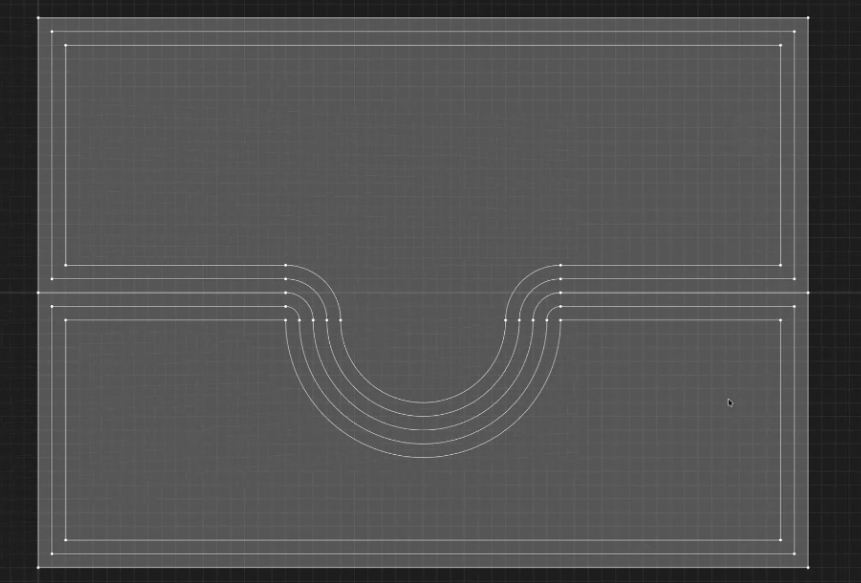

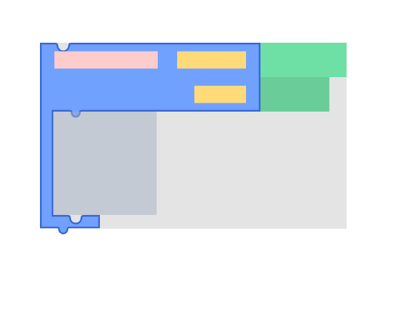

### 1.3 React View Layer

The rendering is integrated through a Higher-Order Component structure.

**BrickViewFixed Component**  
Deals with the presentation of display widgets natively in the DOM, stretching the SVG boundaries instantly to fit text labels across value, expression, and statement bricks.

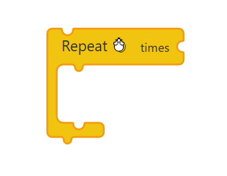

**BrickViewInput Component**  
Accounts for dynamically resizing user input (using `ResizeObserver`) and seamlessly stretches the SVG path around the input without expensive React reconciliations.

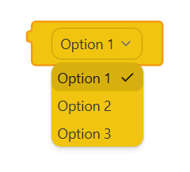

---

## 2. Brick Palette

The Brick Palette serves as the repository for Bricks that can be spawned into the workspace.

### 2.1 Configuration and Rendering
Driven by a config object mapping system IDs to `PaletteBrickConfig` properties, the UI renders sterile visual previews rather than heavy interactive AST nodes.

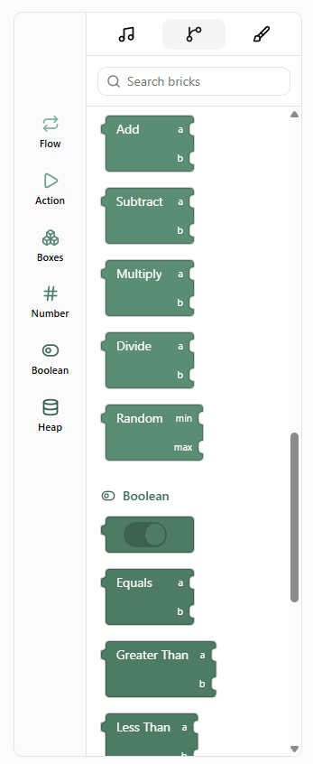

### 2.2 Dragging Bricks from the Palette
Implemented high-performance dragging utilizing `interact.js` to bypass heavy React lifecycles. A `DragGhost` micro-animation gives immediate 60fps feedback. Dropping a brick instantiates a full `BrickModelBase` class via the global state.

---

## 3. Workspace & Layout Engine

The Workspace is the primary staging area, and the most critical architectural achievement in Masonry is the **Two-Pass Layout Engine**. When Bricks are nested, their dimensions rely entirely on their children.

### 3.1 Bookkeeping and Towers
The `useWorkspaceStore` maintains a dictionary of towers, ensuring distinct visual structures are accurately tracked in the layout store.

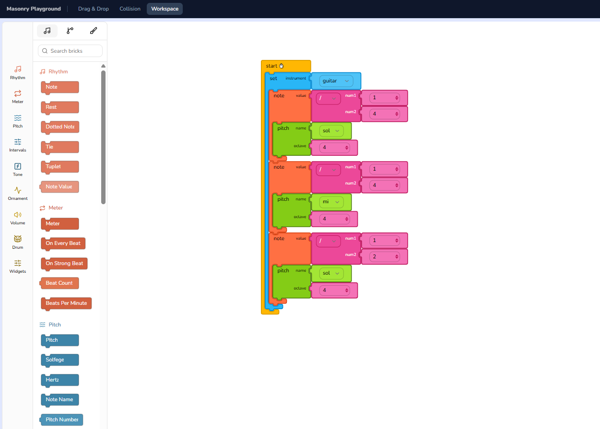

### 3.2 Two-Pass Traversal

**Pass 1: Bottom-Up Bounds Calculation**  
The engine iterates through the tree to establish a topological height array (reverse post-order). It processes the deepest, most nested Bricks first, measures their raw pixel dimensions via DOM layout effects, and computes up the tree so parents precisely wrap their children.

**Pass 2: Top-Down Position Calculation**  
Once every node has accurately computed bounds, the engine starts at the root node and calculates absolute coordinate positions down the Statement and Argument sub-trees.

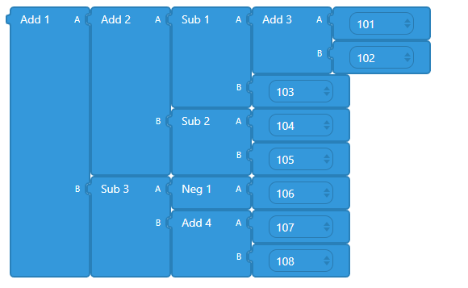

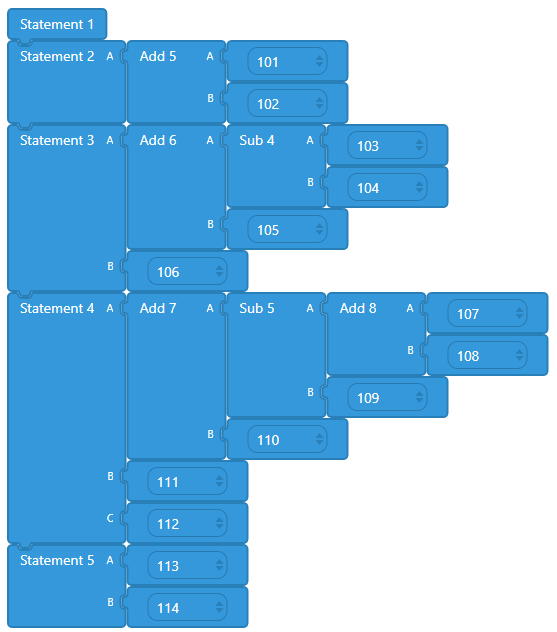

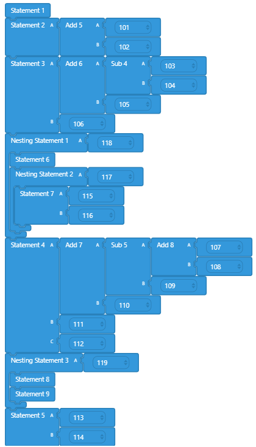

To prevent visual artifacts, Bricks are guarded to remain invisible until their final correct layout positions are atomically calculated and committed. 

---

## 4. Connecting and Disconnecting Bricks

To handle connections, the framework relies on QuadTrees, AST merging, and intuitive visual overlays.

### 4.1 Collision Space and Connector Points
We mathematically query the exact unscaled SVG centroids for every drawn notch. A `QuadtreeCollisionSpace` partitions this 2D space for high-speed hit detection for both Statement and Argument connector points.

### 4.2 Connection Feedback and Drag Logic
During dragging, `resolveCandidateConnection` searches the QuadTree around the cursor. If a compatible notch is found:
- A translucent ghost clone (`SnapPreviewView`) appears at the snap position.
- A glowing indicator (`SnapHintOverlay`) highlights the candidate connector.
- Upon releasing the drag, the AST absorbs the node and triggers a satisfying CSS pulse animation.

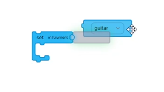

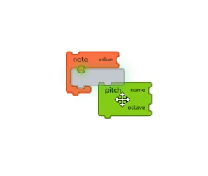

### 4.3 Disconnection Feedback and Drag Logic
When tearing a Brick away from an AST stack:
- The system leaves behind an instant grey footprint (`DisconnectShadowView`) at the detachment socket to provide context.
- The drag logic handles edge cases (like collapsing cavities), rips the sub-tree from the parent structure, and spawns it as a brand-new free-floating Tower seamlessly tracking the user's cursor.

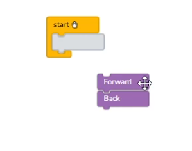

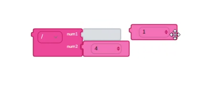

---

## 5. Importing and Exporting Programs

To support serialization of the visual program to disk, we implemented robust Import/Export utilities to save and restore the AST seamlessly.

### 5.1 Defining Import/Export Types and Storybook UI
Before serialization could begin, it was essential to strictly define the required interfaces. I created `@types/import-export.types.ts` to define all data structures such as `ExportedProject`, `ExportedTower`, and `ExportedNode`. To facilitate testing without immediate file-system APIs, I also added a temporary UI to the Storybook playground featuring "Export Workspace" and "Import Workspace" tools.

### 5.2 Export Functionality
Since the AST relies heavily on cyclic pointers (parents referencing children and children referencing parents), a standard JSON serialization causes fatal circular errors. To resolve this, I developed the core export utility inside `utils/import-export.ts`, introducing an **acyclic flattening strategy**. 

The `exportWorkspace` function pushes nodes into a stack and executes a Depth-First Search (DFS) traversal across the active Towers. It logs node metadata (like fixed properties in a `modelConfig` payload) and extracts only the string UUIDs for relational pointers (next, nestedNext, args), completely discarding the cyclic `prev` and `parent` references. The output is a highly efficient, 1-dimensional dictionary (`Record<string, ExportedNode>`). Finally, I integrated this logic into the main state by adding the `exportWorkspace` action to `workspace.ts` and connecting it to the Storybook UI.

### 5.3 Import Functionality
To restore a program, the system reconstructs blank Brick instances based on the flattened dictionary. It maps over the UUIDs to re-link downward object references, simultaneously rebuilding the required cyclic `prev` and `parent` pointers. Finally, the Two-Pass Layout Engine re-runs on the reassembled structures, mathematically redrawing the visual graph based on the user's active viewport scale without relying on pixel metrics saved to the disk file.

---

## Final Result

  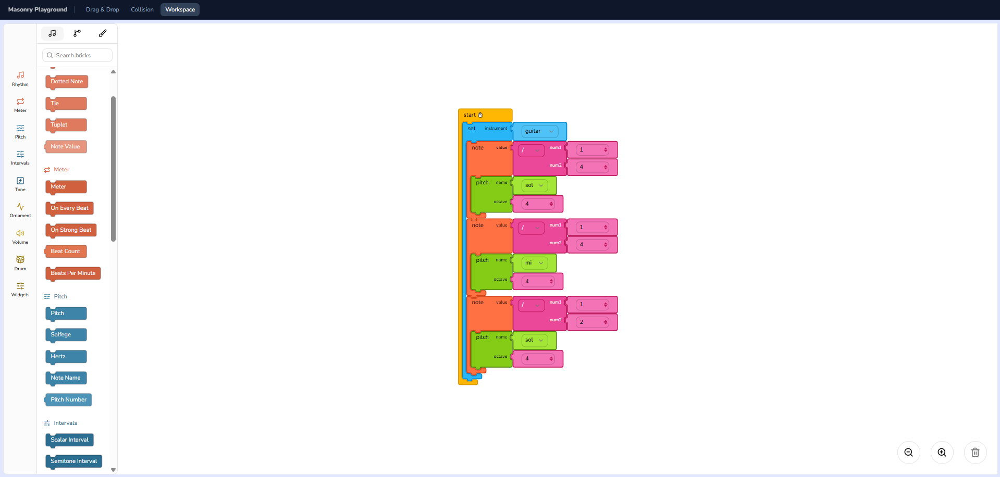
   
  <em>The fully functional Masonry Visual Programming Interface in action</em>

## Pull Requests

Here is a list of all pull requests created and merged during this project:

- [ Add structured brick outline generator](https://github.com/sugarlabs/musicblocks-v4/pull/537)
- [ Add notches to the brick outline generator](https://github.com/sugarlabs/musicblocks-v4/pull/546)
- [ fix misalignment in notches](https://github.com/sugarlabs/musicblocks-v4/pull/589)
- [ fix misalignment in left and right notches](https://github.com/sugarlabs/musicblocks-v4/pull/590)
- [ add BrickViewFixed display-only view component](https://github.com/sugarlabs/musicblocks-v4/pull/606)
- [ fix the glyph in BrickViewFixed](https://github.com/sugarlabs/musicblocks-v4/pull/624)
- [ add BrickViewInput React component](https://github.com/sugarlabs/musicblocks-v4/pull/626)
- [add variant widget to BrickViewFixed React component](https://github.com/sugarlabs/musicblocks-v4/pull/629)
- [Refactoring Brick React component to operate off of Brick models](https://github.com/sugarlabs/musicblocks-v4/pull/651)
- [ define config object for Brick Towers](https://github.com/sugarlabs/musicblocks-v4/pull/655)
- [ Integrate rendering of Bricks in Brick Palette](https://github.com/sugarlabs/musicblocks-v4/pull/663)
- [ Traverse Brick Tower Argument sub-trees and Statement sub-trees bottom up for bounds calculation](https://github.com/sugarlabs/musicblocks-v4/pull/665)
- [ Implement bookkeeping of Brick Towers in the Workspace](https://github.com/sugarlabs/musicblocks-v4/pull/684)
- [ feat masonry palette drag animations](https://github.com/sugarlabs/musicblocks-v4/pull/688)
- [ Add support for being able to move Brick Towers starting from the root Brick](https://github.com/sugarlabs/musicblocks-v4/pull/709)
- [ Add all Statement connector points in the Collision space](https://github.com/sugarlabs/musicblocks-v4/pull/719)
- [Add support for disconnecting Statement Bricks apart](https://github.com/sugarlabs/musicblocks-v4/pull/721)
- [Add support for disconnecting Argument Bricks apart](https://github.com/sugarlabs/musicblocks-v4/pull/739)
- [ Add the tests for brickInput](https://github.com/sugarlabs/musicblocks-v4/pull/740)
- [ add feedback when connecting/disconnecting Bricks](https://github.com/sugarlabs/musicblocks-v4/pull/743)
- [Define Import/Export Types and Implement Storybook UI](https://github.com/sugarlabs/musicblocks-v4/pull/779)
- [implement Export Functionality](https://github.com/sugarlabs/musicblocks-v4/pull/780)

## Acknowledgments

Special thanks to my mentors Anindya Kundu  and Safwan Sayeed for their continued feedback, architecture reviews, and guidance throughout the summer. Thanks also to Devin Ulibarri, Walter Bender, and the entire Sugar Labs community for this incredible opportunity to contribute to Music Blocks v4.
